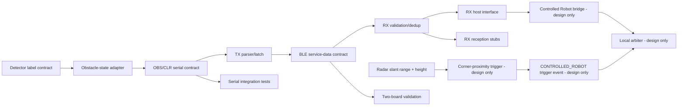

# Dependencies

## Contents

- [Purpose](#purpose)
- [Dependency graph](#dependency-graph)
- [Change-impact rules](#change-impact-rules)
- [Stub dependencies](#stub-dependencies)

## Purpose

This document makes cross-cutting change impact explicit so a local edit does not silently invalidate another subsystem or its evidence.

## Dependency graph

## Change-impact rules

| Dependency changed | Minimum affected areas |
|---|---|
| model output labels | DSP adapter, feature docs, trained-model validation |
| `OBS`/`CLR` framing | DSP writer, TX parser, interface docs, serial tests |
| basic safety precedence (`OBS` overrides joystick) | protocol contract, local arbiter, control authority, integration validation |
| BLE UUID/version/state byte | TX/RX firmware, protocol tests, two-board validation |
| role/PHY runtime semantics | firmware, operations, stub behavior, hardware validation |
| Controlled Robot ROS interface | bridge, arbiter, control-flow docs, failure/liveness policy |
| Radar range-to-corner trigger | range/height calibration, target association, trigger event contract, bridge, local arbiter, latency/braking validation |

## Stub dependencies

A stub depends on the downstream interface it exercises but **does not satisfy** the dependency on the real upstream producer. For example, forced RX `OBS` can validate RX serial/downstream handling but cannot validate over-air packet reception.
