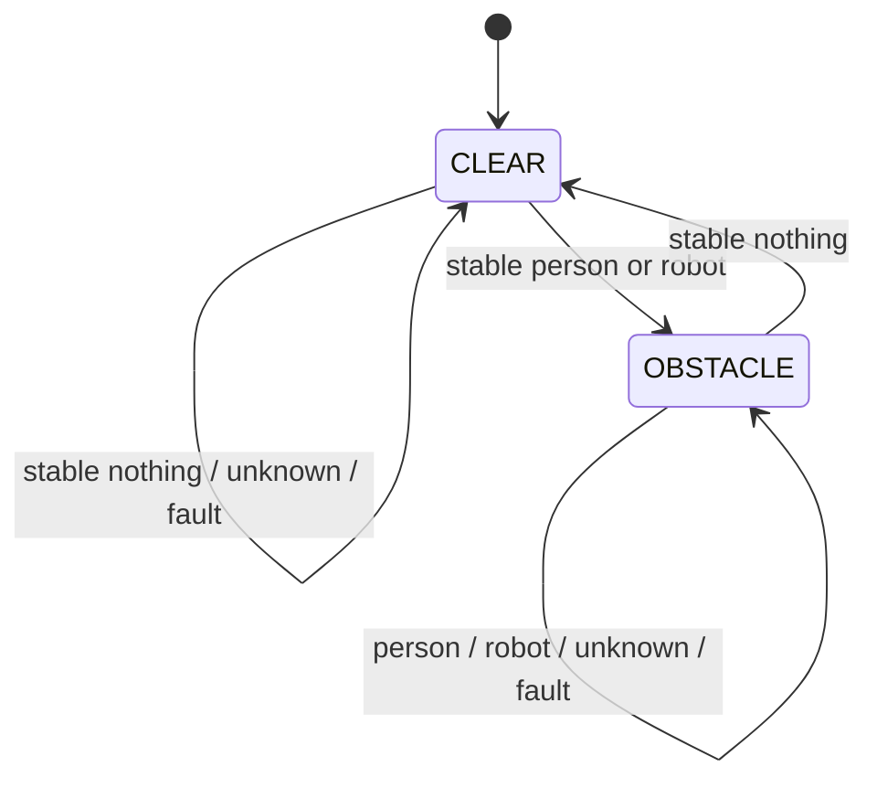

# Runtime and State Semantics

## Contents

- [Purpose](#purpose)
- [State ownership](#state-ownership)
- [DSP temporal state](#dsp-temporal-state)
- [Semantic obstacle latch](#semantic-obstacle-latch)
- [Transceiver TX state](#transceiver-tx-state)
- [Transceiver RX state](#transceiver-rx-state)
- [Target Controlled Robot STOP gate](#target-controlled-robot-stop-gate)
- [Reset and resynchronization boundaries](#reset-and-resynchronization-boundaries)
- [Critical semantic rule](#critical-semantic-rule)

## Purpose

The system contains several independent pieces of state. This document prevents them from being collapsed into one vague idea of "detection state".

## State ownership

| State | Owner | Persistence |
|---|---|---|
| 10-frame classification window | DSP classifier | until one inference, then cleared |
| rolling vote, max 5 predictions | DSP acquisition loop | one recording |
| semantic `CLEAR`/`OBSTACLE` latch | `ObstacleStateAdapter` | one run |
| last successfully transmitted serial state | `SerialStateOutput` | one serial-writer lifetime |
| TX `CLR`/`OBS` latch | NRF TX role | until opposite command, role reset, or reboot |
| RX last accepted state / episode | NRF RX role | current RX observation epoch |
| Controlled Robot STOP state | future ROS-side arbiter | **not implemented** |
| distance-to-corner | future gating input | **TBD** |

## DSP temporal state

The classifier accumulates non-overlapping 10-frame windows. A prediction is produced every tenth frame. Predictions then enter a rolling deque of up to five `(label, score)` pairs. Majority label wins; score resolves ties.

This rolling vote is a temporal filter, not hysteresis. Entry and clearing currently use symmetric evidence.

## Semantic obstacle latch

Implemented in `dsp/integration/obstacle_state.py`:



Unknown/fault inputs hold the prior semantic state and surface a fault. They never synthesize `CLR`.

## Transceiver TX state

TX boots `CLR`, accepts exact `OBS`/`CLR` lines, latches the current state, and advertises it repeatedly. Same-state input is a no-op.

Switching RX -> TX reinitializes the TX latch to `CLR`. Role and PHY are independent dimensions.

## Transceiver RX state

RX scans the selected PHY, validates the service-data contract, and emits only transitions. Initial `CLR` is intentionally silent. A PHY switch resets the RX deduplication epoch.

## Target Controlled Robot STOP gate

**Design only:**

```text
unsafe = received obstacle state is OBS
near_corner = controlled_robot_distance_to_corner <= DISTANCE_THRESHOLD

if unsafe AND near_corner:
    STOP overrides normal cmd_vel
else:
    normal cmd_vel remains eligible
```

This logic is not implemented. `DISTANCE_THRESHOLD` and its input source are TBD.

The intended motion authorities are only normal teleoperation / `cmd_vel` and higher-priority STOP. Distance is context used by the STOP rule, not a separate command authority.

## Reset and resynchronization boundaries

- New DSP run: vote and adapter state reset.
- Serial writer open: `last_transmitted` begins aligned to clear without sending a startup line.
- NRF boot: TX + Coded S=8 + `CLR`.
- Role switch to TX: TX latch resets `CLR`.
- PHY switch in RX: deduplication epoch resets.
- No Controlled Robot-side state-resynchronization contract exists yet because the bridge/arbiter is not implemented.

## Critical semantic rule

**No valid result is not the same thing as clear.**

Acquisition failure, inference failure, unknown label, serial failure, BLE silence, SSH loss, or stale distance must never be casually collapsed into `CLR`. Where the current implementation has no policy yet, the state is documented as unresolved rather than invented.
