# System Architecture

**Document role:** authoritative cross-subsystem architecture dossier.  
**Implementation audit basis:** repository `main`, 2026-09-28.  
**Architecture rule:** every diagram distinguishes implemented behavior from design-only or TBD behavior.

## Contents

- [Purpose and audience](#purpose-and-audience)
- [Status notation](#status-notation)
- [Architecture principles](#architecture-principles)
- [Robot-role abstraction and current hardware bindings](#robot-role-abstraction-and-current-hardware-bindings)
- [System context](#system-context)
- [Physical experiment architecture](#physical-experiment-architecture)
- [Functional decomposition](#functional-decomposition)
- [Part-by-part architecture](#part-by-part-architecture)
  - [1. Dummy Robot and experiment scene](#1-dummy-robot-and-experiment-scene)
  - [2. Radar/RIS sensing boundary](#2-radarris-sensing-boundary)
  - [3. Central-laptop DSP pipeline](#3-central-laptop-dsp-pipeline)
  - [4. Semantic obstacle-state adapter](#4-semantic-obstacle-state-adapter)
  - [5. Serial discovery and DSP-to-TX transport](#5-serial-discovery-and-dsp-to-tx-transport)
  - [6. NRF Transceiver TX role](#6-nrf-transceiver-tx-role)
  - [7. BLE state transport](#7-ble-state-transport)
  - [8. NRF Transceiver RX role](#8-nrf-transceiver-rx-role)
  - [9. RX host and logging](#9-rx-host-and-logging)
  - [10. Controlled Robot-side serial-to-SSH bridge](#10-controlled-robot-side-serial-to-ssh-bridge)
  - [11. Controlled Robot-local ROS arbitration](#11-controlled-robot-local-ros-arbitration)
  - [12. Distance-to-corner gate](#12-distance-to-corner-gate)
  - [13. Controlled Robot and physical safety boundary](#13-controlled-robot-and-physical-safety-boundary)
- [Cross-cutting architectural views](#cross-cutting-architectural-views)
  - [Data-flow view](#data-flow-view)
  - [Control-authority view](#control-authority-view)
  - [Deployment view](#deployment-view)
  - [State-ownership view](#state-ownership-view)
  - [Failure-containment view](#failure-containment-view)
- [Current versus target architecture](#current-versus-target-architecture)
- [Architecture quality analysis](#architecture-quality-analysis)
- [Architectural risks and debt](#architectural-risks-and-debt)
- [System boundaries and non-goals](#system-boundaries-and-non-goals)
- [Architectural constraints](#architectural-constraints)
- [Related architecture records](#related-architecture-records)

## Purpose and audience

This document explains the system at two levels simultaneously:

1. the **whole-system picture** needed to understand the experiment; and
2. the **part-by-part decomposition** needed to review ownership, coupling, interfaces, runtime state, implementation maturity, and remaining work.

It is intended to be usable by sensing, embedded, robotics, controls, and systems reviewers without requiring any one reviewer to reverse-engineer another subsystem first.

Detailed algorithm derivations remain under `dsp/docs/`; firmware build and protocol implementation remain under `firmware/`; robot troubleshooting remains under `robotics/`. This document owns the relationships among them.

## Status notation

Architecture figures use these meanings:

| Marker | Meaning |
|---|---|
| `IMPLEMENTED` | Repository code/configuration exists. |
| `VALIDATED` | Direct software or hardware evidence exists for the stated behavior. |
| `BLOCKED` | Implementation exists but is not acceptable for experiment use because a prerequisite is missing. |
| `DESIGN ONLY` | Accepted target architecture with no corresponding implementation in the repository. |
| `TBD` | The mechanism or value has not been selected. |

An implemented box is not automatically a validated box, and an accepted design is not automatically implemented.

## Architecture principles

The system is deliberately organized around a few strong boundaries:

- **Semantic reduction before transport.** Radar/RIS data are reduced to semantic state before crossing the NRF link.
- **Transport does not own policy.** Serial, BLE, and SSH move state; they do not decide whether Controlled Robot motion is safe.
- **Final motion authority stays robot-local.** The eventual STOP precedence belongs on the Controlled Robot side rather than on the sensing laptop.
- **Failure is not clear.** Missing or invalid information must not silently become `CLR`.
- **Subsystems remain independently testable.** DSP, BLE transport, host bridge, and ROS arbitration can be validated in stages.
- **Roles before platforms.** Architecture uses `DUMMY_ROBOT` and `CONTROLLED_ROBOT`; physical platforms are replaceable bindings of those roles.
- **Architecture follows the experiment, not platform ambition.** The two robot roles exist only for the research functions needed by the experiment; autonomous navigation is outside scope.

## Robot-role abstraction and current hardware bindings

The architectural identities are roles, not robot products.

| Architectural role | Canonical symbol | Responsibility | Current hardware binding |
|---|---|---|---|
| Dummy Robot | `DUMMY_ROBOT` | Provide the physical moving/stationary robot target in the conflicting corridor | Clearpath Husky A200 |
| Controlled Robot | `CONTROLLED_ROBOT` | Remain under normal teleoperation while accepting the local higher-priority STOP policy | Clearpath Husky A200 |

The mapping above is a **deployment/hardware binding**. Replacing either platform should normally require a binding decision and platform-specific validation, not a rewrite of sensing, transport, interface, or control architecture.

Product names remain appropriate in hardware-specific troubleshooting, validation evidence, deployment instructions, and historical decision records.

## System context

### Figure 1 — whole-system context

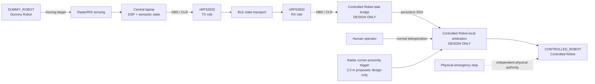

The implemented and validated chain currently ends at the RX serial boundary. The bridge, ROS arbiter, and Radar-side corner trigger appear as design-only target behavior; none is implemented in the repository.

## Physical experiment architecture

### Figure 2 — corridor roles

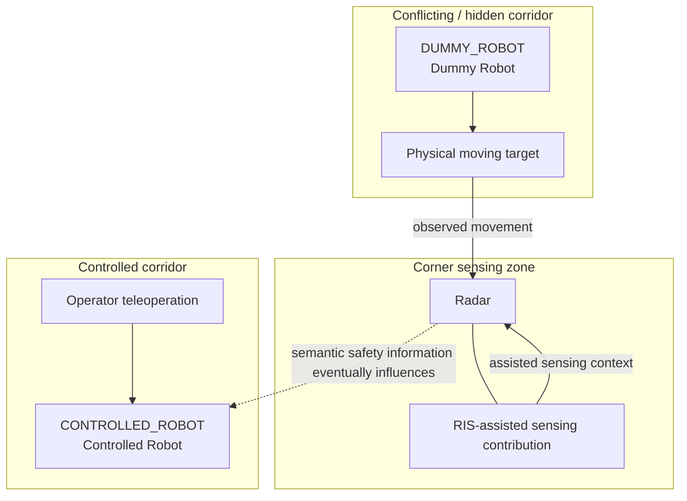

The Dummy Robot is the sensing target rather than a motion-controlled actor in the safety path. The Controlled Robot is the actuator subject to the safety policy, but its safety intervention is not implemented yet. Keeping those roles separate prevents the robot-platform history from being mistaken for the active control architecture.

## Functional decomposition

### Figure 3 — functional blocks

```mermaid
flowchart LR
    A[Acquire radar frames]
    B[Construct range / Doppler / Capon features]
    C[Run CNN-LSTM inference]
    D[Apply rolling vote]
    E[Map semantic label to CLEAR / OBSTACLE]
    F[Render transition as CLR / OBS]
    G[Transmit over USB serial]
    H[Latch + advertise over BLE]
    I[Filter + deduplicate BLE state]
    J[Emit RX serial transition]
    K[Forward to Controlled Robot onboard computer<br/>DESIGN ONLY]
    L[Apply local STOP precedence<br/>DESIGN ONLY]
    M[Apply Radar corner-proximity trigger<br/>2.0 m proposed; design only]
    N[Drive Controlled Robot base]

    A --> B --> C --> D --> E --> F --> G --> H --> I --> J --> K --> L --> M --> N
```

The decomposition shows an important design property: sensing semantics, protocol transport, and motion policy are separate responsibilities rather than one monolithic control script.

## Part-by-part architecture

### 1. Dummy Robot and experiment scene

**Status:** physical experiment role established; not part of the Controlled Robot command chain.

The Dummy Robot provides the moving robot target in the conflicting corridor. Its role is intentionally simple: create repeatable physical motion for Radar/RIS observation. Dummy Robot autonomy, localization, and command integration do not contribute to the final STOP logic.

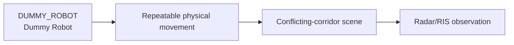

Architectural consequence: failures in Dummy Robot teleoperation affect stimulus generation, not Controlled Robot command authority.

### 2. Radar/RIS sensing boundary

**Status:** sensing/acquisition exists; exact RIS internals are not duplicated in the robotics architecture.

The system boundary starts with sensed physical behavior. Raw sensing data remain on the sensing side. The architecture requires only that the central processing path receive the inputs needed to derive semantic person/robot/nothing state.

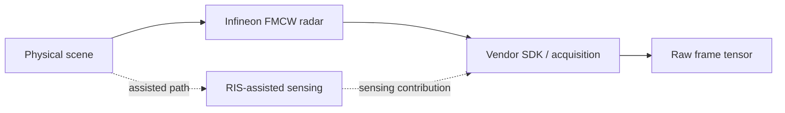

Architectural boundary: neither NRF board needs raw radar frames or signal-processing internals.

### 3. Central-laptop DSP pipeline

**Status:** `IMPLEMENTED`; software-tested. Experiment semantics remain `BLOCKED` because `PLACEHOLDER_MODE = True`.

Actual implementation is centered on `collect_data_realtime.py` and `RealtimeRadarClassifier`.

### Figure 4 — implemented DSP processing path

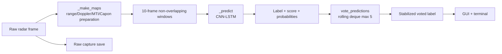

Key runtime properties:

- prediction windows contain 10 frames;
- the rolling vote holds up to five predictions;
- majority count wins and mean score breaks ties;
- the vote is a temporal filter, not asymmetric hysteresis;
- raw capture persistence is independent of the later `OBS`/`CLR` control protocol.

The classifier object also owns persistent clutter memory (`dopp_avg`) across a run. That numerical state can affect classification but is not itself control state.

### 4. Semantic obstacle-state adapter

**Status:** `IMPLEMENTED` and hardware-free tested.

`ObstacleStateAdapter` is the architecture pivot between perception semantics and control semantics.

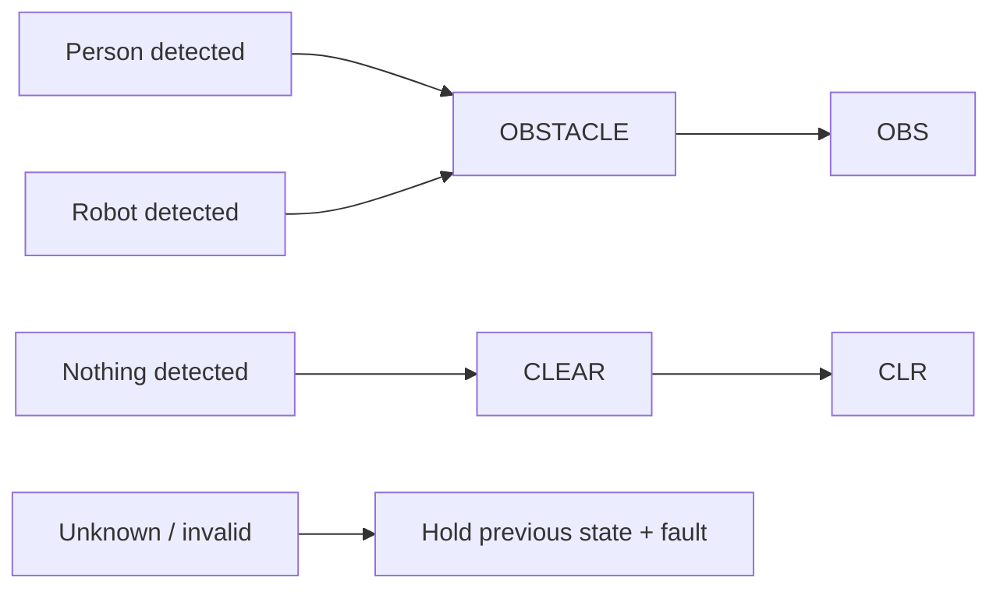

This boundary prevents model labels from leaking into firmware. The transport protocol knows only obstacle/clear state.

The adapter initializes clear to match TX boot state, but unknown input does not generate clear. That distinction is load-bearing for safe future integration.

### 5. Serial discovery and DSP-to-TX transport

**Status:** `IMPLEMENTED`; hardware-free tested; live DSP-to-physical-TX validation pending.

The DSP host does not use a manually specified COM port. `serial_discovery.py` inspects serial metadata, groups interfaces by physical board, and auto-selects only when the target is unambiguous.

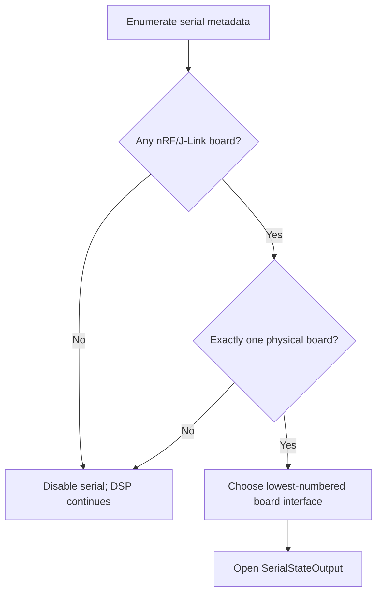

`SerialStateOutput` tracks the last successfully transmitted state. A failed write leaves that transport state stale so a later synchronization attempt retries instead of falsely recording success.

### 6. NRF Transceiver TX role

**Status:** `IMPLEMENTED`; correct-target boot validated; S=8 transport validated.

The physical boards are nRF52833 DKs and both run the same firmware image. A freshly booted board is TX + Coded S=8 + `CLR`.

### Figure 5 — TX responsibility

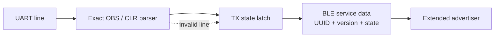

TX does not classify targets and does not decide whether Controlled Robot should move. It accepts protocol state, latches it, and advertises it.

### 7. BLE state transport

**Status:** Coded S=8 path `IMPLEMENTED + VALIDATED`; LE 1M implemented but coordinated over-air switch validation remains open.

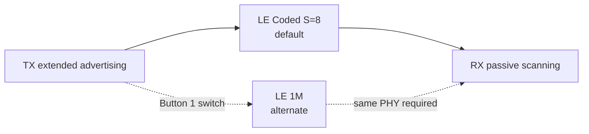

Protocol payload:

| Field | Meaning |
|---|---|
| 128-bit Service Data UUID | `7bb4f91d-521f-4ee6-a9c8-43dca4bb6e11` |
| version | `0x01` |
| state | `0x00 = CLR`, `0x01 = OBS` |

The transport is intentionally compact. BLE does not carry confidence, raw radar data, votes, distance, or velocity commands.

### 8. NRF Transceiver RX role

**Status:** `IMPLEMENTED`; S=8 `OBS`/`CLR` propagation and duplicate suppression validated on two physical boards.

### Figure 6 — RX filtering and episode semantics

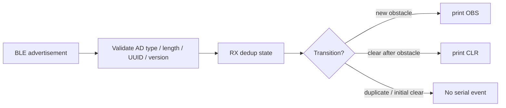

Initial clear is silent. RX emits `CLR` only after an obstacle episode has emitted `OBS`. A PHY switch starts a new observation epoch.

### 9. RX host and logging

**Status:** logger `IMPLEMENTED`; dedicated physical JSONL validation still open.

`firmware/tools/rx_logger.py` is a simple host observer. It accepts only `OBS` and `CLR`, timestamps them in UTC, prints JSON Lines, and can append them to a file.

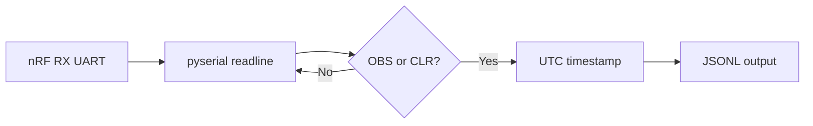

This logger is not the Controlled Robot control bridge. Conflating the two would hide control requirements such as reconnect policy and state synchronization.

### 10. Controlled Robot-side serial-to-SSH bridge

**Status:** `DESIGN ONLY`.

The accepted architecture places a small bridge on the Controlled Robot-side host:

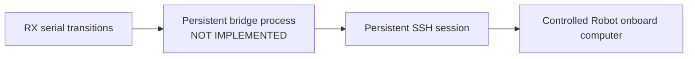

The bridge should transport state, expose connection health, and define reconnect/resynchronization behavior. It should not decide command precedence.

No bridge implementation, SSH client, reconnect FSM, or stale-event policy currently exists in the repository.

### 11. Controlled Robot-local ROS arbitration

**Status:** `DESIGN ONLY`.

The final STOP rule must be enforced locally on the Controlled Robot rather than relying on whichever ROS message arrives last.

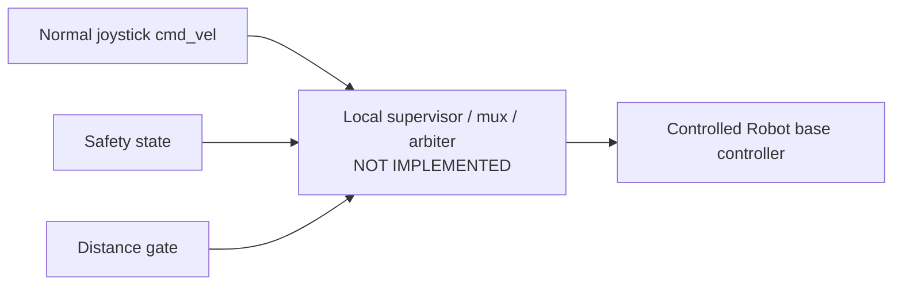

The exact ROS topic names, node implementation, launch configuration, and mux/supervisor mechanism are intentionally not invented before implementation selects them.

### 12. Distance-to-corner gate

**Status:** Radar-side range projection and the proposed `2.0 m` trigger are **Design only**; range association, calibration, release rule, and stopping-distance validation remain open.

The Radar station can derive the tracked `CONTROLLED_ROBOT` ground-plane distance from slant range and height without requesting state from the joystick/control station. At `d <= 2.0 m`, the proposed protocol sends a trigger to `CONTROLLED_ROBOT`; the robot-local arbiter retains final STOP authority. The threshold is a design assumption, not yet proven by a stopping test.

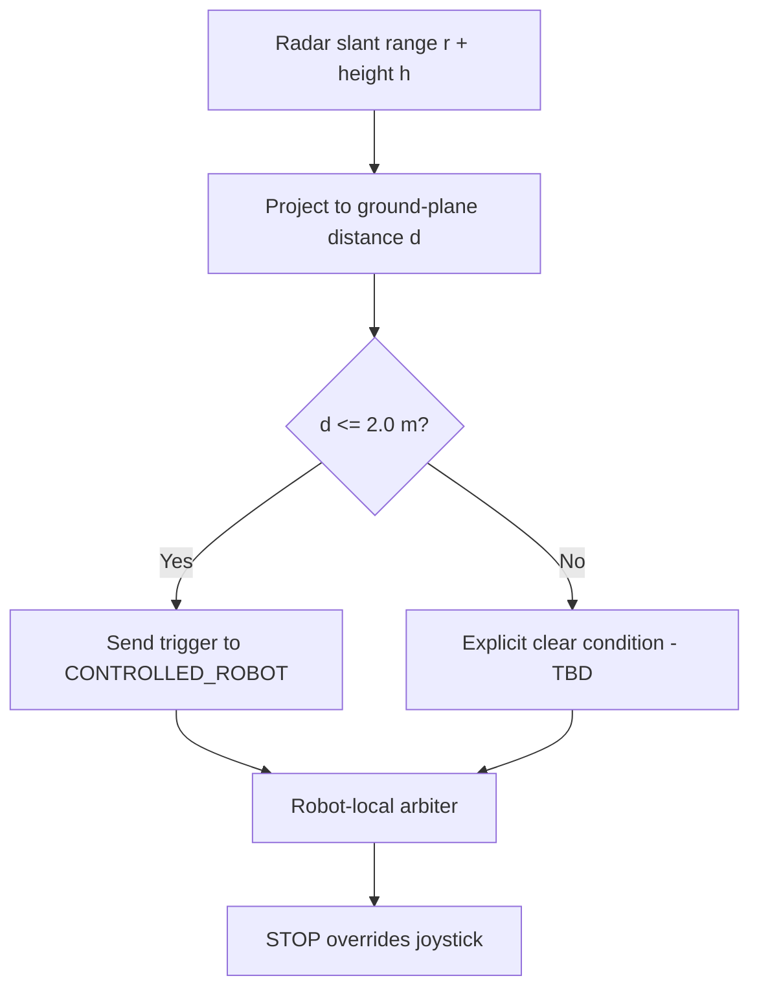

The diagram is the intended protocol flow, not an implemented circuit. `d = sqrt(r^2 - (h-z)^2)` assumes valid calibrated range and a tracked target reference point. The 1 m/s worst-case assumption and Husky A200 footprint leave 1.505 m from the front edge at a 2.0 m center-reference trigger. The trigger threshold remains unvalidated until latency, braking, range uncertainty, and geometry are measured; the explicit release threshold/hysteresis also remains TBD.

### 13. Controlled Robot and physical safety boundary

**Status:** Controlled Robot role and current hardware binding are selected; software safety path not yet integrated.

Software STOP is one experiment control mechanism. The physical emergency stop and supervised laboratory procedure remain independent safety controls.

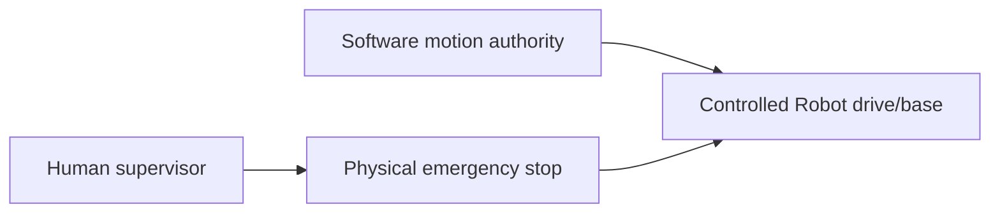

The architecture must never present research software maturity as justification for removing the physical safety layer.

## Cross-cutting architectural views

### Data-flow view

### Figure 7 — data transformations

```mermaid
flowchart LR
    PHYS[Physical motion]
    FRAME[Raw radar frame]
    MAP[Feature maps]
    PRED[Model probabilities]
    LABEL[Per-window label + score]
    VOTE[Stabilized label]
    SEM[CLEAR / OBSTACLE]
    SERIAL[CLR / OBS line]
    PACKET[BLE UUID + version + state]
    RXEVENT[RX CLR / OBS transition]
    FUTURE[Future robot safety state]

    PHYS --> FRAME --> MAP --> PRED --> LABEL --> VOTE --> SEM --> SERIAL --> PACKET --> RXEVENT --> FUTURE
```

Each transformation intentionally reduces or changes representation. The biggest semantic jump occurs between voted detection label and obstacle state; the remaining implemented path is primarily transport/state preservation.

### Control-authority view

### Figure 8 — who may actually command motion

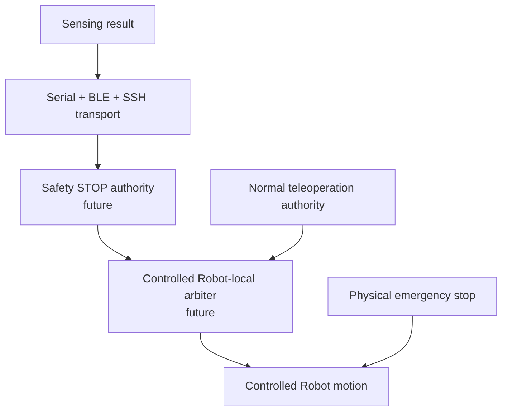

Only teleoperation currently participates in real Controlled Robot motion. The STOP branch is target architecture. Transport is explicitly not a motion authority.

### Deployment view

### Figure 9 — software and hardware placement

```mermaid
flowchart LR
    subgraph CENTRAL[Central sensing laptop]
        ACQ[collect_data_realtime.py]
        CLS[RealtimeRadarClassifier]
        ADAPT[ObstacleStateAdapter]
        SOUT[SerialStateOutput]
    end

    subgraph TXBOARD[nRF52833 DK — TX role]
        TXFW[Shared Transceiver firmware]
    end

    subgraph AIR[Wireless medium]
        BLE[BLE extended advertising]
    end

    subgraph RXBOARD[nRF52833 DK — RX role]
        RXFW[Same Transceiver firmware]
    end

    subgraph HOST[Controlled Robot-side host]
        LOG[rx_logger.py]
        BRIDGE[Future bridge]
    end

    subgraph CONTROLLED_ROBOT_HOST[Controlled Robot onboard computer]
        ROS[Future ROS arbiter]
    end

    ACQ --> CLS --> ADAPT --> SOUT
    SOUT -->|USB serial| TXFW
    TXFW --> BLE --> RXFW
    RXFW -->|USB serial| LOG
    RXFW -. future control feed .-> BRIDGE
    BRIDGE -. SSH over Ethernet .-> ROS
```

This deployment view makes an important distinction: the RX logger and future control bridge may share a host, but they are not the same responsibility.

### State-ownership view

### Figure 10 — distributed state

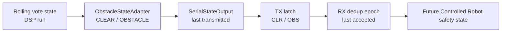

State is intentionally distributed. Therefore restart and reconnect semantics matter: a future bridge cannot assume its local state is authoritative merely because it restarted cleanly.

### Failure-containment view

### Figure 11 — where failures should be contained

```mermaid
flowchart TB
    DSPF[DSP/model failure]
    SERF[Serial discovery/write failure]
    BLEF[BLE silence / PHY mismatch]
    SSHF[Future SSH loss]
    DISTF[Future stale distance]
    MOTION[Controlled Robot motion policy]

    DSPF -->|must not synthesize CLR| SERF
    SERF -->|visible fault / no false success| BLEF
    BLEF -->|liveness policy still required| SSHF
    SSHF -->|policy TBD| DISTF
    DISTF -->|must be handled locally| MOTION
```

Current protection is strongest upstream. Downstream liveness/fail-safe policy remains one of the principal unfinished architectural concerns.

## Current versus target architecture

### Current implemented software path

```text
Radar acquisition
 -> DSP feature construction
 -> CNN-LSTM adapter
 -> rolling vote
 -> ObstacleStateAdapter
 -> SerialStateOutput + automatic discovery
 -> nRF TX firmware
 -> BLE
 -> nRF RX firmware
 -> serial transition / optional rx_logger
```

Current qualifications:

- classification is structurally implemented but experiment control is blocked by `PLACEHOLDER_MODE = True`;
- DSP-to-physical-TX serial has not yet been validated from the live sensing application;
- the Coded S=8 two-board host-UART -> BLE -> host-UART path has passed hardware smoke testing.

### Target controlled-robot path

```text
current implemented path
 -> Controlled Robot-side serial consumer
 -> persistent SSH session
 -> Controlled Robot-local ROS safety input
 -> explicit STOP-vs-cmd_vel arbitration
 -> Radar corner-proximity trigger
 -> Controlled Robot base controller
```

None of the added target blocks above is currently implemented in repository code.

## Architecture quality analysis

| Quality | Current architectural choice | Effect | Remaining concern |
|---|---|---|---|
| Separation of concerns | DSP semantics, serial transport, BLE transport, and motion policy are separated | Easier independent testing and review | Future bridge must preserve this separation |
| Coupling | NRF protocol carries only `OBS`/`CLR` | Sensing implementation can evolve without firmware understanding model internals | Protocol is intentionally small and has no liveness channel yet |
| Testability | Pure obstacle-state logic and firmware protocol helpers are separable from hardware | Strong subsystem-level tests | End-to-end test harness does not yet exist |
| Observability | DSP faults print; LEDs expose role/PHY; logger can timestamp events | Good bring-up visibility | Future bridge/ROS connection health must become observable |
| Safety semantics | Unknown is not clear; placeholder serial is guarded | Avoids several silent-failure classes | BLE/SSH/stale-distance policy remains unresolved |
| Locality of authority | Final STOP decision is intended to remain Controlled Robot-local | Network transport cannot silently become the arbiter | Not yet implemented |
| Replaceability | Serial/BLE boundary uses a compact semantic protocol | Transport or classifier can be changed behind interfaces | Interface versioning beyond protocol v1 is not yet designed |
| Operational simplicity | Same firmware image for TX/RX; runtime buttons select role/PHY | Reduces firmware-image drift | Runtime role/PHY mismatch still needs clear pre-run checks |

## Architectural risks and debt

The principal risks are not hidden implementation bugs in the already-tested BLE link; they are **gaps between subsystem maturity levels**:

- The classifier is still a placeholder, so the most important semantic input is not experiment-valid.
- The validated BLE path was driven by host-generated protocol events, not by the complete live DSP chain.
- The future bridge lacks reconnect, state resynchronization, and liveness semantics.
- ROS command arbitration is accepted in principle but has no implementation or verified topic topology.
- Distance gating is required by the experiment logic but has no selected data source or threshold.
- Silence/loss across BLE, serial, SSH, or distance updates does not yet have a complete robot-side policy.
- A transition-only protocol is compact, but future reconnect behavior will require an explicit way to recover authoritative current state rather than infer it from silence.

These are real engineering gaps, not documentation TODOs. The documentation should continue to expose them until implementation and evidence close them.

## System boundaries and non-goals

### In scope

- sensing-to-semantic-state transformation;
- semantic obstacle/clear protocol;
- two-board BLE transport;
- robot-side transport architecture;
- local command arbitration architecture;
- distance-gated STOP behavior;
- validation and failure semantics necessary for the experiment.

### Explicitly out of scope

- Controlled Robot autonomous navigation, SLAM, mapping, or path planning;
- sophisticated Dummy Robot autonomy;
- raw Radar/RIS streaming over BLE;
- using the NRF firmware as a robot safety arbiter;
- treating SSH or ROS message arrival order as priority;
- replacing the physical emergency stop with research software.

## Architectural constraints

- Physical transceivers used in bring-up are nRF52833 DKs; canonical build target is `nrf52833dk/nrf52833`.
- Both boards use one shared firmware image.
- Boot default is TX + Coded S=8 + `CLR`.
- Button 1 changes PHY; Button 2 changes runtime role.
- DSP serial discovery is automatic and must remain ambiguity-safe.
- Placeholder inference is not acceptable for real experiment actuation.
- No valid result is not equivalent to clear.
- The final STOP precedence must be explicit and local to the controlled robot.
- Distance is gating context, not an independent motion command.
- Software STOP remains subordinate to physical emergency-stop supervision.

## Related architecture records

- [`uml.md`](views.md) — whole-system structural and behavioral UML views.
- [`interfaces.md`](../interactions/interfaces.md) — exact boundary contracts.
- [`runtime-and-state.md`](../runtime/state-machines.md) — detailed state semantics.
- [`requirements-and-traceability.md`](requirements-and-traceability.md) — requirement-to-implementation/evidence traceability.
- [`implementation-status.md`](current-state.md) — maturity ledger.
- [`validation.md`](../../validation/system-validation.md) — evidence and validation gaps.
- [`failure-modes-and-safety.md`](../safety/failure-modes.md) — cross-boundary failure behavior.
- [`integration-plan.md`](integration-plan.md) — dependency-ordered remaining work.
- [`../../decisions/`](../../decisions) — accepted and superseded design decisions.
