# Recursive System Progress

## Contents

- [Whole system](#whole-system)
- [1. Experiment roles](#1-experiment-roles)
- [2. Radar/RIS sensing](#2-radarris-sensing)
- [3. DSP pipeline](#3-dsp-pipeline)
- [4. Semantic obstacle state](#4-semantic-obstacle-state)
- [5. DSP-to-TX serial boundary](#5-dsp-to-tx-serial-boundary)
- [6. Transceiver TX role](#6-transceiver-tx-role)
- [7. BLE transport](#7-ble-transport)
- [8. Transceiver RX role](#8-transceiver-rx-role)
- [9. RX host and logging](#9-rx-host-and-logging)
- [10. Serial-to-SSH bridge](#10-serial-to-ssh-bridge)
- [11. ROS arbitration](#11-ros-arbitration)
- [12. Distance gate](#12-distance-gate)
- [13. Controlled Robot and safety](#13-controlled-robot-and-safety)
- [System validation](#system-validation)
- [Data-flow view](#data-flow-view)
- [Control-authority view](#control-authority-view)
- [Deployment view](#deployment-view)
- [State-ownership view](#state-ownership-view)
- [Failure-containment view](#failure-containment-view)
- [Written progress detail](#written-progress-detail)
  - [Experiment roles and sensing](#experiment-roles-and-sensing)
  - [DSP and semantic state](#dsp-and-semantic-state)
  - [Serial boundary and Transceiver](#serial-boundary-and-transceiver)
  - [RX host and Controlled Robot](#rx-host-and-controlled-robot)
  - [Validation and next-item order](#validation-and-next-item-order)

## Whole system

```mermaid
flowchart LR
    SCENE["Experiment roles<br/>Selected; repeatable run next"] --> SENSE["Radar/RIS capture<br/>Implemented; dataset record next"]
    SENSE --> DSP["DSP detection<br/>Placeholder model; trained detector next"]
    DSP --> STATE["Obstacle state<br/>Implemented; real labels next"]
    STATE --> SERIAL["DSP-to-TX serial<br/>Implemented; live hardware proof next"]
    SERIAL --> TX["Transceiver TX<br/>Implemented; role check next"]
    TX --> BLE["BLE S=8<br/>Two-board pass; PHY checks next"]
    BLE --> RX["Transceiver RX<br/>S=8 pass; stub checks next"]
    RX --> HOST["RX host logger<br/>Implemented; JSONL run next"]
    HOST --> BRIDGE["SSH bridge<br/>Design only; implementation next"]
    BRIDGE --> ROS["ROS topic / STOP priority<br/>TBD / design only; local arbiter next"]
    ROS --> DIST["Distance gate<br/>TBD; choose source and threshold next"]
    DIST --> ROBOT["Controlled Robot motion<br/>Not end-to-end; local STOP test next"]

    classDef pass fill:#dbeafe,stroke:#1d4ed8,color:#172554,stroke-width:2px;
    classDef work fill:#eff6ff,stroke:#2563eb,color:#172554,stroke-width:2px;
    classDef blocked fill:#bfdbfe,stroke:#1e40af,color:#172554,stroke-width:2px;
    classDef planned fill:#f8fbff,stroke:#60a5fa,color:#172554,stroke-width:2px,stroke-dasharray:4 4;
    class BLE,RX pass;
    class SCENE,SENSE,STATE,TX,HOST work;
    class DSP,SERIAL blocked;
    class BRIDGE,ROS,DIST,ROBOT planned;
```

## 1. Experiment roles

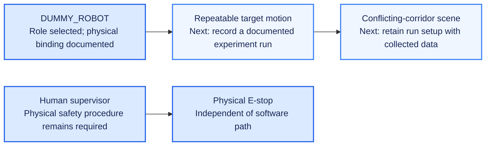

## 2. Radar/RIS sensing

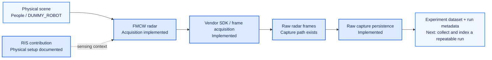

## 3. DSP pipeline

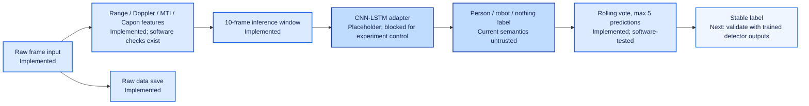

## 4. Semantic obstacle state

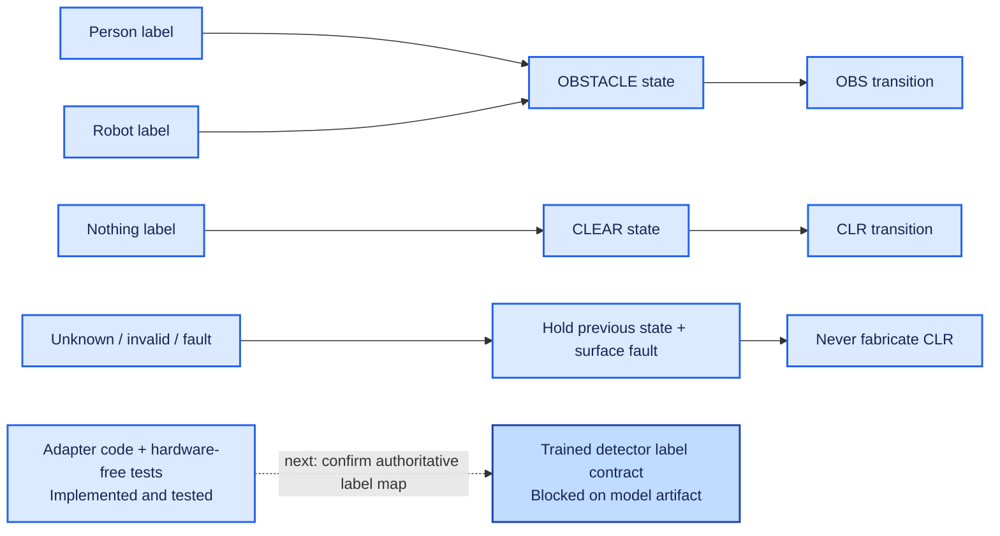

## 5. DSP-to-TX serial boundary

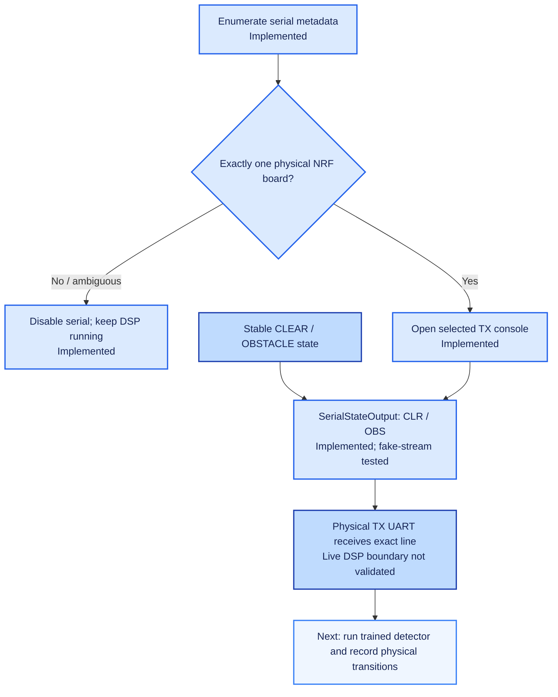

## 6. Transceiver TX role

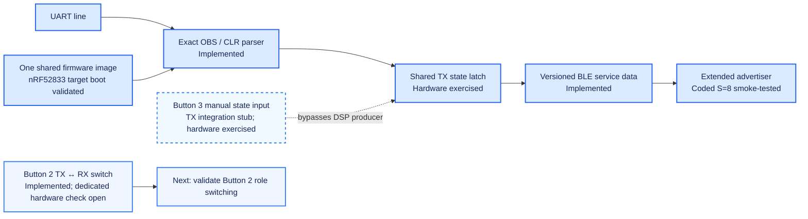

## 7. BLE transport

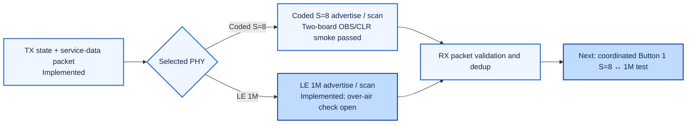

## 8. Transceiver RX role

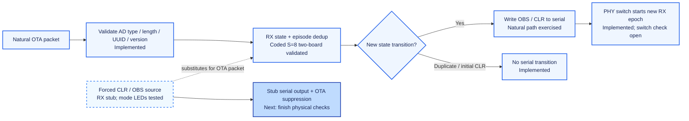

## 9. RX host and logging

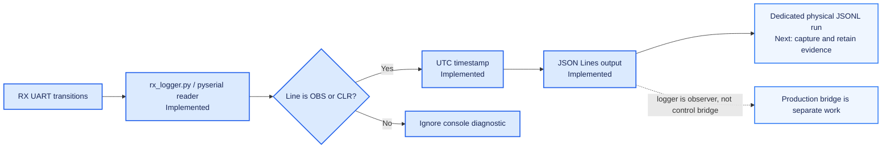

## 10. Serial-to-SSH bridge

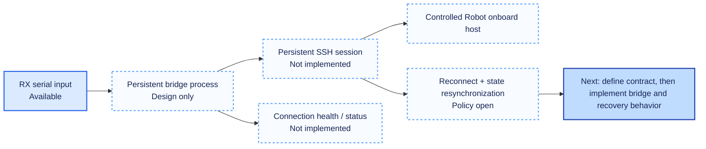

## 11. ROS arbitration

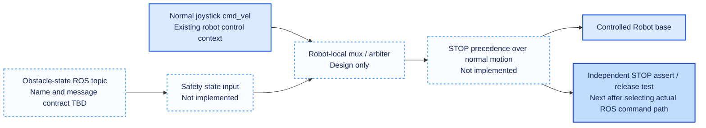

## 12. Distance gate

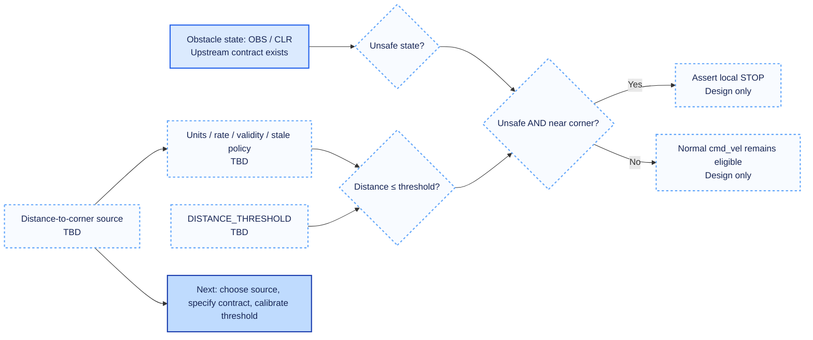

## 13. Controlled Robot and safety

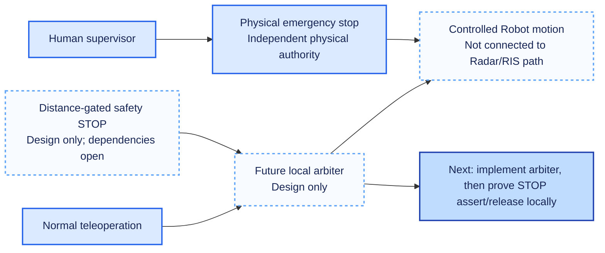

## System validation

```mermaid
flowchart LR
    DSP["DSP hardware-free checks<br/>Passed; real model validation next"] --> BOARD["Single-board nRF52833 bring-up<br/>Passed"]
    BOARD --> LINK["Two-board Coded S=8 OBS/CLR smoke<br/>Passed"]
    LINK --> STUB["RX stub mode LED check<br/>Passed; synthetic serial / OTA suppression next"]
    STUB --> HOST["Physical RX JSONL logger run<br/>Open"]
    HOST --> E2E["End-to-end Radar-to-robot smoke test<br/>Not run"]
    E2E --> ACCEPT["Sensing-to-STOP acceptance<br/>Not achieved"]
    NEXT["Next system milestone: trained detector + label mapping"] -. "unblocks" .-> DSP

    classDef pass fill:#dbeafe,stroke:#1d4ed8,color:#172554,stroke-width:2px;
    classDef work fill:#eff6ff,stroke:#2563eb,color:#172554,stroke-width:2px;
    classDef planned fill:#f8fbff,stroke:#60a5fa,color:#172554,stroke-width:2px,stroke-dasharray:4 4;
    class DSP,BOARD,LINK,STUB pass;
    class HOST,NEXT work;
    class E2E,ACCEPT planned;
```

## Data-flow view

```mermaid
flowchart LR
    PHYS["Physical motion<br/>Experiment stimulus"] --> FRAME["Raw Radar frames<br/>Capture implemented"]
    FRAME --> FEATURES["Range / Doppler / Capon features<br/>Implemented"] --> INFER["CNN-LSTM result<br/>Placeholder; trained model next"]
    INFER --> VOTE["Rolling label<br/>Implemented; trained-output validation next"]
    VOTE --> SEMANTIC["CLEAR / OBSTACLE<br/>Adapter tested; label verification next"]
    SEMANTIC --> SERIAL["CLR / OBS serial<br/>Live TX boundary proof next"]
    SERIAL --> BLE["BLE service data<br/>Coded S=8 smoke passed"]
    BLE --> RX["RX serial transition<br/>S=8 smoke passed"]
    RX --> FUTURE["Bridge → ROS safety state<br/>Design only; bridge implementation next"]

    classDef pass fill:#dbeafe,stroke:#1d4ed8,color:#172554,stroke-width:2px;
    classDef work fill:#eff6ff,stroke:#2563eb,color:#172554,stroke-width:2px;
    classDef blocked fill:#bfdbfe,stroke:#1e40af,color:#172554,stroke-width:2px;
    classDef planned fill:#f8fbff,stroke:#60a5fa,color:#172554,stroke-width:2px,stroke-dasharray:4 4;
    class BLE,RX pass;
    class PHYS,FRAME,FEATURES,VOTE,SEMANTIC work;
    class INFER,SERIAL blocked;
    class FUTURE planned;
```

## Control-authority view

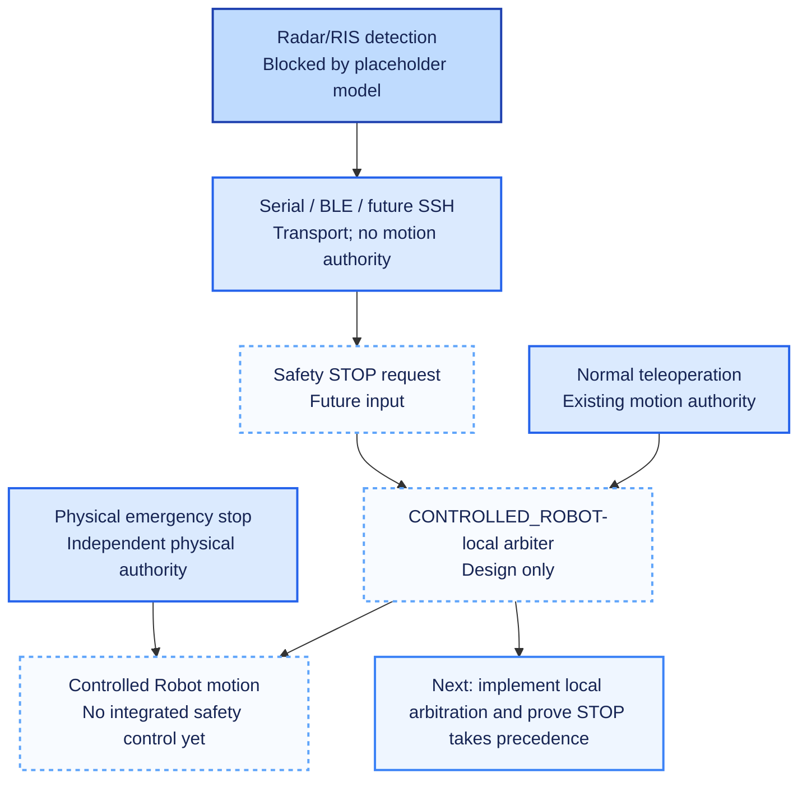

## Deployment view

```mermaid
flowchart LR
    subgraph LAPTOP["Central sensing laptop"]
        ACQ["Radar acquisition + capture<br/>Implemented"] --> DSP["Feature + detector + vote<br/>Placeholder model"] --> ADAPTER["ObstacleStateAdapter<br/>Implemented"] --> SOUT["SerialStateOutput<br/>Implemented; live check open"]
    end
    subgraph TXBOARD["nRF52833 TX role"]
        TXFW["Shared Transceiver image<br/>Boot + TX latch exercised"]
    end
    AIR["BLE Coded S=8<br/>Two-board smoke passed"]
    subgraph RXBOARD["nRF52833 RX role"]
        RXFW["Same Transceiver image<br/>RX transitions validated"]
    end
    subgraph HOST["RX-side host"]
        LOGGER["rx_logger.py<br/>Implemented; physical JSONL run next"]
        BRIDGE["Future control bridge<br/>Design only"]
    end
    subgraph ROBOTPC["CONTROLLED_ROBOT onboard computer"]
        ROS["Future ROS topic + arbiter<br/>TBD / design only"]
    end
    SOUT -->|"USB serial"| TXFW --> AIR --> RXFW -->|"USB serial"| LOGGER
    RXFW -. "future safety input" .-> BRIDGE -. "persistent SSH over Ethernet" .-> ROS
    BRIDGE --> NEXT["Next: implement bridge deployment after input contract is defined"]

    classDef pass fill:#dbeafe,stroke:#1d4ed8,color:#172554,stroke-width:2px;
    classDef work fill:#eff6ff,stroke:#2563eb,color:#172554,stroke-width:2px;
    classDef blocked fill:#bfdbfe,stroke:#1e40af,color:#172554,stroke-width:2px;
    classDef planned fill:#f8fbff,stroke:#60a5fa,color:#172554,stroke-width:2px,stroke-dasharray:4 4;
    class AIR,RXFW pass;
    class ACQ,ADAPTER,TXFW,LOGGER work;
    class DSP,SOUT blocked;
    class BRIDGE,ROS planned;
    class NEXT work;
```

## State-ownership view

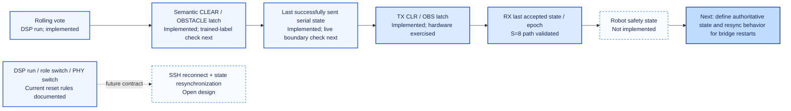

## Failure-containment view

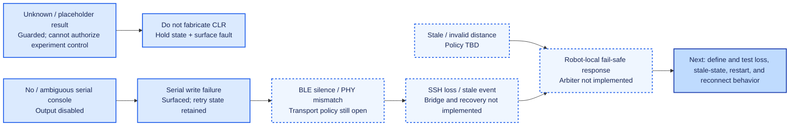

## Written progress detail

The diagrams give the recursive shape and a compact status label for every branch. This written tracker explains what each status means in the current implementation, points to the evidence, and states the next concrete item. A stub result is evidence only for the boundary it substitutes; it does not raise the maturity of the real input path.

### Experiment roles and sensing

#### Experiment roles

**Progress:** `DUMMY_ROBOT` and `CONTROLLED_ROBOT` are the repository's architectural identities, with physical bindings documented. The Dummy Robot supplies the sensed target; it is not part of the Controlled Robot command path. A physical emergency stop and supervised lab procedure remain independent requirements.

**Evidence:** [hardware bindings](../deployment/hardware-bindings.md), [corridor roles](overview.md#physical-experiment-architecture), [robot-role decision](../../../docs/decisions/robot-runtime-0003-robot-role-abstraction-and-hardware-binding.md).

**Next item:** record a repeatable target-motion run together with its experimental setup. This supports sensing/data collection; it does not replace the first control-path milestone below.

#### Radar/RIS sensing and data collection

**Progress:** Radar frame acquisition and capture are implemented in the DSP runtime. The system architecture treats RIS as sensing context at the physical boundary; this repo does not claim that the RIS internals are implemented by the control software. Runtime capture code exists, while a named experiment campaign/data record is not indexed in the repository.

**Evidence:** [sensing subsystem](../subsystems/sensing.md), [`collect_data_realtime.py`](../../../dsp/collect_data_realtime.py), [DSP pipeline diagram](overview.md#figure-4--implemented-dsp-processing-path).

**Next item:** capture and retain a repeatable experiment dataset with the relevant run configuration so detector work can be tied to the data used.

### DSP and semantic state

#### Feature construction and inference

**Progress:** Range/Doppler/MTI/Capon feature construction and the CNN-LSTM adapter exist. The current model is a placeholder, so the detection pipeline's shape exists while its experiment semantics do not. The rolling vote is implemented and software-tested, but it is a temporal vote rather than hysteresis.

**Evidence:** [DSP subsystem](../subsystems/dsp.md), [radar semantic detection maturity](../../features/sensing/radar-semantic-detection.md), [DSP tests](../../../dsp/tests/), [runtime state details](../runtime/state-machines.md#dsp-temporal-state).

**Next item:** install the trained detector and confirm the authoritative output-index to `person` / `robot` / `nothing` mapping. Then re-run the feature, inference, and rolling-vote checks with that artifact.

#### Semantic obstacle-state adapter

**Progress:** `ObstacleStateAdapter` maps person/robot to `OBSTACLE` (`OBS`) and nothing to `CLEAR` (`CLR`). Unknown, invalid, or fault input holds the previous state and surfaces a fault; it must not fabricate `CLR`. The adapter has hardware-free tests, but its control meaning depends on the still-missing trained detector contract.

**Evidence:** [obstacle-state feature](../../features/control/obstacle-state-generation.md), [`obstacle_state.py`](../../../dsp/integration/obstacle_state.py), [semantic latch state diagram](../runtime/state-machines.md#semantic-obstacle-latch).

**Next item:** test the authoritative trained-model labels through the adapter and confirm the intended `OBS`/`CLR` transitions before enabling experiment control.

### Serial boundary and Transceiver

#### Serial discovery and writer

**Progress:** Serial auto-discovery and the `OBS`/`CLR` writer are implemented. Discovery selects only an unambiguous nRF/J-Link interface and leaves serial disabled if it cannot identify a single target. The writer tracks successful state transmission and surfaces failures; the boundary has hardware-free tests, but no live DSP-to-physical-TX run has proven it end to end.

**Evidence:** [automatic serial discovery](../../features/transport/automatic-serial-discovery.md), [`serial_discovery.py`](../../../dsp/integration/serial_discovery.py), [`serial_output.py`](../../../dsp/integration/serial_output.py), [serial integration tests](../../../dsp/tests/test_serial_integration.py).

**Next item:** after detector semantics are valid, run the real acquisition/classification path and record exact `OBS`/`CLR` lines received by the physical TX console.

#### TX role and manual injection stub

**Progress:** One nRF52833 firmware image supports runtime TX/RX roles. The TX UART parser accepts exact `OBS`/`CLR` commands into a shared state latch, and the current latch/LED behavior has been hardware-exercised. Button 3 is an integration stub: it writes the same latch manually and bypasses Radar/DSP serial production. Dedicated Button-2 role-switch validation remains open.

**Evidence:** [Transceiver operation](../../../firmware/README.md), [shared TX state hardware check](../../../firmware/validation/2026-10-02-shared-tx-state-led-test.md), [TX manual injection feature](../../features/transport/tx-manual-state-injection.md).

**Next item:** perform the dedicated Button-2 TX↔RX hardware check. Continue to label Button-3-driven results as stub-driven evidence, not as a live DSP pass.

#### BLE transport

**Progress:** BLE carries compact versioned `OBS`/`CLR` service data. The default Coded S=8 path passed a two-board smoke test, including repeated-state suppression and UART integration. LE 1M support exists, but coordinated over-air PHY switching and further range/reliability characterization remain open.

**Evidence:** [wireless transport subsystem](../subsystems/wireless-transport.md), [two-board smoke evidence](../../../firmware/validation/2026-09-28-two-board-smoke-test.md), [runtime transceiver modes](../../features/transport/runtime-transceiver-modes.md).

**Next item:** exercise coordinated Button-1 S=8↔1M switching on both boards, then record any experiment-required link reliability result.

#### RX role and forced-state stub

**Progress:** Natural RX validates the packet contract and deduplicates state transitions. The Coded S=8 two-board smoke test passed. RX Forced CLR/OBS modes are a separate stub that feeds synthetic state into the RX processing path; their mode/LED cycle passed on hardware, but synthetic serial output and suppression of natural OTA packets while forced remain open.

**Evidence:** [RX state path](overview.md#figure-6--rx-filtering-and-episode-semantics), [two-board smoke evidence](../../../firmware/validation/2026-09-28-two-board-smoke-test.md), [RX stub hardware record](../../../firmware/validation/2026-10-02-rx-stub-mode-test.md), [RX stub feature](../../features/transport/rx-reception-stubs.md).

**Next item:** verify synthetic `OBS`/`CLR` serial output and real packet suppression in forced modes. Separately test natural receive behavior across remaining PHY/runtime checks.

### RX host and Controlled Robot

#### RX serial host logger

**Progress:** `rx_logger.py` reads `OBS`/`CLR`, timestamps events in UTC, and can emit JSONL. It is an observer/logger and is not the production robot control bridge. The code exists; a dedicated physical JSONL evidence run remains open.

**Evidence:** [`rx_logger.py`](../../../firmware/tools/rx_logger.py), [system validation evidence](../../validation/system-validation.md#firmware-and-ble-evidence), [architecture's RX host boundary](overview.md#9-rx-host-and-logging).

**Next item:** run the logger on the physical RX console with JSONL output enabled and retain the output as dated evidence.

#### Serial-to-SSH bridge

**Progress:** The accepted architecture is for an RX-side process to read serial and forward state over a persistent SSH session. No production bridge, session-health reporting, reconnect state machine, or resynchronization behavior is implemented.

**Evidence:** [robot-control subsystem](../subsystems/robot-control.md), [integration plan Stage 4](integration-plan.md#stage-4--implement-the-controlled-robot-bridge), [accepted bridge decision](../../../docs/decisions/robot-ros-0001-jackal-control-serial-ssh-ros.md).

**Next item:** define the bridge's input/output contract and reconnect/resynchronization behavior, then implement the persistent process without assigning it motion-policy authority.

#### ROS topic and local arbitration

**Progress:** The exact ROS topic and message contract are TBD. Local STOP precedence is design-only; no arbiter/mux implementation or command configuration exists. Final motion authority is intended to remain local to `CONTROLLED_ROBOT`.

**Evidence:** [interfaces](../interactions/interfaces.md), [Controlled Robot STOP feature](../../features/control/controlled-robot-stop.md), [integration plan Stage 5](integration-plan.md#stage-5--implement-local-ros-arbitration).

**Next item:** inspect the existing robot command path, choose and document the safety-state interface, then implement a local arbiter and independently test STOP assertion/release against normal `cmd_vel`.

#### Distance gate

**Progress:** The intended rule is `unsafe AND distance_to_corner <= DISTANCE_THRESHOLD -> STOP`. The distance source, units/update rate, validity/staleness behavior, calibration, and threshold are all TBD; the boolean gate itself is design only.

**Evidence:** [distance-gated STOP feature](../../features/control/distance-gated-stop.md), [integration plan Stage 6](integration-plan.md#stage-6--implement-distance-gating).

**Next item:** select a source, define and calibrate its data contract and threshold, then implement the gate inside the robot-local arbitration path.

#### Controlled Robot and independent safety

**Progress:** The Controlled Robot role and physical binding are documented, but no complete sensing-to-motion software path is integrated. Software STOP remains an experiment feature and does not replace the physical emergency stop or human-supervised lab procedure.

**Evidence:** [control authority view](overview.md#control-authority-view), [system validation robot evidence](../../validation/system-validation.md#robot-side-evidence), [physical safety boundary](overview.md#13-controlled-robot-and-physical-safety-boundary).

**Next item:** after the local arbiter exists, prove STOP assertion/release on the robot command path before connecting Radar/RIS input.

### Validation and next-item order

#### Existing validation levels

**Progress:** DSP hardware-free checks exist; nRF52833 single-board bring-up passed; the two-board Coded S=8 `OBS`/`CLR` smoke test passed; the RX stub LED/mode check passed partially. These passes prove only their named boundaries. There is no complete Radar-to-Controlled-Robot smoke test or end-to-end acceptance run.

**Evidence:** [system validation ladder](../../validation/system-validation.md), [single-board bring-up](../../../firmware/validation/2026-09-28-single-board-bringup.md), [two-board test](../../../firmware/validation/2026-09-28-two-board-smoke-test.md), [RX stub test](../../../firmware/validation/2026-10-02-rx-stub-mode-test.md).

**Next item:** do not label a subsystem or stub pass as full-system progress. Add dated evidence as each boundary below is closed.

#### Dependency-ordered next items

1. **Train/install the detector and authoritative label mapping.** This is the first open integration-plan stage and blocks experiment-valid detection.
2. **Prove live DSP → physical TX serial.** Use controlled transitions from real inference after step 1.
3. **Close Transceiver checks.** Button-2 role switching, coordinated PHY switching, RX stub output/suppression, and physical JSONL logging.
4. **Implement the RX serial-to-SSH bridge.** Define health, reconnect, and resynchronization behavior.
5. **Select the ROS interface and implement local STOP arbitration.** Test the priority locally before sensing integration.
6. **Select/calibrate distance input and threshold.** Define stale/invalid distance behavior.
7. **Exercise failures and perform end-to-end acceptance.** Include loss, stale state, restart/reconnect, latency, and physical E-stop supervision.

**Source of order:** [system integration plan](integration-plan.md).
