# System Progress Map

## Contents

- [Purpose](#purpose)
- [Flow chart](#flow-chart)
- [How to read the boundaries](#how-to-read-the-boundaries)
- [Repository references](#repository-references)

## Purpose

This page gives a compact progress view of the Radar/RIS-to-Controlled-Robot path. It groups work by the system boundaries discussed by the team and keeps real-path progress distinct from test stubs and planned robot integration.

## Flow chart

```mermaid
flowchart LR
    subgraph RADAR["Radar / DSP side"]
        DETECT["Detect obstacle<br/>Pipeline implemented; classifier is a placeholder"]
        SERIAL_TX["Write OBS / CLR to serial<br/>Implemented; live DSP-to-TX hardware check open"]
        DETECT --> SERIAL_TX
    end

    subgraph TRANSCEIVER["Transceiver side — one firmware image, runtime TX / RX roles"]
        OTA_TX["OTA Tx<br/>Real BLE advertiser"]
        TX_STUB["Tx stub<br/>Button 3 manual OBS / CLR input"]
        OTA_RX["OTA Rx<br/>Natural BLE receive"]
        RX_STUB["Rx stub<br/>Forced CLR / OBS input"]
        RX_PROC["RX state processing<br/>Deduplication and serial transition"]
        SERIAL_RX["Write RX state to serial"]

        OTA_TX -->|"BLE OBS / CLR"| OTA_RX
        OTA_RX --> RX_PROC
        RX_STUB -. "substitutes for OTA receive" .-> RX_PROC
        RX_PROC --> SERIAL_RX
        TX_STUB -. "substitutes for DSP serial input" .-> OTA_TX
    end

    subgraph ROBOT["Controlled Robot side"]
        SSH["SSH bridge reads RX serial<br/>Design only; script not implemented"]
        TOPIC["ROS obstacle-state topic<br/>Name and interface TBD"]
        PRIORITY["Topic priority / local STOP arbitration<br/>Design only; not implemented"]
        SSH --> TOPIC --> PRIORITY
    end

    SERIAL_TX --> OTA_TX
    SERIAL_RX --> SSH

    subgraph SYSTEM["System-level activities and validation"]
        DATA["Radar data collection<br/>Capture code exists; experiment campaign evidence is separate"]
        SMOKE["System smoke tests<br/>NRF two-board smoke test passed; end-to-end system smoke test pending"]
    end

    DATA -. "radar frames" .-> DETECT
    OTA_TX -. "transport validation" .-> SMOKE
    SSH -. "end-to-end validation awaits bridge" .-> SMOKE

    classDef implemented fill:#dbeafe,stroke:#2563eb,color:#172554,stroke-width:2px;
    classDef blocked fill:#bfdbfe,stroke:#1d4ed8,color:#172554,stroke-width:2px;
    classDef stub fill:#eff6ff,stroke:#3b82f6,color:#172554,stroke-width:2px,stroke-dasharray:5 5;
    classDef planned fill:#f8fbff,stroke:#60a5fa,color:#172554,stroke-width:2px,stroke-dasharray:3 3;
    classDef validation fill:#e0f2fe,stroke:#0284c7,color:#0c4a6e,stroke-width:2px;

    class DATA,OTA_TX,OTA_RX,RX_PROC,SERIAL_RX implemented;
    class DETECT,SERIAL_TX blocked;
    class TX_STUB,RX_STUB stub;
    class SSH,TOPIC,PRIORITY planned;
    class SMOKE validation;
```

## How to read the boundaries

- **Radar / DSP:** acquisition and the serial writer exist. The current classifier is still a placeholder, so its labels are not valid experiment detections; the live DSP-to-physical-TX boundary also remains unvalidated.
- **Transceiver:** TX and RX are roles in one firmware image. The OTA path is the real transport path. TX manual injection and RX forced-state modes are stubs that substitute for different inputs; stub checks do not validate the producer they replace.
- **Controlled Robot:** the accepted design is to read RX serial over a persistent SSH bridge, publish obstacle state to ROS, and enforce STOP priority locally. The bridge and arbitration are not implemented, and the topic contract is still open.
- **System level:** radar capture code exists, and the NRF two-board transport smoke test passed. The repository does not yet contain a complete Radar-to-robot system smoke test or end-to-end acceptance run.

## Repository references

- [Current system state](docs/architecture/system/current-state.md)
- [System integration plan](docs/architecture/system/integration-plan.md)
- [Stub and simulation boundaries](docs/architecture/runtime/stubs-and-simulation.md)
- [RX reception stubs](docs/features/transport/rx-reception-stubs.md)
- [TX manual state injection](docs/features/transport/tx-manual-state-injection.md)
- [System validation evidence](docs/validation/system-validation.md)
