# System Progress Map

## Contents

- [Purpose and tracking rules](#purpose-and-tracking-rules)
- [Top-level system diagram](#top-level-system-diagram)
- [Next system item](#next-system-item)
- [Recursive progress breakdown](#recursive-progress-breakdown)
  - [Experiment scene and sensing](#experiment-scene-and-sensing)
  - [DSP and semantic state](#dsp-and-semantic-state)
  - [DSP-to-Transceiver serial boundary](#dsp-to-transceiver-serial-boundary)
  - [Transceiver TX, BLE, and RX](#transceiver-tx-ble-and-rx)
  - [RX host and Controlled Robot](#rx-host-and-controlled-robot)
  - [System validation](#system-validation)
- [System diagram crosswalk](#system-diagram-crosswalk)
- [Repository references](#repository-references)

## Purpose and tracking rules

This page tracks the Radar/RIS-to-Controlled-Robot system recursively. Each parent boundary is split into its implementation parts; each part records its maturity, repository evidence, and next item. The diagram crosswalk maps every system architecture diagram to the relevant progress breakdown.

Statuses describe the specific part in that row. **Implemented** means code or configuration exists; **Validated** requires direct evidence for that behavior; **Blocked** means a missing prerequisite prevents experiment use; **Stub** means a test substitute; **Design only** and **TBD** are not implemented progress.

## Top-level system diagram

```mermaid
flowchart LR
    subgraph SCENE["Experiment scene and sensing"]
        TARGET["DUMMY_ROBOT / physical scene<br/>Role and hardware binding selected"]
        CAPTURE["Radar data capture<br/>Implemented"]
        TARGET --> CAPTURE
    end

    subgraph DSP["DSP and semantic state"]
        FEATURES["Feature construction<br/>Implemented"]
        MODEL["CNN-LSTM detector<br/>Placeholder; blocked for experiment control"]
        VOTE["Rolling vote<br/>Implemented; software-tested"]
        ADAPTER["Obstacle-state adapter<br/>Implemented; software-tested"]
        CAPTURE --> FEATURES --> MODEL --> VOTE --> ADAPTER
    end

    subgraph TX["DSP-to-Transceiver and TX role"]
        SERIAL_TX["Serial discovery / OBS-CLR writer<br/>Implemented; live boundary unvalidated"]
        TX_ROLE["TX parser and state latch<br/>Implemented; hardware exercised"]
        ADVERT["BLE advertiser, Coded S=8<br/>Two-board smoke test passed"]
        TX_STUB["TX manual input stub<br/>Hardware exercised; bypasses DSP"]
        ADAPTER --> SERIAL_TX --> TX_ROLE --> ADVERT
        TX_STUB -. "substitutes for DSP serial input" .-> TX_ROLE
    end

    subgraph RX["BLE and RX role"]
        SCAN["Natural BLE receive and dedup<br/>Coded S=8 smoke test passed"]
        RX_PROCESS["RX state processing<br/>Natural and synthetic inputs share path"]
        RX_STUB["Forced RX state stub<br/>Mode LEDs tested; output checks open"]
        RX_SERIAL["RX serial output"]
        LOGGER["RX host logger<br/>Implemented; physical JSONL run open"]
        ADVERT --> SCAN --> RX_PROCESS --> RX_SERIAL --> LOGGER
        RX_STUB -. "substitutes for natural BLE input" .-> RX_PROCESS
    end

    subgraph ROBOT["Controlled Robot integration"]
        BRIDGE["Serial-to-SSH bridge<br/>Design only"]
        TOPIC["ROS topic contract<br/>TBD"]
        ARBITER["Local STOP priority / arbitration<br/>Design only"]
        DISTANCE["Distance source and threshold<br/>TBD"]
        MOTION["Controlled Robot motion response<br/>End-to-end path not implemented"]
        LOGGER -. "future control input" .-> BRIDGE --> TOPIC --> ARBITER --> MOTION
        DISTANCE --> ARBITER
    end

    classDef validated fill:#dbeafe,stroke:#2563eb,color:#172554,stroke-width:2px;
    classDef implemented fill:#eff6ff,stroke:#3b82f6,color:#172554,stroke-width:2px;
    classDef blocked fill:#bfdbfe,stroke:#1d4ed8,color:#172554,stroke-width:2px;
    classDef stub fill:#f8fbff,stroke:#60a5fa,color:#172554,stroke-width:2px,stroke-dasharray:5 5;
    classDef planned fill:#f8fafc,stroke:#64748b,color:#334155,stroke-width:2px,stroke-dasharray:3 3;

    class ADVERT,SCAN validated;
    class TARGET,CAPTURE,FEATURES,VOTE,ADAPTER,TX_ROLE,RX_PROCESS,RX_SERIAL,LOGGER implemented;
    class MODEL,SERIAL_TX blocked;
    class TX_STUB,RX_STUB stub;
    class BRIDGE,TOPIC,ARBITER,DISTANCE,MOTION planned;
```

## Next system item

**Install and validate the trained detector and its authoritative label mapping.** This is Integration Plan Stage 1 and is the first dependency in the remaining end-to-end path. After its semantics are trustworthy, validate the live DSP-to-physical-TX serial boundary (Stage 2), then close the open Transceiver host checks (Stage 3).

## Recursive progress breakdown

### Experiment scene and sensing

| Part | Progress | Evidence | Next item |
|---|---|---|---|
| Experiment roles | `Selected` — `DUMMY_ROBOT` supplies the physical target; `CONTROLLED_ROBOT` is the motion subject. Current hardware bindings are documented. | [Hardware bindings](../deployment/hardware-bindings.md), [experiment architecture](overview.md#physical-experiment-architecture) | Use the selected roles consistently in the next recorded run. |
| Radar/RIS acquisition | `Implemented` — sensing/acquisition and raw-frame capture exist. | [Sensing subsystem](../subsystems/sensing.md), [`collect_data_realtime.py`](../../../dsp/collect_data_realtime.py) | Capture and retain the experiment dataset with its run configuration; no campaign record is indexed yet. |
| Radar/RIS semantic detection | `Implemented + Placeholder + Blocked` — the pipeline produces labels, but the configured CNN-LSTM is not the experiment-trained detector. | [Radar semantic detection](../../features/sensing/radar-semantic-detection.md) | Install the trained detector and authoritative person/robot/nothing mapping; validate against the experiment data. |

### DSP and semantic state

| Part | Progress | Evidence | Next item |
|---|---|---|---|
| Range/Doppler/MTI/Capon feature construction | `Implemented` — processing code and software checks exist. | [`realtime_classifier.py`](../../../dsp/realtime_classifier.py), [DSP docs](../../../dsp/docs/) | Re-run the feature and inference path with the trained detector artifact. |
| CNN-LSTM inference adapter | `Implemented + Placeholder + Blocked` — interface shape exists; current model semantics are not valid for control. | [Current system state](current-state.md), [`dsp/README.md`](../../../dsp/README.md) | Replace placeholder weights/configuration and verify output-index to label mapping. |
| Rolling vote | `Implemented + Software-tested` — up to five predictions are stabilized; this is a vote, not hysteresis. | [`dsp/tests/`](../../../dsp/tests/), [DSP state machines](../runtime/state-machines.md#dsp-temporal-state) | Verify stable and transition behavior using real detector outputs; no separate algorithm change is currently specified. |
| Obstacle-state adapter | `Implemented + Hardware-free tested` — person/robot map to `OBS`, nothing maps to `CLR`, and unknown/fault holds state. | [Obstacle-state generation](../../features/control/obstacle-state-generation.md), [`obstacle_state.py`](../../../dsp/integration/obstacle_state.py) | Check the mapping with the trained detector labels before enabling experiment control. |

### DSP-to-Transceiver serial boundary

| Part | Progress | Evidence | Next item |
|---|---|---|---|
| Serial discovery | `Implemented + Metadata-tested` — selects only an unambiguous nRF/J-Link console; ambiguity disables output. | [`serial_discovery.py`](../../../dsp/integration/serial_discovery.py), [automatic discovery](../../features/transport/automatic-serial-discovery.md) | Confirm the intended physical console is selected during a live DSP run. |
| `OBS`/`CLR` serial writer | `Implemented + Hardware-free tested` — framing, transition sync, and retry behavior exist. | [`serial_output.py`](../../../dsp/integration/serial_output.py), [DSP integration tests](../../../dsp/tests/test_serial_integration.py) | With the trained detector, observe exact transitions arriving at the physical TX board. |
| Live DSP → physical TX boundary | `Open validation` — no complete hardware run has proved semantic DSP output driving TX. | [System validation](../../validation/system-validation.md#not-yet-proven), [integration plan Stage 2](integration-plan.md#stage-2--close-the-dsp-to-tx-hardware-boundary) | Run and record controlled `OBS`/`CLR` transitions through the real acquisition and classifier path. |

### Transceiver TX, BLE, and RX

| Part | Progress | Evidence | Next item |
|---|---|---|---|
| Shared firmware image and target | `Implemented + Correct-target boot validated` — same nRF52833 image supports runtime TX/RX roles. | [`firmware/README.md`](../../../firmware/README.md), [single-board bring-up](../../../firmware/validation/2026-09-28-single-board-bringup.md) | Keep using the verified `nrf52833dk/nrf52833` target for subsequent hardware checks. |
| TX serial parser and shared state latch | `Implemented + Hardware-exercised` — serial and Button 3 update the same `OBS`/`CLR` state. | [Shared TX state LED test](../../../firmware/validation/2026-10-02-shared-tx-state-led-test.md) | Validate the separate Button-2 TX↔RX role switch on hardware. |
| TX manual injection | `Implemented + Stub + Hardware-exercised` — Button 3 drives the TX latch without reading Radar/DSP. | [TX manual state injection](../../features/transport/tx-manual-state-injection.md) | Use only to isolate TX/BLE/downstream checks; it does not close the live DSP boundary. |
| BLE Coded S=8 path | `Implemented + Two-board validated` — repeated `OBS`/`CLR` delivery and RX dedup passed on two boards. | [Two-board smoke test](../../../firmware/validation/2026-09-28-two-board-smoke-test.md) | Complete remaining runtime-mode and reliability checks needed for the chosen experiment setup. |
| BLE LE 1M and PHY switching | `Implemented; dedicated over-air validation open`. | [Transceiver runtime modes](../../features/transport/runtime-transceiver-modes.md), [integration plan Stage 3](integration-plan.md#stage-3--finish-nrf-host-side-validation) | Run coordinated Button-1 S=8↔1M switching with both boards. |
| Natural RX filtering and episode dedup | `Implemented + Coded S=8 two-board validated` — duplicate states are suppressed and transitions are emitted. | [Two-board smoke test](../../../firmware/validation/2026-09-28-two-board-smoke-test.md), [RX state machine](../runtime/state-machines.md#transceiver-rx-state) | Validate behavior across the alternate PHY and characterize reliability for the experiment. |
| RX forced-state stub | `Implemented + Stub + Partially hardware-validated` — mode and LED cycle passed; synthetic serial output and natural-packet suppression remain open. | [RX stub validation](../../../firmware/validation/2026-10-02-rx-stub-mode-test.md), [RX reception stubs](../../features/transport/rx-reception-stubs.md) | Complete the synthetic `OBS`/`CLR` serial check and confirm OTA packets are suppressed while forced. |
| RX serial output and host logger | `Implemented`; two-board serial transition path exercised; dedicated physical JSONL logger run remains open. | [`rx_logger.py`](../../../firmware/tools/rx_logger.py), [system validation](../../validation/system-validation.md#firmware-and-ble-evidence) | Run the physical RX logger with JSONL output and preserve the capture. |

### RX host and Controlled Robot

| Part | Progress | Evidence | Next item |
|---|---|---|---|
| RX serial consumer for robot control | `Design only` — the logger exists, but it is not the production control bridge. | [RX host and logging](overview.md#9-rx-host-and-logging), [robot-control subsystem](../subsystems/robot-control.md) | Define the bridge process boundary and consume RX serial transitions without conflating it with the logger. |
| Persistent serial-to-SSH bridge | `Design only` — no bridge, persistent session, reconnect FSM, or state resynchronization implementation exists. | [Integration plan Stage 4](integration-plan.md#stage-4--implement-the-controlled-robot-bridge), [bridge decision](../../../docs/decisions/robot-ros-0001-jackal-control-serial-ssh-ros.md) | Implement persistent SSH transport, observable connection health, and reconnect/resynchronization behavior. |
| ROS obstacle-state topic | `TBD` — exact topic names and message contract are not selected. | [Interfaces](../interactions/interfaces.md), [current system state](current-state.md#tbd-items) | Inspect the actual Controlled Robot ROS command path and select/document the safety-state interface. |
| Local STOP priority / ROS arbitration | `Design only` — no local arbiter or command configuration exists. | [Controlled Robot STOP](../../features/control/controlled-robot-stop.md), [integration plan Stage 5](integration-plan.md#stage-5--implement-local-ros-arbitration) | Implement and independently test STOP precedence over normal `cmd_vel`. |
| Distance-to-corner input and gate | `TBD` — source, units, validity/staleness policy, calibration, and threshold are unselected. | [Distance-gated STOP](../../features/control/distance-gated-stop.md), [integration plan Stage 6](integration-plan.md#stage-6--implement-distance-gating) | Select the distance source and define its contract and calibrated `DISTANCE_THRESHOLD`. |
| Controlled Robot command response | `Not integrated` — no system path presently connects Radar/RIS state to robot motion. | [Control-authority model](overview.md#control-authority-view), [system validation](../../validation/system-validation.md#robot-side-evidence) | After bridge and arbiter exist, prove STOP assertion/release locally before connecting Radar/RIS. |
| Loss, stale state, and recovery policy | `Open design` — BLE/serial/SSH loss and stale distance do not yet have complete end-to-end behavior. | [Failure modes](../safety/failure-modes.md), [integration plan Stage 7](integration-plan.md#stage-7--validate-failures-before-the-full-demo) | Specify and test each failure/reconnect behavior before end-to-end acceptance. |

### System validation

| Part | Progress | Evidence | Next item |
|---|---|---|---|
| DSP hardware-free checks | `Implemented + Software-tested` — capture lifecycle, voting, and serial integration logic have test coverage. | [System validation — DSP evidence](../../validation/system-validation.md#dsp-evidence) | Repeat relevant checks after replacing the placeholder model and label contract. |
| Transceiver bring-up | `Validated` — two nRF52833 boards booted and target UART/GPIO behavior was observed. | [Single-board bring-up](../../../firmware/validation/2026-09-28-single-board-bringup.md) | Complete the open role/PHY and RX host checks listed above. |
| Two-board transport smoke test | `Passed` — Coded S=8 `OBS`/`CLR`, UART integration, and duplicate suppression. | [Two-board smoke evidence](../../../firmware/validation/2026-09-28-two-board-smoke-test.md) | Extend evidence to the remaining runtime modes and physical RX logger. |
| End-to-end system smoke test | `Not run` — no complete sensing-to-Controlled-Robot STOP acceptance run exists. | [System validation — acceptance](../../validation/system-validation.md#end-to-end-acceptance-record) | Run only after trained semantics, live TX boundary, bridge, arbiter, distance gate, and failure policy are complete. |

## System diagram crosswalk

Each diagram in the system architecture is covered by one or more recursive progress sections above. The next item column names the current work remaining for the behavior each diagram represents; it does not imply the diagram itself is an implementation.

### Architecture overview figures

| Diagram | Decomposition tracked in | Current next item |
|---|---|---|
| [Figure 1 — whole-system context](overview.md#figure-1--whole-system-context) | All sections below | Install and validate the trained detector and label mapping. |
| [Figure 2 — corridor roles](overview.md#figure-2--corridor-roles) | [Experiment scene and sensing](#experiment-scene-and-sensing) | Capture a repeatable, documented experiment run. |
| [Figure 3 — functional blocks](overview.md#figure-3--functional-blocks) | [DSP and semantic state](#dsp-and-semantic-state), [Transceiver TX, BLE, and RX](#transceiver-tx-ble-and-rx), [RX host and Controlled Robot](#rx-host-and-controlled-robot) | Close the upstream detector prerequisite before downstream integration. |
| [Figure 4 — DSP processing](overview.md#figure-4--implemented-dsp-processing-path) | [DSP and semantic state](#dsp-and-semantic-state) | Replace placeholder inference and verify the real label mapping. |
| [Semantic obstacle adapter diagram](overview.md#4-semantic-obstacle-state-adapter) | [DSP and semantic state](#dsp-and-semantic-state) | Check person/robot/nothing mapping against the trained detector. |
| [Serial discovery decision diagram](overview.md#5-serial-discovery-and-dsp-to-tx-transport) | [DSP-to-Transceiver serial boundary](#dsp-to-transceiver-serial-boundary) | Confirm selection of the intended physical TX console in a live DSP run. |
| [Figure 5 — TX responsibility](overview.md#figure-5--tx-responsibility) | [Transceiver TX, BLE, and RX](#transceiver-tx-ble-and-rx) | Validate the Button-2 role switch; live DSP input remains a separate boundary. |
| [BLE state transport](overview.md#7-ble-state-transport) | [Transceiver TX, BLE, and RX](#transceiver-tx-ble-and-rx) | Validate coordinated S=8↔1M switching over the air. |
| [Figure 6 — RX filtering](overview.md#figure-6--rx-filtering-and-episode-semantics) | [Transceiver TX, BLE, and RX](#transceiver-tx-ble-and-rx) | Finish RX stub-output checks and remaining real-path validation. |
| [RX host and logging](overview.md#9-rx-host-and-logging) | [Transceiver TX, BLE, and RX](#transceiver-tx-ble-and-rx), [RX host and Controlled Robot](#rx-host-and-controlled-robot) | Record a physical RX logger JSONL run; define the separate control bridge. |
| [Controlled Robot bridge](overview.md#10-controlled-robot-side-serial-to-ssh-bridge) | [RX host and Controlled Robot](#rx-host-and-controlled-robot) | Implement the persistent bridge and its reconnect/resync behavior. |
| [Local ROS arbitration](overview.md#11-controlled-robot-local-ros-arbitration) | [RX host and Controlled Robot](#rx-host-and-controlled-robot) | Select the ROS interface, then implement and test local STOP precedence. |
| [Distance gate](overview.md#12-distance-to-corner-gate) | [RX host and Controlled Robot](#rx-host-and-controlled-robot) | Select and calibrate the distance source and threshold. |
| [Controlled Robot safety boundary](overview.md#13-controlled-robot-and-physical-safety-boundary) | [RX host and Controlled Robot](#rx-host-and-controlled-robot) | Prove software STOP assertion/release while preserving physical E-stop supervision. |
| [Figure 7 — data transformations](overview.md#figure-7--data-transformations) | [DSP and semantic state](#dsp-and-semantic-state), [DSP-to-Transceiver serial boundary](#dsp-to-transceiver-serial-boundary), [Transceiver TX, BLE, and RX](#transceiver-tx-ble-and-rx) | Validate the trained semantic transformation through the physical TX boundary. |
| [Figure 8 — control authority](overview.md#figure-8--who-may-actually-command-motion) | [RX host and Controlled Robot](#rx-host-and-controlled-robot) | Implement and test the robot-local arbiter; transport alone grants no motion authority. |
| [Figure 9 — deployment](overview.md#figure-9--software-and-hardware-placement) | [DSP-to-Transceiver serial boundary](#dsp-to-transceiver-serial-boundary), [Transceiver TX, BLE, and RX](#transceiver-tx-ble-and-rx), [RX host and Controlled Robot](#rx-host-and-controlled-robot) | Implement the bridge after the upstream data path is experiment-valid. |
| [Figure 10 — state ownership](overview.md#figure-10--distributed-state) | [DSP and semantic state](#dsp-and-semantic-state), [Transceiver TX, BLE, and RX](#transceiver-tx-ble-and-rx), [RX host and Controlled Robot](#rx-host-and-controlled-robot) | Define state resynchronization and stale-state handling in the future bridge. |
| [Figure 11 — failure containment](overview.md#figure-11--where-failures-should-be-contained) | [RX host and Controlled Robot](#rx-host-and-controlled-robot), [System validation](#system-validation) | Specify and test serial, BLE, SSH, restart, and stale-distance failure behavior. |
| [Experiment-scene role diagram](overview.md#1-dummy-robot-and-experiment-scene) | [Experiment scene and sensing](#experiment-scene-and-sensing) | Capture a repeatable, documented target-motion run. |
| [Radar/RIS sensing boundary diagram](overview.md#2-radarris-sensing-boundary) | [Experiment scene and sensing](#experiment-scene-and-sensing) | Retain a dataset with its run configuration and sensing setup. |
| [RX state processing diagram](overview.md#figure-6--rx-filtering-and-episode-semantics) | [Transceiver TX, BLE, and RX](#transceiver-tx-ble-and-rx) | Finish synthetic output checks; test natural RX on remaining modes. |
| [Bridge diagram](overview.md#10-controlled-robot-side-serial-to-ssh-bridge) | [RX host and Controlled Robot](#rx-host-and-controlled-robot) | Implement the bridge after upstream input contract validation. |
| [ROS arbitration diagram](overview.md#11-controlled-robot-local-ros-arbitration) | [RX host and Controlled Robot](#rx-host-and-controlled-robot) | Select the command interface and implement STOP precedence locally. |
| [Distance-gate diagram](overview.md#12-distance-to-corner-gate) | [RX host and Controlled Robot](#rx-host-and-controlled-robot) | Select the source and calibrate the threshold. |
| [Physical safety boundary diagram](overview.md#13-controlled-robot-and-physical-safety-boundary) | [RX host and Controlled Robot](#rx-host-and-controlled-robot) | Validate software STOP while retaining the independent physical E-stop. |

### UML and cross-cutting diagrams

| Diagram | Decomposition tracked in | Current next item |
|---|---|---|
| [UML 1 — conceptual components](views.md#uml-view-1--conceptual-classescomponents) | All recursive progress sections | Advance from sensing prerequisites toward the robot-side design blocks. |
| [UML 2 — implemented software structure](views.md#uml-view-2--implemented-dsp-and-transport-side-software) | [DSP and semantic state](#dsp-and-semantic-state), [Transceiver TX, BLE, and RX](#transceiver-tx-ble-and-rx) | Validate trained inference through the live TX boundary. |
| [UML 3 — deployment](views.md#uml-view-3--deployment) | [Experiment scene and sensing](#experiment-scene-and-sensing), [DSP-to-Transceiver serial boundary](#dsp-to-transceiver-serial-boundary), [Transceiver TX, BLE, and RX](#transceiver-tx-ble-and-rx), [RX host and Controlled Robot](#rx-host-and-controlled-robot) | Implement and validate the absent bridge deployment. |
| [UML 4 — obstacle episode](views.md#uml-view-4--obstacle-episode) | [DSP and semantic state](#dsp-and-semantic-state), [Transceiver TX, BLE, and RX](#transceiver-tx-ble-and-rx) | Drive the episode from validated Radar semantics, then verify the physical TX input. |
| [UML 5 — clear transition](views.md#uml-view-5--clear-transition) | [DSP and semantic state](#dsp-and-semantic-state), [Transceiver TX, BLE, and RX](#transceiver-tx-ble-and-rx) | Verify `CLR` semantics with the trained detector and full upstream path. |
| [UML 6 — guarded startup](views.md#uml-view-6--guarded-startup) | [DSP-to-Transceiver serial boundary](#dsp-to-transceiver-serial-boundary) | Confirm automatic physical port selection and experiment guard in live operation. |
| [UML 7 — TX to RX](views.md#uml-view-7--tx-to-rx) | [Transceiver TX, BLE, and RX](#transceiver-tx-ble-and-rx) | Complete dedicated Button-2 hardware validation. |
| [UML 8 — serial write retry](views.md#uml-view-8--implemented-retry-semantics) | [DSP-to-Transceiver serial boundary](#dsp-to-transceiver-serial-boundary) | Validate retry path at the live physical TX boundary. |
| [UML 9 — future SSH loss](views.md#uml-view-9--required-design-behavior-not-implemented) | [RX host and Controlled Robot](#rx-host-and-controlled-robot) | Define loss, retry, and resynchronization policy as part of bridge implementation. |
| [UML 10 — role and PHY state](views.md#uml-view-10--role-and-phy-orthogonality) | [Transceiver TX, BLE, and RX](#transceiver-tx-ble-and-rx) | Validate coordinated PHY switching and role switching on hardware. |
| [UML 11 — semantic and transport state](views.md#uml-view-11--semantic-and-transport-state) | [DSP and semantic state](#dsp-and-semantic-state), [Transceiver TX, BLE, and RX](#transceiver-tx-ble-and-rx) | Replace placeholder semantics; preserve the already validated transport contract. |
| [UML 12 — local decision activity](views.md#uml-view-12--future-local-decision-activity) | [RX host and Controlled Robot](#rx-host-and-controlled-robot) | Select ROS topic, arbiter, distance source, and threshold before implementation. |
| [Dependency graph](../interactions/dependencies.md#dependency-graph) | [DSP-to-Transceiver serial boundary](#dsp-to-transceiver-serial-boundary), [Transceiver TX, BLE, and RX](#transceiver-tx-ble-and-rx), [RX host and Controlled Robot](#rx-host-and-controlled-robot) | Follow the dependency order: trained detector → live serial boundary → remaining NRF checks → robot bridge. |
| [DSP temporal-state diagram](../runtime/state-machines.md#dsp-temporal-state) | [DSP and semantic state](#dsp-and-semantic-state) | Verify window/vote behavior with the trained model. |
| [Semantic obstacle-latch diagram](../runtime/state-machines.md#semantic-obstacle-latch) | [DSP and semantic state](#dsp-and-semantic-state) | Validate class-to-state mapping against experiment labels. |
| [Transceiver TX and RX state diagrams](../runtime/state-machines.md#transceiver-tx-state) | [Transceiver TX, BLE, and RX](#transceiver-tx-ble-and-rx) | Finish Button-2, PHY-switch, RX stub-output, and logger checks. |
| [Target STOP gate and reset/resynchronization diagrams](../runtime/state-machines.md#target-controlled-robot-stop-gate) | [RX host and Controlled Robot](#rx-host-and-controlled-robot) | Define local arbitration and state resynchronization before end-to-end tests. |

## Repository references

- [System architecture overview](overview.md)
- [Current system state](current-state.md)
- [System integration plan](integration-plan.md)
- [Architecture views](views.md)
- [Subsystem architecture](../subsystems/README.md)
- [Runtime state machines](../runtime/state-machines.md)
- [Dependency graph](../interactions/dependencies.md)
- [Stub and simulation boundaries](../runtime/stubs-and-simulation.md)
- [System validation evidence](../../validation/system-validation.md)
