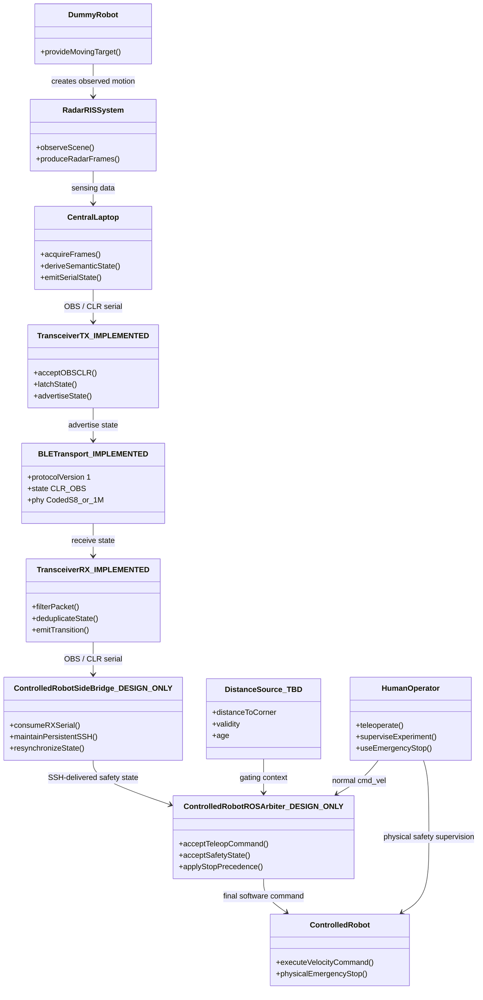
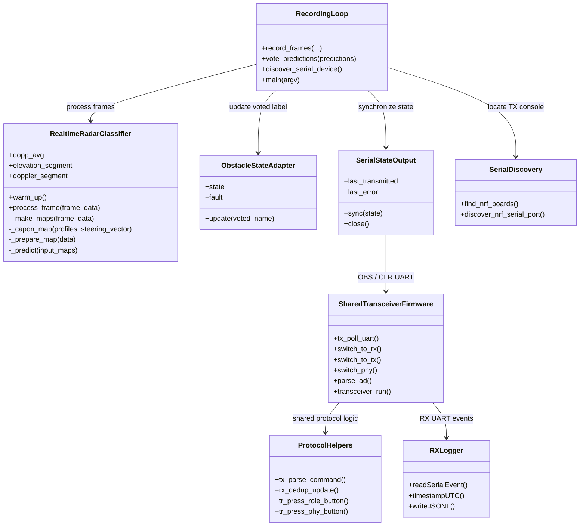
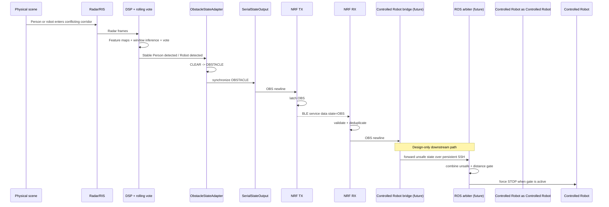
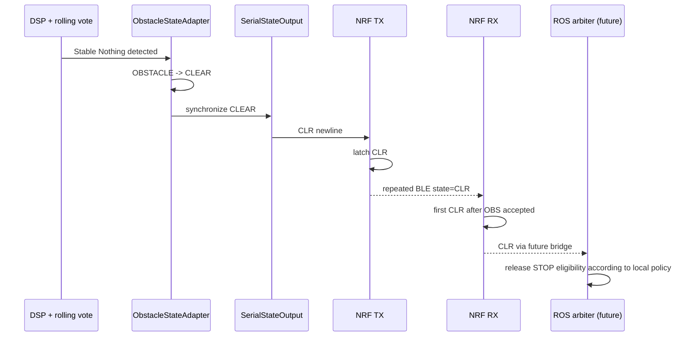
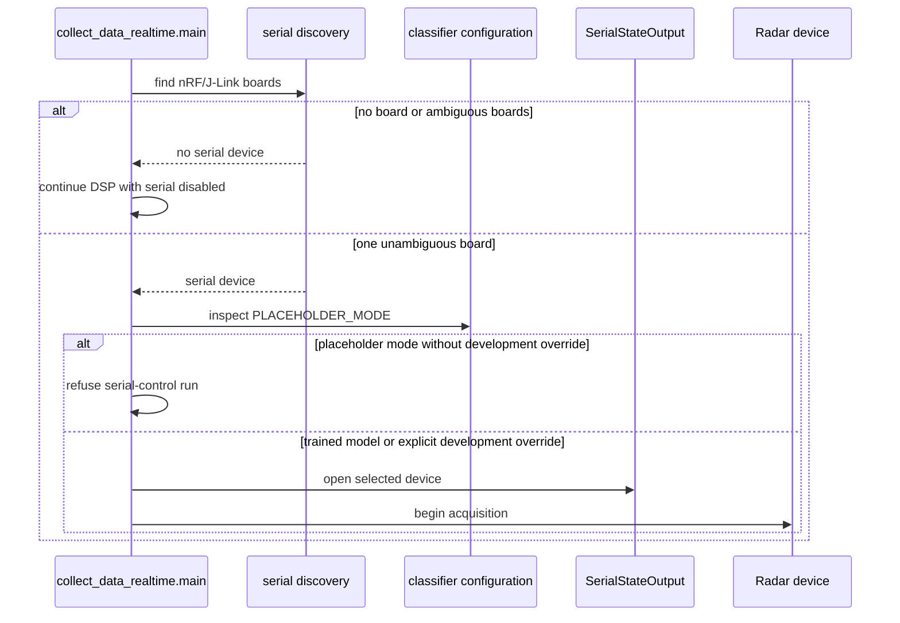
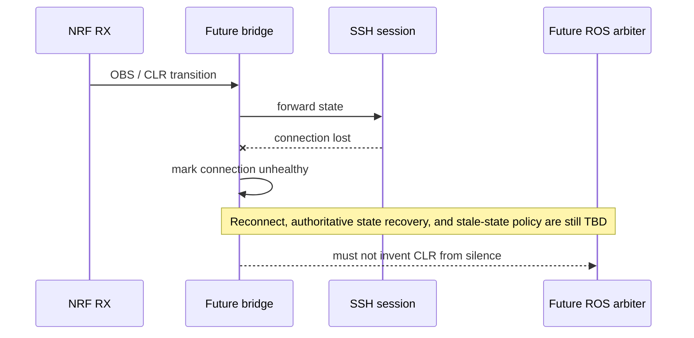
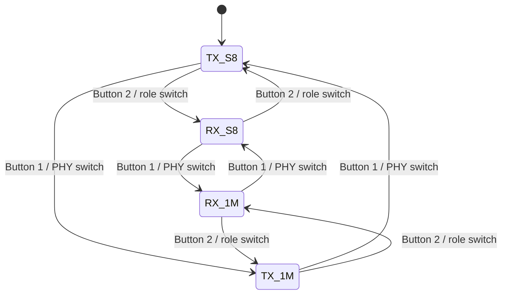
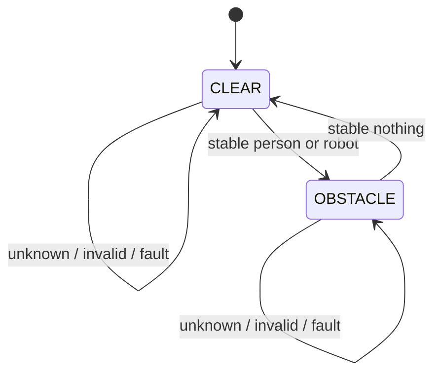
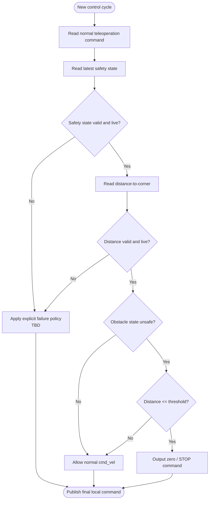

# Whole-System UML Views

**Document role:** structural and behavioral UML-style views of RIS-Robotics, rendered in Mermaid so they remain reviewable directly in the repository.  
**Important:** conceptual elements marked design-only or TBD are architecture elements, not claims that matching code classes already exist.

## Contents

- [Purpose](#purpose)
- [Notation and maturity](#notation-and-maturity)
- [Whole-system structural model](#whole-system-structural-model)
- [Implemented software structure](#implemented-software-structure)
- [Deployment model](#deployment-model)
- [Nominal obstacle sequence](#nominal-obstacle-sequence)
- [Nominal clear sequence](#nominal-clear-sequence)
- [DSP startup and serial-enablement sequence](#dsp-startup-and-serial-enablement-sequence)
- [Transceiver runtime role-switch sequence](#transceiver-runtime-role-switch-sequence)
- [Failure sequence — serial write failure](#failure-sequence--serial-write-failure)
- [Future failure sequence — SSH loss](#future-failure-sequence--ssh-loss)
- [Transceiver runtime state model](#transceiver-runtime-state-model)
- [System semantic state model](#system-semantic-state-model)
- [Target Controlled Robot control activity model](#target-controlled-robot-control-activity-model)
- [UML interpretation notes](#uml-interpretation-notes)

## Purpose

No single UML diagram can faithfully represent a distributed cyber-physical system. This document therefore uses several complementary views:

- structural relationships;
- implemented software object relationships;
- physical deployment;
- nominal runtime sequences;
- failure sequences;
- state machines;
- target control activity.

Together they describe the entire system without pretending that design-only Controlled Robot components are already implemented.

## Notation and maturity

| Diagram element suffix | Meaning |
|---|---|
| `_IMPLEMENTED` | Corresponding repository implementation exists. |
| `_DESIGN_ONLY` | Accepted target element with no repository implementation. |
| `_TBD` | Required concept whose mechanism/value is not selected. |

Where an exact repository class exists, the UML uses its real name. Conceptual future blocks use descriptive architecture names rather than fabricated source-code class names.

## Whole-system structural model

### UML view 1 — conceptual classes/components



This is a conceptual system UML view. `Controlled RobotSideBridge_DESIGN_ONLY`, `Controlled RobotROSArbiter_DESIGN_ONLY`, and `DistanceSource_TBD` are architecture elements rather than repository classes.

## Implemented software structure

### UML view 2 — implemented DSP and transport-side software



`RecordingLoop`, `SerialDiscovery`, `SharedTransceiverFirmware`, `ProtocolHelpers`, and `RXLogger` represent modules/function groups rather than Python/C classes. Exact class names are used where classes actually exist.

## Deployment model

### UML view 3 — deployment

```mermaid
flowchart LR
    subgraph Scene[Physical experiment scene]
        H[Dummy Robot]
        R[Radar / RIS hardware]
        J[Controlled Robot]
    end

    subgraph Central[Central sensing laptop]
        DSP[Python DSP application]
        AD[ObstacleStateAdapter]
        SO[SerialStateOutput]
    end

    subgraph TX[nRF52833 DK A]
        FW1[Shared Transceiver firmware<br/>TX runtime role]
    end

    subgraph Radio[Wireless]
        AIR[BLE extended advertising]
    end

    subgraph RX[nRF52833 DK B]
        FW2[Same Transceiver firmware<br/>RX runtime role]
    end

    subgraph Host[Controlled Robot-side host]
        LOG[rx_logger.py]
        BR[Future serial-to-SSH bridge]
    end

    subgraph Onboard[Controlled Robot onboard computer]
        ROS[Future ROS arbiter]
    end

    H --> R
    R -->|USB / vendor SDK| DSP
    DSP --> AD --> SO
    SO -->|USB UART 115200| FW1
    FW1 --> AIR --> FW2
    FW2 -->|USB UART 115200| LOG
    FW2 -. future control path .-> BR
    BR -. Ethernet + persistent SSH .-> ROS
    ROS -. future local command .-> J
```



## Nominal obstacle sequence

### UML view 4 — obstacle episode



The sequence is partially executable today. Steps through RX serial are implemented; steps after RX serial are target behavior.

## Nominal clear sequence

### UML view 5 — clear transition



An initial clear advertisement is intentionally silent at RX; this sequence describes clearing an established obstacle episode.

## DSP startup and serial-enablement sequence

### UML view 6 — guarded startup



This is a major architectural safeguard: the application does not silently guess a board and does not silently actuate from placeholder inference.

## Transceiver runtime role-switch sequence

### UML view 7 — TX to RX

```mermaid
sequenceDiagram
    participant User as Operator
    participant Button as Button 2 ISR
    participant Loop as transceiver_run
    participant TX as TX transport
    participant RX as RX transport
    participant LEDs as Role LEDs

    User->>Button: press role button
    Button->>Loop: set role-switch request
    Loop->>TX: stop advertising
    Loop->>Loop: discard partial UART + reset RX epoch
    Loop->>RX: start scanning on current PHY
    alt scan starts
        RX-->>Loop: success
        Loop->>Loop: commit active role RX
        Loop->>LEDs: steady RX role LED; packet LED pulses on receive
    else scan fails
        RX-->>Loop: error
        Loop->>TX: attempt previous TX restore
        alt restore succeeds
            Loop->>LEDs: retain TX role LED and advertising pulses
        else restore fails
            Loop->>LEDs: role LEDs off
        end
    end
```

The active role is committed only after its BLE transport starts successfully. This keeps visual role indication tied to real transport state rather than requested state.

## Failure sequence — serial write failure

### UML view 8 — implemented retry semantics

```mermaid
sequenceDiagram
    participant Adapter as ObstacleStateAdapter
    participant Writer as SerialStateOutput
    participant Port as Serial transport
    participant Loop as DSP recording loop

    Adapter->>Writer: sync(new semantic state)
    Writer->>Port: write OBS or CLR
    Port-->>Writer: write failure
    Writer->>Writer: keep last_transmitted unchanged
    Writer-->>Loop: false + visible last_error
    Loop->>Loop: continue according to current application behavior
    Note over Writer: Next sync sees transport still stale and retries
```

Transport failure does not advance the writer's record of what reached the downstream side.

## Future failure sequence — SSH loss

### UML view 9 — required design behavior, not implemented



This diagram is intentionally incomplete at the policy point because the repository has not selected the reconnect/fail-safe semantics yet.

## Transceiver runtime state model

### UML view 10 — role and PHY orthogonality



Role and PHY are independent state dimensions. The firmware additionally has failure recovery around transport restart; the simplified state chart above shows only successful active modes.

## System semantic state model

### UML view 11 — semantic and transport state



The semantic FSM is deliberately conservative: unknown/fault holds state. It does not interpret lack of a valid classification as evidence of clearance.

## Target Controlled Robot control activity model

### UML view 12 — future local decision activity



The `POLICY` branch is intentionally unresolved. A professional architecture should show the missing decision explicitly rather than conceal it behind an assumed default.

## UML interpretation notes

- Mermaid `classDiagram` is used for UML-style structure because it renders directly in GitHub; it is not a claim that every conceptual component is implemented as a software class.
- Deployment diagrams are represented with Mermaid subgraphs because native UML deployment rendering is not available directly in GitHub Markdown.
- Sequence diagrams explicitly show where the implemented chain ends and future behavior begins.
- State diagrams model only state dimensions supported by implementation or accepted architecture; no unselected distance/localization mechanism is invented.
- Exact protocol and interface details remain authoritative in [`interfaces.md`](../interactions/interfaces.md), while implementation maturity remains authoritative in [`implementation-status.md`](current-state.md).
