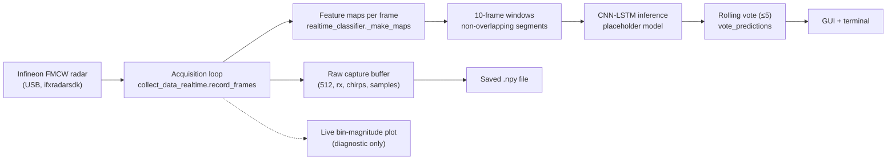

# RIS DSP — real-time radar acquisition and person/robot detection

## Contents

- [Purpose](#purpose)
- [System boundary](#system-boundary)
- [Pipeline overview](#pipeline-overview)
- [Directory structure](#directory-structure)
- [Runtime entry points](#runtime-entry-points)
- [Inputs](#inputs)
- [Outputs](#outputs)
- [Dependencies](#dependencies)
- [Running the system](#running-the-system)
- [Placeholder model](#placeholder-model)
- [Settings](#settings)
- [Documentation map](#documentation-map)
- [Current engineering status](#current-engineering-status)

## Purpose

This subsystem acquires real-time data from an Infineon FMCW radar,
processes it into range/Doppler/angle feature maps, classifies what is in
front of the sensor (person, robot, or nothing), and shows the result live
while recording the raw capture. It is the sensing-side front end of
RIS-Robotics: its detection display is what a future serial trigger to the
NRF Transceiver TX board will be derived from. That serial trigger is not
implemented here yet — see [System boundary](#system-boundary).


## Documentation authority

This README owns DSP implementation entry points, dependencies, and local execution. Cross-system architecture and feature maturity are canonical under [`../docs/`](../docs/):

- DSP subsystem architecture: [`../docs/architecture/subsystems/dsp.md`](../docs/architecture/subsystems/dsp.md)
- sensing/control features: [`../docs/features/`](../docs/features/)
- system interfaces: [`../docs/architecture/interactions/interfaces.md`](../docs/architecture/interactions/interfaces.md)
- validation synthesis: [`../docs/validation/`](../docs/validation/)

The detailed files in `dsp/docs/` remain algorithm/implementation documentation and must not become a competing whole-system architecture.

## System boundary

What enters DSP:

- Raw FMCW frames from the Infineon radar over USB, via the vendor
  `ifxradarsdk` (`collect_data_realtime.py` → `DeviceFmcw`).
- An operator pressing Enter (start), the Stop button / window close /
  Ctrl+C (stop), and the settings at the top of
  `collect_data_realtime.py`.

What DSP owns:

- Radar configuration (metrics + chirp overrides), acquisition loop,
  preprocessing and feature-map formation (`realtime_classifier.py`),
  CNN-LSTM inference, rolling-vote decision smoothing, live GUI and live
  plot, and saving the raw `.npy` capture.

What DSP does not own:

- The radar hardware, the vendor SDK, the trained detector (the bundled
  model is an explicit placeholder), NRF/BLE firmware, or the Controlled Robot-side
  control path.

What leaves DSP:

- On-screen detection state (`Person detected` / `Robot detected` /
  `Nothing detected`), terminal vote lines, and a saved
  `(frames, rx, chirps, samples)` `complex64` NumPy capture.
- When serial integration is enabled and placeholder protection permits
  it, transition-only `OBS`/`CLR` lines toward the NRF TX through
  `dsp/integration/`.

The DSP-to-NRF serial boundary is now implemented in `integration/` and wired into `record_frames()`. It remains **blocked for experiment control** while `PLACEHOLDER_MODE = True`, and the live DSP-to-physical-TX boundary still needs hardware validation. Controlled Robot-side SSH/ROS actuation remains downstream work; see [`../docs/architecture/system/current-state.md`](../docs/architecture/system/current-state.md).

## Pipeline overview



Actual stages in code order: metrics/chirp configuration → acquisition
(`device.get_next_frame`) → per-frame range–Doppler + Capon elevation
maps → 10-frame buffering → per-timestep normalization → model
prediction every 10th frame → majority vote over recent predictions →
GUI/terminal update → `.npy` save of acquired frames (including on
early stop or error). Details: [`docs/signal-processing-pipeline.md`](docs/signal-processing-pipeline.md).

## Directory structure

Every immediate child directory is documented here. Each linked README continues the navigation recursively for its own children.

| Directory | Responsibility | What belongs there | Recursive index |
|---|---|---|---|
| [`docs/`](docs/) | DSP-specific engineering documentation | Signal-processing pipeline, contracts, runtime behavior, parameters, validation/performance notes, state machines, serial integration, and algorithm docs | [`docs/README.md`](docs/README.md) |
| [`integration/`](integration/) | DSP-to-transport boundary | Obstacle-state conversion, automatic serial discovery, and transition-only serial output | [`integration/README.md`](integration/README.md) |
| [`tests/`](tests/) | Hardware-free DSP/integration validation | Realtime detection, serial discovery, and serial-integration tests | [`tests/README.md`](tests/README.md) |

```text
dsp/
├── README.md                      this index
├── collect_data_realtime.py       acquisition, voting, recording, entry point
├── realtime_classifier.py         preprocessing, feature maps, model adapter
├── patient_status_gui.py          Tk detection display (legacy filename kept)
├── requirements.txt               keras + tensorflow only (see Dependencies)
├── __init__.py                    package marker
├── docs/
│   ├── README.md                  DSP documentation index
│   └── algorithms/                algorithm-specific documentation
├── integration/
│   ├── README.md                  serial/control-boundary index
│   ├── obstacle_state.py          semantic label -> OBS/CLR state
│   ├── serial_discovery.py        automatic serial-device discovery
│   └── serial_output.py           transition-only serial writer
└── tests/
    ├── README.md                  hardware-free test coverage
    ├── test_realtime_detection.py realtime pipeline checks
    ├── test_serial_discovery.py   discovery behavior checks
    └── test_serial_integration.py serial adapter/output checks
```

## Runtime entry points

- Primary runtime: `collect_data_realtime.py` → `main()` (acquire +
  classify + display + save). Requires a connected Infineon radar and
  the vendor SDK.
- Automated checks: `python -m unittest discover -s tests -v` from this
  folder. Hardware-free (faked radar/GUI/classifier); still imports the
  real modules, so `ifxradarsdk`, `matplotlib`, and `tkinter` must be
  importable — see [`docs/validation-and-performance.md`](docs/validation-and-performance.md).
- `realtime_classifier.py` and `patient_status_gui.py` are libraries;
  nothing else in the repository imports them.

## Inputs

- FMCW frames `(rx, chirps, samples)` of complex samples from
  `device.get_next_frame(timeout_ms=1000)[0]`; concrete `rx/chirps/samples`
  counts are read back from the configured SDK sequence at startup and
  printed. Frame cadence is set by `sequence.loop.repetition_time_s =
  1 / FRAME_RATE` with `FRAME_RATE = 12.94`.
- Operator actions (Enter to start, Stop/close/Ctrl+C to stop early).

## Outputs

- Continuous: GUI result text + color, progress bar, terminal
  `Frame i/N` counters and vote lines.
- Per 10-frame window: one `(label, confidence, probabilities)` prediction.
- Per recording: one `.npy` file with only the frames actually acquired.
- Diagnostic only: live bin-magnitude plot (`SHOW_LIVE_PLOT`, off by
  default).
- Not produced: any serial/network trigger, ROS message, or file other
  than the capture.

## Dependencies

| Dependency | Role | Specified where | Note |
|---|---|---|---|
| `ifxradarsdk` (+ parent SDK folder) | Radar hardware API | Not in `requirements.txt` | Provided separately; absence breaks even the test imports — engineering gap, see `docs/validation-and-performance.md` |
| `keras`, `tensorflow` | Model loading/inference | `requirements.txt` | Only the model path needs them at runtime |
| `numpy` | All numerics | Assumed present | Verified locally as 2.5.2 |
| `matplotlib` | Live plot + import-time dependency | Assumed present | Imported by `collect_data_realtime.py` unconditionally |
| `tkinter` | GUI | Python stdlib (needs OS Tk) | Imported by `patient_status_gui.py` unconditionally |
| Trained detector | Real detections | `CLASSIFICATION_MODEL_PATH` | Currently a placeholder activity model; no detection accuracy implied |

There is no lockfile and no pinned versions; reproducible-environment
specification is a gap (see `docs/validation-and-performance.md`).

## Running the system

Run from this folder using the existing Python environment:

```powershell
.\.venv_tf\Scripts\python.exe .\collect_data_realtime.py
```

Press Enter when the radar and subject are ready. The script records **512 frames
at 12.94 Hz** (about 39.6 seconds) and saves the raw capture as a NumPy array with
shape `(frames, rx, chirps, samples)` and dtype `complex64`.

The GUI displays **Person detected**, **Robot detected**, or **Nothing detected**.
It shows a dash until the first prediction is available, with recording progress
below the result. The existing model needs 10-frame windows, so a result is
available every 10 frames (about 0.77 seconds at the configured acquisition rate).
A rolling vote over the latest five predictions smooths the display; it starts
with the first prediction without waiting for all five. Ties use the average
winning-output score. Each result describes recent frames, rather than an
independent classification of each individual frame.

Click **Stop recording**, close the window, or press Ctrl+C in the terminal to
stop early. Frames already collected are saved without unused buffer entries.
The last result remains visible when a recording finishes; click **Close** to exit.
Acquisition/inference errors also save frames already captured, then report the
error in the terminal.

## Placeholder model

`Bathroom_CNNLSTM.keras` is retained unchanged and loaded from this folder.
It is an activity classifier, **not a trained person/robot/empty-scene detector**.
The GUI and terminal explicitly mark placeholder mode. Its temporary mapping is:

| Existing model output index | GUI result |
| --- | --- |
| 0 | Person detected |
| 1 | Robot detected |
| 2, 3, 4, 5, 6 | Nothing detected |

These assignments only exercise the interface. In particular, "Nothing detected"
in placeholder mode does not establish that the scene is empty. No detection
accuracy is implied, and the terminal's model score refers to the winning
original model output.

The adapter in `realtime_classifier.py` keeps the current preprocessing:
range-elevation and range-Doppler maps, resized to `(32, 256)`, buffered into
10-frame windows, and normalized per timestep. The Capon calculation is batched
to reduce processing overhead while retaining the same calculation.
Model inference is warmed up before acquisition starts to avoid a startup pause
while radar frames are arriving.

To use a trained detector with the same two-input format, set
`CLASSIFICATION_MODEL_PATH` to its file, adjust `DETECTION_CLASS_NAMES` to match
its output order, and set `PLACEHOLDER_MODE = False`. The default target order is
`0 = person`, `1 = robot`, `2 = nothing`. Output mapping coverage is checked when
loading the model. A model with different inputs also needs adapter changes.

## Settings

Settings are at the top of `collect_data_realtime.py`:

- `FILE_NAME` and `SAVE_FOLDER`: capture destination. The existing default is
  `C:\Users\j3visser\Documents\RIS\Test_LOS_realtime.npy`; subsequent recordings
  replace that file, so change the name when keeping multiple captures.
- `NUM_FRAMES` and `FRAME_RATE`: recording length and acquisition rate.
- `ENABLE_REALTIME_CLASSIFICATION`: turn inference on or off.
- `CLASSIFICATION_WINDOW_FRAMES`: keep at 10 for the supplied model.
- `VOTE_WINDOW_PREDICTIONS`: number of recent predictions used for smoothing.
- `SHOW_DETECTION_STATUS_GUI`, `LOCATION_LABEL`, and `SHOW_LIVE_PLOT`: display options.
- `CLASSIFICATION_MODEL_PATH` and `PLACEHOLDER_MODE`: model configuration.
- `--serial-baud`, `--serial-allow-placeholder`: command-line
  only (no settings constants). The NRF TX console is discovered
  automatically at startup (see `integration/serial_discovery.py`); no
  manual port flag exists. Serial output additionally requires a
  trained model: refused under placeholder inference without the
  development-only override flag.

The radar SDK, NumPy, Matplotlib, Keras, TensorFlow, and Tkinter must be available
in the Python environment. Keras/TensorFlow dependencies are listed in
`requirements.txt`; the radar SDK is provided separately by the parent SDK folder.

Run the automated checks without connecting a radar:

```powershell
.\.venv_tf\Scripts\python.exe -m unittest discover -s tests -v
```

## Documentation map

- [`docs/README.md`](docs/README.md) — what each engineering document answers.
- [`docs/signal-processing-pipeline.md`](docs/signal-processing-pipeline.md) —
  how data moves through the chain.
- [`docs/data-and-signal-contracts.md`](docs/data-and-signal-contracts.md) —
  representations, shapes, units, interfaces.
- [`docs/real-time-execution.md`](docs/real-time-execution.md) — the system
  as a running real-time program.
- [`docs/parameters-and-tuning.md`](docs/parameters-and-tuning.md) — operating
  point and tuning.
- [`docs/validation-and-performance.md`](docs/validation-and-performance.md) —
  what has actually been measured or validated.
- [`docs/algorithms/`](docs/algorithms/) — one document per substantive
  algorithm, in pipeline order.
- [`docs/state-machines.md`](docs/state-machines.md) — control-relevant
  state (vote filter, buffers, clutter memory, GUI latch, NRF latch,
  proposed obstacle adapter).
- [`docs/serial-integration-point.md`](docs/serial-integration-point.md) —
  exact planned insertion point, obstacle-state FSM, transition
  semantics, blockers. No serial code written yet.
- [`tests/README.md`](tests/README.md) — hardware-free test coverage.

## Current engineering status

| Area | Status |
|---|---|
| Acquisition + recording (512-frame `.npy` captures) | Implemented; exercised in live sessions |
| Placeholder classification + GUI display | Implemented; explicitly not a detector |
| Trained person/robot detector | TBD — no trained model in the repository |
| Serial `OBS`/`CLR` bridge to NRF TX | Implemented + unit tested; hardware validation pending — see [`docs/serial-integration-point.md`](docs/serial-integration-point.md) |
| Serial `OBS`/`CLR` trigger to NRF TX | Not implemented — integration work remains |
| Unit-test suite (14 checks) | Implemented; executed 2026-09-28, 14/14 PASS (SDK stubbed, see validation doc) |
| Timing/latency/CPU measurements | Not currently measured |
| Detection accuracy / false-alarm metrics | Not currently measured (placeholder model) |
| Antenna-geometry documentation (which pair is elevation) | Not currently documented |

Nothing in this table implies validation beyond what
[`docs/validation-and-performance.md`](docs/validation-and-performance.md)
records.
