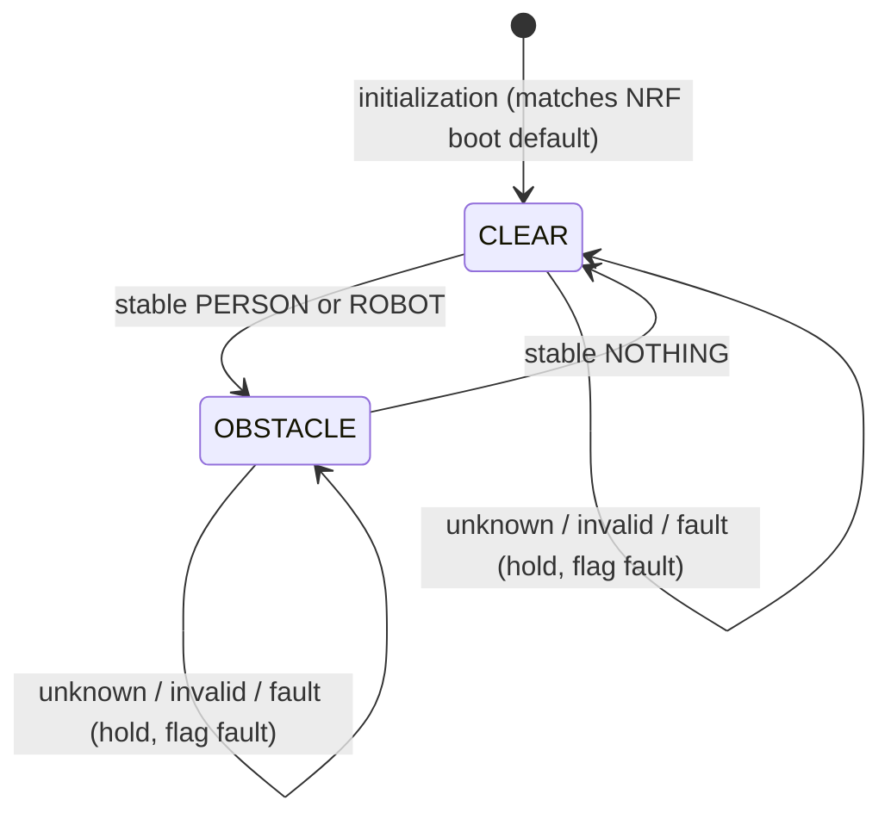

# Serial integration point (DSP → NRF TX)

> Implementation status: implemented + unit tested (`dsp/integration/`,
> wired in `record_frames()`). Hardware validation pending — no NRF
> board test performed yet.

## Contents

- [Purpose](#purpose)
- [Class semantics from code](#class-semantics-from-code)
- [Safety predicate](#safety-predicate)
- [Recommended insertion point](#recommended-insertion-point)
- [Why here and not elsewhere](#why-here-and-not-elsewhere)
- [Proposed obstacle-state FSM](#proposed-obstacle-state-fsm)
- [Serial transition semantics](#serial-transition-semantics)
- [The CLR question](#the-clr-question)
- [Hysteresis and debounce](#hysteresis-and-debounce)
- [Placeholder and invalid-class handling](#placeholder-and-invalid-class-handling)
- [Failure-state semantics](#failure-state-semantics)
- [NRF TX serial contract](#nrf-tx-serial-contract)
- [Code ownership boundary](#code-ownership-boundary)
- [Exact future call flow](#exact-future-call-flow)
- [Blockers before implementation](#blockers-before-implementation)

## Purpose

Identify the exact codebase location where a stabilized person/robot
classification becomes a serial `OBS`/`CLR` line for NRF Transceiver TX,
and design the minimal adapter between them. The design below is now
implemented (`dsp/integration/`); this document is the implementation
record.

## Class semantics from code

Source of truth: `realtime_classifier.py` constants + `_predict()` +
`patient_status_gui.STATUS_COLORS` + `tests/test_realtime_detection.py`.

| Index | Placeholder label (current) | Future detector label | Meaning |
|---|---|---|---|
| 0 | Person detected | Person detected | Obstacle-relevant |
| 1 | Robot detected | Robot detected | Obstacle-relevant |
| 2 | Nothing detected | Nothing detected | Background / no relevant target |
| 3 | Nothing detected | — (mapping TBD with model) | Currently background |
| 4 | Nothing detected | — (mapping TBD with model) | Currently background |
| 5 | Nothing detected | — (mapping TBD with model) | **Genuinely producible** (7-output model); covered only by the placeholder map; absent from legacy `CLASS_NAMES` |
| 6 | Nothing detected | — (mapping TBD with model) | Currently background |

- Background/empty class: "Nothing detected" (placeholder indices 2–6;
  future index 2). No separate "unknown" class exists.
- Index 5 **can** be produced (the model has 7 outputs); today it maps
  to "Nothing detected" via `PLACEHOLDER_CLASS_NAMES`. It is not
  special-cased anywhere.
- Unmapped index (e.g. a future 8-output model): `_predict` returns
  `"Unknown class: i"` → vote accepts any string → GUI
  `update_status` raises `ValueError` → run aborts (partial save kept).
  The display layer is the current backstop, and it fails closed.

## Safety predicate

With documentation notation (`PERSON`/`ROBOT`/`NOTHING` = voted labels):

```text
unsafe = (stable_class == PERSON) OR (stable_class == ROBOT)
clear  = (stable_class == NOTHING)
```

Clear is defined as the stabilized background label — the vote moving
away from person/robot — not as a timeout or as absence of output.

## Recommended insertion point

One primary location:

```text
File:     dsp/collect_data_realtime.py
Function: record_frames()
Variable: voted_name (str), with voted_score and vote_count
Insert after:   voted_name, voted_score, vote_count = vote_predictions(prediction_votes)
Insert before:  the terminal print and status_gui.update_status(voted_name)
Reason:         voted_name is the first variable in the program that holds the
                semantic decision (temporally stabilized class). Everything
                upstream is features, single-window inference, or buffering;
                everything downstream is display. The adapter call goes here:
                stable_class in → obstacle-state update → optional serial write.
```

Code immediately before: `prediction_votes.append((class_name, confidence))`.
Code immediately after: `print(f"\n{voted_name} ...")` and the GUI update.

## Why here and not elsewhere

- **Too early (FFT/Capon/maps)**: pre-classification signals; no semantic
  content to drive safety state. Confirmed: maps feed the model only.
- **Too early (single `_predict` output)**: one 10-frame window flips with
  scene noise; wiring serial here would chatter `OBS`/`CLR` on every
  ambiguous window. The vote exists precisely to absorb this.
- **Candidate (post-vote `voted_name`)**: first semantic decision —
  majority over ≤5 windows with score tie-break. Selected.
- **Too late (GUI)**: display layer; it rightly rejects unknown labels
  with `ValueError`, which must never gate the control path. Display
  follows the adapter, not vice versa.

Separation of concerns:

```text
DSP                produces semantic state (voted_name)
adapter            maps semantic state to control protocol (CLEAR/OBSTACLE → CLR/OBS)
serial transport   transmits protocol lines (pyserial writer, future)
```

## Proposed obstacle-state FSM

Internal semantic state stays free of wire strings; the adapter renders
`OBSTACLE → "OBS\n"`, `CLEAR → "CLR\n"` only on transitions.



Rules: initialize `CLEAR` (NRF TX boots `CLR`, so both ends agree
without a handshake). Emit only on `CLEAR→OBSTACLE` (`OBS`) and
`OBSTACLE→CLEAR` (`CLR`). Unknown labels, unmapped indices, inference
exceptions, acquisition loss, and serial-write failures **hold the last
state and raise a visible fault** — never synthesize `CLR`, never
synthesize `OBS`.

## Serial transition semantics

Transition-only emission is recommended: the NRF TX latch
(`firmware/transceiver/src/main.c` → `tx_poll_uart()`) already holds
state and re-advertises only on change, so repeats are harmless on the
wire — but DSP-side episode semantics (emit once per transition) keep
the integration deliberate, debuggable, and log-clean. Continuous
re-emission every iteration is rejected: it would mask a stuck adapter
as live traffic.

## The CLR question

`CLR` is currently definable: the stabilized "Nothing detected" label
winning the vote. With the placeholder model this condition is
meaningless (a bathroom-activity model cannot declare the corridor
clear), so today the honest statement holds:

> `OBS` could be generated from the classifier's structure, but neither
> `OBS` nor `CLR` is trustworthy until a trained detector replaces the
> placeholder — the serial bridge must stay disabled meanwhile.

No timeout or disappearance heuristic is introduced; the vote moving
away from person/robot is the designed clear signal once the model is
real.

## Hysteresis and debounce

Current stabilization is the majority vote only: symmetric evidence for
entering and clearing, 3–2 splits can flicker state at ~0.77 s per
flap. This is **not** hysteresis (no separate entry/exit thresholds).
No additional debounce is added now; asymmetric
enter-vs-clear evidence (e.g. faster enter, slower clear) is recorded
as a future design consideration, not established behavior.

## Placeholder and invalid-class handling

- Placeholder path executes fully today (7-output model → mapped labels
  → vote → display). It must never reach serial: gate the adapter on
  `PLACEHOLDER_MODE == False` (plus a real-model presence check) so
  UI-test traffic cannot drive the robot path.
- Index 5 today → "Nothing detected" (placeholder map). Under a future
  model its meaning comes from that model's contract.
- Unknown/unmapped index → adapter holds state + faults; must never
  reach the GUI's `ValueError` path from the control side, and must
  never map to `CLR`.
- Model load failure → current code raises before acquisition; adapter
  never engages. Model exception mid-run → propagate (current behavior),
  adapter holds last state.

## Failure-state semantics

| Condition | Current code behavior | Adapter rule (proposed) |
|---|---|---|
| Acquisition raises | Partial save, hardware stopped, propagate | Hold last state, fault visible |
| Inference raises | Triggering frame already stored, propagate | Hold last state, fault visible |
| Model file missing | Startup failure, no recording | Never engage |
| Unknown class index | Display `ValueError`, run aborts | Hold + fault, never `CLR` |
| DSP stops updating | Loop exits / hangs (undefined) | Downstream (NRF/laptop) must treat silence by policy, not as clear |
| Serial port gone / write fails | N/A (no writer yet) | Fault visible; TX latch keeps last commanded state |

Core invariant: **no valid result ≠ corridor clear.** Silence, errors,
and unknowns hold state; only a stabilized `NOTHING` vote clears.

## NRF TX serial contract

From `firmware/transceiver/src/main.c` (`tx_poll_uart()`,
`tx_parse_command()`) at 115200 8N1 on the TX console:

- Exact `OBS` / `CLR` lines, `\r`/`\n` terminated; 7-char buffer,
  overlong lines discarded without matching a tail.
- Anything else ignored silently; state unchanged.
- Opposite state latches and re-advertises; same state is a no-op.
- TX boots `CLR`; RX→TX re-entry re-initializes `CLR`.
- Details: `firmware/README.md`; do not duplicate firmware internals here.

## Code ownership boundary

Implemented as (filenames differ slightly from the proposal, same split):

```text
dsp/
    integration/
        README.md            # boundary, components, tests, links
        __init__.py
        obstacle_state.py    # ObstacleStateAdapter: CLEAR/OBSTACLE latch (pure logic, unit-tested)
        serial_output.py     # SerialStateOutput: framing, transport, retry (I/O only)
```

Rationale: `collect_data_realtime.py` keeps acquisition/voting;
`realtime_classifier.py` keeps mathematics; the new package owns
control semantics and transport. The FSM module must import nothing
from DSP internals beyond the voted-label string; the writer must know
nothing about models or votes.

## Exact call flow (implemented)

```text
record_frames()                                   [collect_data_realtime.py]
        ↓ device.get_next_frame()
RealtimeRadarClassifier.process_frame()           [realtime_classifier.py]
        ↓ _make_maps → segments → _predict (every 10th frame)
prediction_votes.append((class_name, confidence))
        ↓
vote_predictions(prediction_votes)                [collect_data_realtime.py]
        ↓ voted_name, voted_score, vote_count
ObstacleStateAdapter.update(voted_name)           [dsp/integration/obstacle_state.py]
        ↓ new state on transition, else None; fault recorded on unknown
SerialStateOutput.sync(adapter.state)             [dsp/integration/serial_output.py]
        ↓ b"OBS\n" / b"CLR\n" at 115200, transition-only + retry
        ↓ existing print + status_gui.update_status(voted_name) (unchanged)
```

Enablement: `--serial-port <device>` (plus optional `--serial-baud`,
default 115200). Without it DSP runs with serial disabled. Placeholder
gate: serial refused when `PLACEHOLDER_MODE` is on unless explicit
`--serial-allow-placeholder` (development-only override, bannered in
terminal). Port opened eagerly (fail fast); closed in `finally` with no
exit-time `CLR`. Failures: `sync()` returns False and prints the error;
`last_transmitted` stays stale so the next prediction retries.

## Blockers before hardware use

1. **No trained detector** — placeholder outputs must never drive serial; enforced by the startup gate (refused unless `--serial-allow-placeholder`).
2. **Antenna geometry undocumented** — affects future model validity, not adapter shape.
3. ~~**`pyserial` absent from `requirements.txt`**~~ — resolved: declared.
4. **COM-port discovery** — no enumeration/selection logic exists yet; pass `--serial-port` explicitly.
5. **GUI `ValueError` on unknown labels** — control path (adapter hold + fault print) runs before display; display behavior unchanged.
