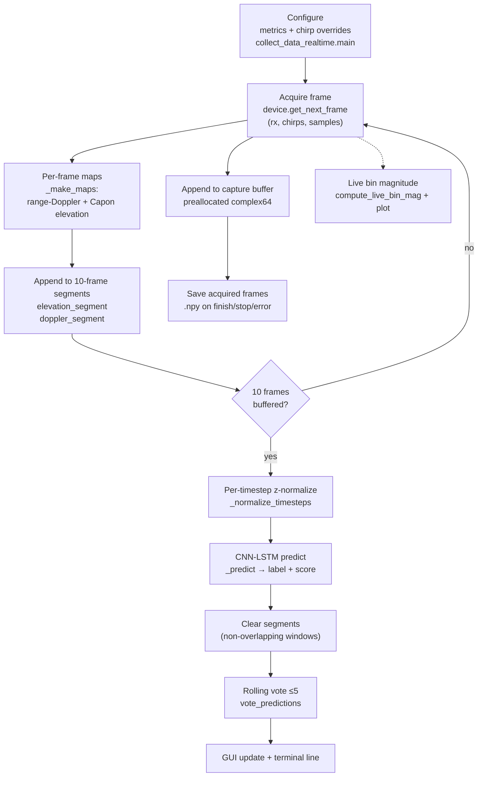

# Signal-processing pipeline

## Contents

- [Purpose](#purpose)
- [Pipeline diagram](#pipeline-diagram)
- [Stages](#stages)
- [Branching and side paths](#branching-and-side-paths)
- [State across frames](#state-across-frames)

## Purpose

Authoritative architectural description of how radar data moves through
the DSP subsystem, reconstructed from `collect_data_realtime.py` and
`realtime_classifier.py`. For representations see
[`data-and-signal-contracts.md`](data-and-signal-contracts.md); for
timing see [`real-time-execution.md`](real-time-execution.md).

## Pipeline diagram

## Stages

### 1. Radar configuration — `collect_data_realtime.main()`

- Purpose: derive the SDK chirp/frame program from the experiment's
  range/velocity requirements.
- Input: `FmcwMetrics` (range resolution 0.05 m, max range 1.6 m,
  max speed 2.0 m/s, speed resolution 0.065 m/s, center 60.75 GHz) plus
  explicit chirp overrides (59.25–62.25 GHz sweep, 2 MHz sampling,
  RX all / TX 1, TX power 31, IF gain 23 dB, LP 500 kHz, HP 80 kHz).
- Transformation: `sequence_from_metrics` then field overrides;
  frame cadence fixed by `repetition_time_s = 1 / 12.94`.
- Output: running acquisition; `num_chirps` / `num_samples` read back
  from the sequence and printed, then handed to the classifier.
- State: none beyond the SDK sequence object.
- Real-time critical: no (once, before acquisition).

### 2. Frame acquisition — `record_frames()`

- Purpose: pull one complex frame per period and store it.
- Input: `device.get_next_frame(timeout_ms=1000)[0]` →
  `(rx, chirps, samples)` complex.
- Transformation: copy into preallocated `(512, rx, chirps, samples)`
  `complex64` buffer; increment counter.
- Output: buffered frame; counter for progress/results.
- Upstream: SDK/device. Downstream: capture buffer, feature maps,
  live plot. Real-time critical: yes — every frame, blocking read.

### 3. Feature-map formation — `RealtimeRadarClassifier._make_maps()`

- Purpose: convert one raw frame into the two model input maps.
- Input: single `(rx, chirps, samples)` complex frame.
- Transformation: per-antenna DC removal → Blackman–Harris → zero-padded
  range FFT (single-sided) → transpose → Blackman–Harris → zero-padded
  Doppler FFT → exponential clutter averaging + MTI subtraction →
  `fftshift` → non-coherent sum over 3 antennas (Doppler map) and Capon
  beamforming on antennas `[1, 2]` (elevation map) → magnitude, float32,
  nearest-neighbor resize to `(32, 256)`.
- Output: `(elevation_map, doppler_map)`, each `(32, 256)` float32.
- State written: `dopp_avg` clutter memory (see below).
- Real-time critical: yes — every frame; heaviest per-frame cost
  (FFTs + per-range-bin `pinv` in Capon).
- Details: [`algorithms/range-doppler-mti.md`](algorithms/range-doppler-mti.md),
  [`algorithms/capon-beamforming.md`](algorithms/capon-beamforming.md).

### 4. Window buffering — `process_frame()`

- Purpose: assemble non-overlapping 10-frame model inputs.
- Input: per-frame map pair. Output: every 10th frame, two
  `(10, 32, 256)` stacks; otherwise `None`.
- State: `elevation_segment`, `doppler_segment` lists, cleared after
  each prediction (windows do not overlap).
- Real-time critical: no (list appends).

### 5. Normalization + inference — `_normalize_timesteps()`, `_predict()`

- Purpose: standardize each window and run the CNN-LSTM.
- Input: two `(10, 32, 256)` float32 stacks.
- Transformation: per-timestep (per-frame) mean/std normalization
  (epsilon `1e-8`), add channel + batch dims → `(1, 10, 32, 256, 1)` ×2;
  `model.predict(verbose=0)`; `argmax` → mapped label + winning score.
- Output: `(class_name, confidence, probabilities)` or `None`.
- State: none (model weights are read-only).
- Real-time critical: yes — every 10th frame; the largest latency step.
- Details: [`algorithms/cnn-lstm-adapter.md`](algorithms/cnn-lstm-adapter.md).

### 6. Rolling vote — `vote_predictions()`

- Purpose: smooth predictions into a displayed result.
- Input: deque (maxlen 5) of recent `(label, score)` pairs.
- Transformation: majority label count wins; ties broken by higher mean
  winning-output score; vote starts with the first prediction.
- Output: `(voted_name, voted_score, vote_count)`; printed and shown.
- State: `prediction_votes` deque in `record_frames()`.
- Real-time critical: no (≤5 elements).
- Details: [`algorithms/rolling-vote.md`](algorithms/rolling-vote.md).
  State-machine interpretation and the serial boundary live in
  [`state-machines.md`](state-machines.md) and
  [`serial-integration-point.md`](serial-integration-point.md): the voted
  label is the final authoritative classification and the only defensible
  serial source.

### 7. Display + recording close-out — plus serial branch

- GUI (`DetectionStatusGUI`): result text/color, progress bar, stop/close
  handling, last-result retention; `pump()` runs Tk each frame.
- Terminal: banner, config echo, per-frame counter, vote lines, save
  summary, error reports.
- Serial branch (only with `--serial-port`): on each prediction,
  `ObstacleStateAdapter.update(voted_name)` advances the CLEAR/OBSTACLE
  latch (unknown holds + fault print), and `SerialStateOutput.sync()`
  writes `OBS`/`CLR` on transitions only, retrying after failures;
  port opened eagerly and closed in `finally` with no exit-time `CLR`.
- Save: `np.save` of acquired frames only, on finish, early stop, or
  error; `stop_acquisition()` always attempted first.
- Details: [`real-time-execution.md`](real-time-execution.md),
  [`serial-integration-point.md`](serial-integration-point.md).

## Branching and side paths

- **Control/detection path** (above): acquisition → maps → inference →
  vote → display. No serial/network output leaves this path.
- **Diagnostic path**: `compute_live_bin_mag()` (Hanning window, mean
  removal, single FFT, `|bin 1|` averaged over RX) feeds the optional
  matplotlib plot. It uses only chirp 0, only the real part
  (`.astype(float)` discards the imaginary component — documented
  limitation, not fixed), and a different window than the main path.
- **Azimuth path**: present in code only as comments
  (`range_dopp_prof[[0, 2]]`, `azimuth_segment`); never computed or fed
  to the model.
- **Classification-off path**: `ENABLE_REALTIME_CLASSIFICATION = False`
  records raw data only; GUI shows "Classification disabled".

## State across frames

| State | Owner | Lifetime | Reset |
|---|---|---|---|
| Capture buffer + counter | `record_frames()` | One recording | New recording |
| `dopp_avg` clutter memory | Classifier instance | Whole run (never cleared) | New run only |
| 10-frame segments | Classifier instance | Until each prediction | After each prediction |
| Vote deque (≤5) | `record_frames()` | Whole run | New recording |
| GUI state | `DetectionStatusGUI` | Window lifetime | New run |
| Live-plot series | `LivePlot` | Window lifetime | New run |
