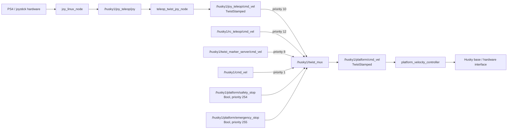
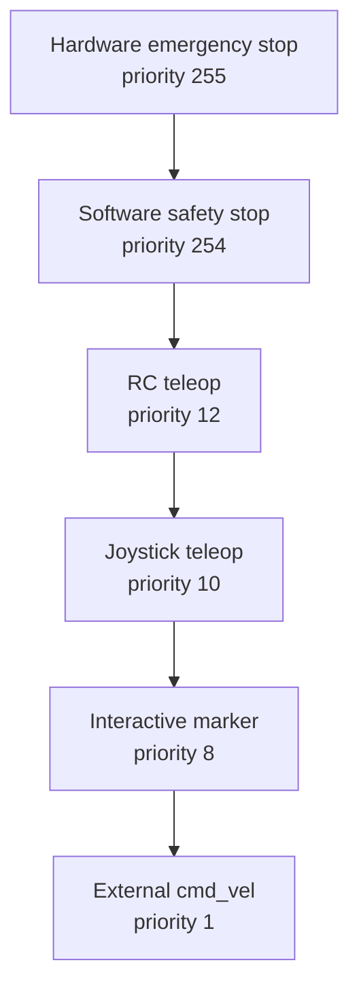
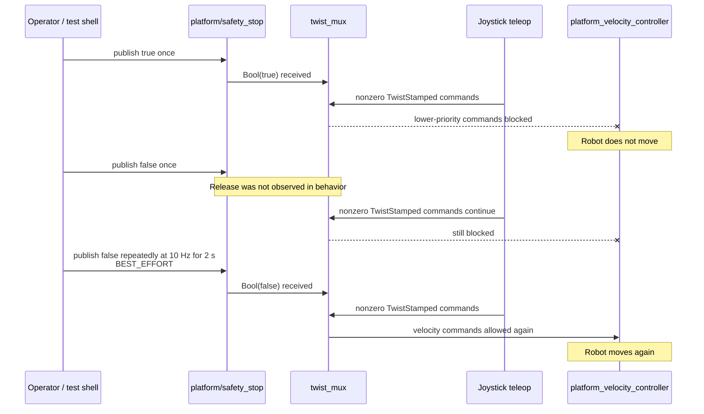
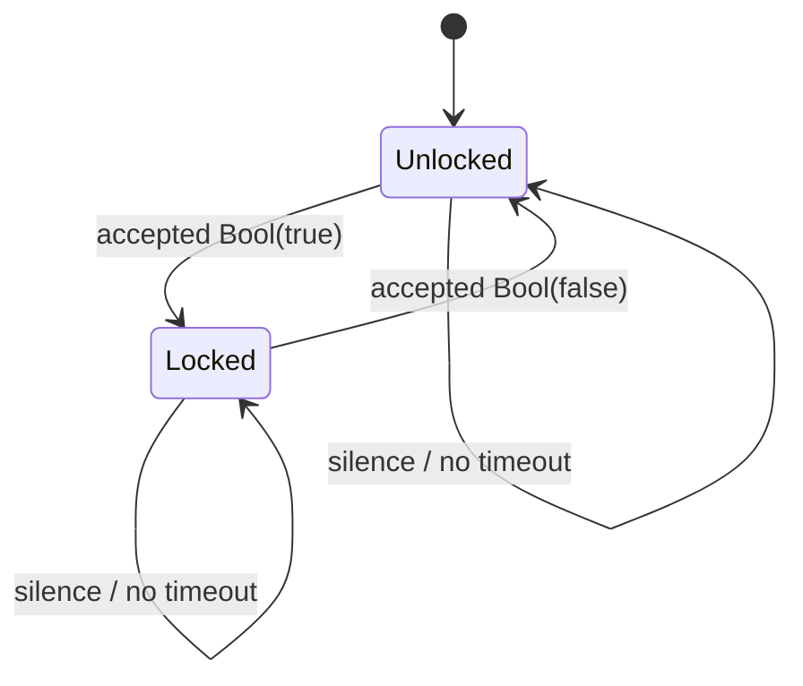
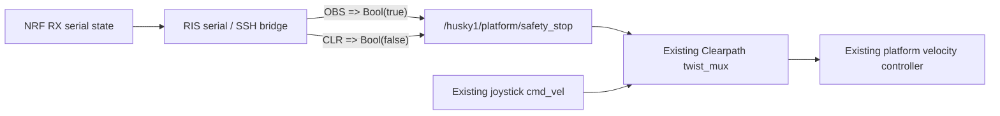
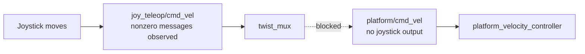

# ROS Controller Exploration — Controlled Robot

**Date:** 2026-10-05  
**Target:** `CONTROLLED_ROBOT`  
**Current hardware binding:** Clearpath Husky A200 (`husky1`)  
**Connection:** `robot@192.168.131.1`  
**ROS distribution discovered:** ROS 2 Jazzy

## Contents

- [Summary](#summary)
- [What was proven](#what-was-proven)
- [Discovered ROS control topology](#discovered-ros-control-topology)
- [Safety-lock priority model](#safety-lock-priority-model)
- [Observed STOP and release behavior](#observed-stop-and-release-behavior)
- [Implication for RIS integration](#implication-for-ris-integration)
- [Recorded exploration](#recorded-exploration)
  - [1. Start a recorded SSH session](#1-start-a-recorded-ssh-session)
  - [2. Identify the ROS environment](#2-identify-the-ros-environment)
  - [3. Query the visible ROS node graph](#3-query-the-visible-ros-node-graph)
  - [4. Inspect ROS-related operating-system processes](#4-inspect-ros-related-operating-system-processes)
  - [5. Inspect the Clearpath `twist_mux` configuration](#5-inspect-the-clearpath-twist_mux-configuration)
  - [6. Identify the safety-stop message type](#6-identify-the-safety-stop-message-type)
  - [7. Inspect the safety-stop topic endpoints and QoS](#7-inspect-the-safety-stop-topic-endpoints-and-qos)
  - [8. Inspect installed `twist_mux` lock documentation](#8-inspect-installed-twist_mux-lock-documentation)
  - [9. Read the installed example lock configuration](#9-read-the-installed-example-lock-configuration)
  - [10. Verify the final velocity path](#10-verify-the-final-velocity-path)
  - [11. Verify the joystick input path](#11-verify-the-joystick-input-path)
  - [12. Inspect the live safety-stop parameters](#12-inspect-the-live-safety-stop-parameters)
  - [13. Read the live safety-stop parameter values](#13-read-the-live-safety-stop-parameter-values)
  - [14. Search the installed lock implementation](#14-search-the-installed-lock-implementation)
  - [15. Locate `LockTopicHandle`](#15-locate-locktopichandle)
  - [16. Read `isLocked()`](#16-read-islocked)
  - [17. Read `hasExpired()`](#17-read-hasexpired)
  - [18. Check for an existing user ROS workspace](#18-check-for-an-existing-user-ros-workspace)
  - [19. Verify Python ROS 2 support](#19-verify-python-ros-2-support)
  - [20. Verify `colcon`](#20-verify-colcon)
  - [21. Verify ROS package creation support](#21-verify-ros-package-creation-support)
  - [22. Inspect the robot user's home directory](#22-inspect-the-robot-users-home-directory)
  - [23. Inspect the existing `robohub` directory structure](#23-inspect-the-existing-robohub-directory-structure)
  - [24. Check for existing project files under `robohub`](#24-check-for-existing-project-files-under-robohub)
  - [25. Inspect Clearpath system services](#25-inspect-clearpath-system-services)
  - [26. Inspect the Clearpath platform-extras service](#26-inspect-the-clearpath-platform-extras-service)
  - [27. Assert the software safety stop](#27-assert-the-software-safety-stop)
  - [28. Attempt a one-shot safety-stop release](#28-attempt-a-one-shot-safety-stop-release)
  - [29. List relevant lock and velocity topics](#29-list-relevant-lock-and-velocity-topics)
  - [30. Inspect the hardware emergency-stop topic](#30-inspect-the-hardware-emergency-stop-topic)
  - [31. Read the current hardware emergency-stop state](#31-read-the-current-hardware-emergency-stop-state)
  - [32. Verify joystick commands are still being produced](#32-verify-joystick-commands-are-still-being-produced)
  - [33. Verify whether commands leave `twist_mux`](#33-verify-whether-commands-leave-twist_mux)
  - [34. Repeatedly publish the release with matching QoS](#34-repeatedly-publish-the-release-with-matching-qos)
- [Conclusions](#conclusions)
- [Open questions before implementation](#open-questions-before-implementation)

## Summary

The Controlled Robot already contains the key ROS-side arbitration mechanism required by the RIS project. The Clearpath Husky A200 is running **ROS 2 Jazzy** and already launches a `twist_mux` instance that is the sole software publisher feeding the platform velocity controller. Normal joystick commands enter this mux through `/husky1/joy_teleop/cmd_vel`.

Most importantly, Clearpath already defines a Boolean software lock at:

```text
/husky1/platform/safety_stop
```

with priority `254`. The hardware emergency-stop lock uses priority `255`. Therefore the RIS project does **not** need to create a custom velocity arbiter or change the existing priority structure. The existing Clearpath mux already expresses the desired authority hierarchy correctly.

The live experiment proved that publishing `std_msgs/msg/Bool` with `data: true` to `/husky1/platform/safety_stop` prevents joystick motion. The joystick continued producing nonzero velocity commands, but `twist_mux` emitted no platform velocity commands while the safety lock was active. This directly proves that the stop occurs at the mux boundary rather than by disabling the joystick itself.

A second observation is equally important: a one-shot `false` publication did **not** restore motion, while a short repeated BEST_EFFORT publication of `false` did restore it. The safety-stop subscriber advertises BEST_EFFORT QoS, and the installed lock configuration uses `timeout: 0.0`; therefore a received lock state does not expire automatically. The eventual RIS bridge must not assume that a single release packet is guaranteed to be received.

## What was proven

| Question | Result | Meaning |
|---|---|---|
| ROS generation | ROS 2 | The integration must use ROS 2 interfaces and tooling. |
| ROS distribution | Jazzy | The robot runs ROS 2 Jazzy. |
| Existing motion arbiter | `twist_mux` | No custom RIS velocity arbiter is required. |
| Normal joystick source | `/husky1/joy_teleop/cmd_vel` | Joystick commands already enter the mux through a dedicated topic. |
| Final software velocity path | `/husky1/platform/cmd_vel` | `twist_mux` is the sole publisher and `platform_velocity_controller` is the sole subscriber. |
| RIS-compatible stop interface | `/husky1/platform/safety_stop` | The RIS bridge can drive the existing Clearpath lock. |
| Safety-stop type | `std_msgs/msg/Bool` | `true` / `false` are sufficient at the ROS binding. |
| Safety-stop priority | `254` | It blocks all configured normal command sources without outranking hardware E-stop. |
| Hardware E-stop priority | `255` | Physical emergency authority remains above software safety stop. |
| Safety-stop timeout | `0.0` | The stored lock value never expires because of time alone. |
| `true` semantics | Locked | Confirmed from installed `twist_mux` code and live robot behavior. |
| One-shot `true` test | Robot did not move | Existing lock successfully blocks joystick motion. |
| Joystick during lock | Still published nonzero commands | The joystick remained healthy; blocking occurred downstream at the mux. |
| Mux output during lock | No changing output from joystick | The lock prevented the lower-priority velocity source from reaching the controller. |
| One-shot `false` test | Motion remained blocked | A single release publication cannot be assumed reliable in this setup. |
| Repeated BEST_EFFORT `false` | Motion restored | Once the release state was received by `twist_mux`, normal control resumed. |

## Discovered ROS control topology



The most important discovered ownership boundary is:

```text
teleop_twist_joy_node
        |
        v
joy_teleop/cmd_vel
        |
        v
     twist_mux  <---- platform/safety_stop
        |
        v
 platform/cmd_vel
        |
        v
platform_velocity_controller
```

`twist_mux` is therefore the correct place to enforce the RIS stop because it already owns selection between velocity authorities.

## Safety-lock priority model

The live Clearpath configuration is:



`twist_mux` defines a lock as disabling velocity topics whose priority is lower than the lock priority. Consequently, the current `safety_stop` value of `254` already blocks every normal velocity source configured on this Husky while leaving the hardware emergency-stop authority above it.

No priority change is required for the RIS integration.

## Observed STOP and release behavior



The installed `twist_mux` implementation stores the most recently received Boolean message. With `timeout: 0.0`, `hasExpired()` is always false, so the stored Boolean remains authoritative until another message changes it.

This produces the conceptual state machine:



The one-shot release experiment demonstrated that **application semantics and transport reliability must be treated separately**. Semantically, `false` releases the lock. Operationally, the bridge must ensure that the release state actually reaches the subscriber before assuming normal motion has resumed.

## Implication for RIS integration

The minimum ROS binding is now known:



The ROS side therefore does **not** require:

- a custom RIS velocity mux;
- a new velocity command topic;
- a change to the existing joystick path;
- a priority change;
- a custom ROS node merely to arbitrate motion.

The eventual bridge only needs a reliable way to drive the existing safety-lock interface. Whether the bridge invokes a ROS command through persistent SSH or later uses a small persistent publisher is an implementation decision still to be made.

The live release behavior also suggests that the final design should not rely on isolated one-shot shell publications for safety-state synchronization. Reconnect, retry, heartbeat/liveness, and state-resynchronization policy remain design work.

# Recorded exploration

## 1. Start a recorded SSH session

### Command

Run on the external machine before connecting to the robot:

```bash
mkdir -p logs/ROS/controller && script -q -f -c "ssh robot@192.168.131.1" "logs/ROS/controller/controlled_robot_ssh_$(date +%Y%m%d_%H%M%S).log"
```

### What it does

Creates the ROS/controller log directory, starts an SSH session to the Controlled Robot, and wraps the complete terminal interaction in `script` so commands and terminal output are retained as raw evidence.

### Result

The session successfully entered the robot as `robot@husky1`.

### Meaning

The exploration was conducted inside a recorded shell rather than reconstructed afterward. This preserves the chronological command/output evidence separately from this synthesized documentation.

---

## 2. Identify the ROS environment

### Command

```bash
env | grep '^ROS_'
```

### What it does

Prints environment variables beginning with `ROS_` to identify the ROS generation, distribution, domain, and discovery configuration active in the shell.

### Result

```text
ROS_VERSION=2
ROS_PYTHON_VERSION=3
ROS_SUPER_CLIENT=True
ROS_DOMAIN_ID=0
ROS_AUTOMATIC_DISCOVERY_RANGE=SUBNET
ROS_DISTRO=jazzy
ROS_DISCOVERY_SERVER=127.0.0.1:11811;
```

### Meaning

The Controlled Robot runs **ROS 2 Jazzy**, uses Python 3, domain ID `0`, and is configured to use a local discovery server. All further controller exploration must therefore use ROS 2 Jazzy interfaces and tooling.

---

## 3. Query the visible ROS node graph

### Command

```bash
ros2 node list
```

### What it does

Asks the ROS 2 graph for currently visible nodes.

### Result

```text
<no nodes printed>
```

### Meaning

At this point the CLI graph query did not expose nodes. This did **not** mean the platform stack was absent. The next operating-system-level process query showed that the Clearpath launch and ROS processes were running. Later topic queries also successfully discovered ROS endpoints. Therefore this empty output must not be interpreted as evidence that ROS was stopped.

---

## 4. Inspect ROS-related operating-system processes

### Command

```bash
ps -ef | grep -E 'ros2|clearpath|husky|controller|joy' | grep -v grep
```

### What it does

Lists running processes whose command lines reference ROS, Clearpath, Husky, controllers, or joystick software. This bypasses ROS graph discovery and directly inspects the operating system.

### Result

The important discovered processes were:

```text
/usr/sbin/clearpath-robot-check
/etc/clearpath/discovery-server-start
/usr/sbin/clearpath-platform-start
/opt/ros/jazzy/bin/ros2 launch /tmp/clearpath-platform.launch.py
robot_state_publisher/robot_state_publisher
controller_manager/ros2_control_node
robot_localization/ekf_node
interactive_marker_twist_server/marker_server
twist_mux/twist_mux
joy_linux/joy_linux_node
teleop_twist_joy/teleop_node
diagnostic_aggregator/aggregator_node
clearpath_diagnostics/clearpath_diagnostic_updater
foxglove_bridge/foxglove_bridge
```

The process arguments also exposed critical remappings:

```text
platform_velocity_controller/cmd_vel := platform/cmd_vel
twist_mux cmd_vel_out := platform/cmd_vel
joy_linux joy := joy_teleop/joy
teleop_twist_joy cmd_vel := joy_teleop/cmd_vel
```

### Meaning

The robot is running the full Clearpath ROS 2 platform stack. Most importantly, this immediately revealed three components central to RIS integration:

1. `teleop_twist_joy_node` creates joystick velocity commands;
2. `twist_mux` arbitrates velocity inputs;
3. `platform_velocity_controller` consumes the final platform velocity command.

This was the first evidence that a custom RIS arbiter may be unnecessary.

---

## 5. Inspect the Clearpath `twist_mux` configuration

### Command

```bash
cat /etc/clearpath/platform/config/twist_mux.yaml
```

### What it does

Reads the Clearpath-generated mux configuration currently used by the platform launch.

### Result

```yaml
husky1:
  twist_mux:
    ros__parameters:
      use_stamped: True
      topics:
        joy:
          topic: 'joy_teleop/cmd_vel'
          timeout: 0.5
          priority: 10
        interactive_marker:
          topic: 'twist_marker_server/cmd_vel'
          timeout: 0.5
          priority: 8
        rc:
          topic: 'rc_teleop/cmd_vel'
          timeout: 0.5
          priority: 12
        external:
          topic: 'cmd_vel'
          timeout: 0.5
          priority: 1
      locks:
        e_stop:
          topic: 'platform/emergency_stop'
          timeout: 0.0
          priority: 255
        safety_stop:
          topic: 'platform/safety_stop'
          timeout: 0.0
          priority: 254
```

### Meaning

The Husky already has the exact software arbitration interface needed by RIS. `platform/safety_stop` is a lock with priority `254`, higher than every normal velocity source and one level below the physical emergency-stop lock at priority `255`.

This means **no priority change and no new mux are needed**.

---

## 6. Identify the safety-stop message type

### Command

```bash
ros2 topic type /husky1/platform/safety_stop
```

### What it does

Queries the ROS message type associated with the safety-stop topic.

### Result

```text
std_msgs/msg/Bool
```

### Meaning

The ROS binding is minimal: the software safety interface is Boolean. The intended RIS mapping can therefore be:

```text
OBS -> true
CLR -> false
```

without translating RIS semantics into a velocity message.

---

## 7. Inspect the safety-stop topic endpoints and QoS

### Command

```bash
ros2 topic info -v /husky1/platform/safety_stop
```

### What it does

Displays publishers, subscribers, endpoint identities, and QoS for the safety-stop topic.

### Result

```text
Type: std_msgs/msg/Bool
Publisher count: 0
Subscription count: 1

Node name: twist_mux
Node namespace: /husky1
Reliability: BEST_EFFORT
Durability: VOLATILE
Liveliness: AUTOMATIC
```

### Meaning

Before the RIS test there was no publisher on the software safety-stop topic. `twist_mux` was the sole subscriber. The subscriber uses **BEST_EFFORT** reliability and **VOLATILE** durability.

The BEST_EFFORT observation became important later when a one-shot release did not restore motion.

---

## 8. Inspect installed `twist_mux` lock documentation

### Command

```bash
grep -R "lock\|Bool\|true\|false" /opt/ros/jazzy/share/twist_mux -n | head -80
```

### What it does

Searches the installed package documentation and configuration examples for lock semantics.

### Result

The search found `/opt/ros/jazzy/share/twist_mux/config/twist_mux_locks.yaml`, including comments stating that lock topics use `std_msgs::Bool` and describing timeout behavior.

### Meaning

This identified the installed package's own lock example as the next source of truth rather than relying on assumptions about `twist_mux` behavior.

---

## 9. Read the installed example lock configuration

### Command

```bash
cat /opt/ros/jazzy/share/twist_mux/config/twist_mux_locks.yaml
```

### What it does

Reads the upstream/example lock configuration bundled with the installed `twist_mux` package.

### Result

The important comments were:

```text
# timeout : == 0.0 -> not used
#           > 0.0 -> the lock is supposed to published at a certain frequency
#                    ... if the publisher dies we will enable the lock
# priority: priority in the range [0, 255], so all the topics with priority lower
#           than it will be stopped/disabled
```

### Meaning

Two semantics were established:

1. a lock masks velocity sources whose priority is lower than the lock priority;
2. timeout `0.0` disables timeout-based liveness behavior.

Because the Husky safety stop is `254`, it masks all currently configured normal command sources. Because its timeout is `0.0`, silence alone does not change the stored lock state.

---

## 10. Verify the final velocity path

### Command

```bash
ros2 topic info -v /husky1/platform/cmd_vel
```

### What it does

Inspects publishers and subscribers of the final platform velocity topic.

### Result

```text
Type: geometry_msgs/msg/TwistStamped
Publisher count: 1
  Node: /husky1/twist_mux

Subscription count: 1
  Node: /husky1/platform_velocity_controller
```

### Meaning

This is strong architectural evidence: `twist_mux` is the **single software publisher** feeding the Husky velocity controller on this running configuration. Therefore a lock enforced by `twist_mux` sits directly on the existing command path rather than beside it.


---

## 11. Verify the joystick input path

### Command

```bash
ros2 topic info -v /husky1/joy_teleop/cmd_vel
```

### What it does

Inspects the publisher and subscriber of the joystick velocity topic.

### Result

```text
Type: geometry_msgs/msg/TwistStamped
Publisher count: 1
  Node: /husky1/teleop_twist_joy_node

Subscription count: 1
  Node: /husky1/twist_mux
```

### Meaning

The joystick path is unambiguous:

```text
teleop_twist_joy_node
  -> /husky1/joy_teleop/cmd_vel
  -> twist_mux
  -> /husky1/platform/cmd_vel
  -> platform_velocity_controller
```

The RIS stop does not need to alter the joystick node or joystick topic. It can act orthogonally as a mux lock.

---

## 12. Inspect the live safety-stop parameters

### Command

```bash
ros2 param list /husky1/twist_mux | grep safety_stop
```

### What it does

Lists live `twist_mux` parameters related to the safety-stop lock.

### Result

```text
locks.safety_stop.priority
locks.safety_stop.timeout
locks.safety_stop.topic
```

### Meaning

The expected safety-stop configuration is not merely present in a file; it is exposed as live parameters on the running `twist_mux` node.

---

## 13. Read the live safety-stop parameter values

### Command

```bash
ros2 param get /husky1/twist_mux locks.safety_stop.topic && \
ros2 param get /husky1/twist_mux locks.safety_stop.timeout && \
ros2 param get /husky1/twist_mux locks.safety_stop.priority
```

### What it does

Reads the actual runtime topic, timeout, and priority values from the running mux.

### Result

```text
String value is: platform/safety_stop
Double value is: 0.0
Integer value is: 254
```

### Meaning

The running node matches `/etc/clearpath/platform/config/twist_mux.yaml`. The test therefore targeted a live, active mux lock at priority `254` with no timeout.

---

## 14. Search the installed lock implementation

### Command

```bash
grep -R "msg->data\|msg.data" /opt/ros/jazzy/include/twist_mux /opt/ros/jazzy/lib 2>/dev/null | head -40
```

### What it does

Attempts to find how Boolean message data is consumed inside the installed package.

### Result

The search returned unrelated package matches and did not expose the `twist_mux` lock logic directly.

### Meaning

This command did not answer the semantic question. It was therefore followed by a symbol-oriented search for `LockTopicHandle` and `isLocked`.

---

## 15. Locate `LockTopicHandle`

### Command

```bash
grep -R "LockTopicHandle\|isLocked\|lock" /opt/ros/jazzy/include/twist_mux -n
```

### What it does

Searches the installed `twist_mux` headers for the lock-handle implementation and relevant methods.

### Result

The search located:

```text
/opt/ros/jazzy/include/twist_mux/topic_handle.hpp
```

and specifically documented:

```text
@return true if has expired or locked (i.e. bool message data is true)
```

### Meaning

The installed implementation explicitly defines `Bool.data == true` as a locked condition.

---

## 16. Read `isLocked()`

### Command

```bash
sed -n '248,265p' /opt/ros/jazzy/include/twist_mux/topic_handle.hpp
```

### What it does

Reads the exact section of the installed source defining lock evaluation and callback behavior.

### Result

```cpp
/**
 * @brief isLocked
 * @return true if has expired or locked (i.e. bool message data is true)
 */
bool isLocked() const
{
  return hasExpired() || getMessage().data;
}

void callback(const std_msgs::msg::Bool::ConstSharedPtr msg)
{
  stamp_ = mux_->now();
  msg_ = *msg;
}
```

### Meaning

The mux stores the most recently received Boolean message. A lock is active when either:

- the lock has expired under a configured positive timeout, or
- the most recently stored Boolean value is `true`.

Thus `true` is definitively the software STOP assertion value.

---

## 17. Read `hasExpired()`

### Command

```bash
grep -n "bool hasExpired" -A12 /opt/ros/jazzy/include/twist_mux/topic_handle.hpp
```

### What it does

Reads the timeout-expiration logic used by `isLocked()`.

### Result

```cpp
bool hasExpired() const
{
  return (timeout_.seconds() > 0.0) && (
    (mux_->now().seconds() - stamp_.seconds()) > timeout_.seconds());
}
```

### Meaning

Expiration is only possible when `timeout > 0.0`. Because the live safety-stop timeout is exactly `0.0`, `hasExpired()` remains false regardless of message age.

Therefore:

```text
accepted true  -> remains locked until another accepted message changes state
accepted false -> remains unlocked until another accepted message changes state
silence         -> does not change the stored state
```

This behavior is central to the later release observation.

---

## 18. Check for an existing user ROS workspace

### Command

```bash
find ~ -maxdepth 3 -type f -name package.xml 2>/dev/null
```

### What it does

Searches the robot user's home directory for ROS packages within three directory levels.

### Result

```text
<no files found>
```

### Meaning

There is no existing user-owned ROS package/workspace under the home directory at this depth. If a custom ROS package is later required, it would be newly introduced rather than extending an existing user package.

This exploration subsequently established that a custom arbitration node is not needed for the basic RIS stop path.

---

## 19. Verify Python ROS 2 support

### Command

```bash
python3 -c "import rclpy; print(rclpy.__file__)"
```

### What it does

Checks whether Python can import the ROS 2 client library.

### Result

```text
/opt/ros/jazzy/lib/python3.12/site-packages/rclpy/__init__.py
```

### Meaning

`rclpy` is installed. A small Python ROS 2 process is technically available as an implementation option if later needed, but it is not required merely to perform velocity arbitration because `twist_mux` already does that.

---

## 20. Verify `colcon`

### Command

```bash
colcon --version
```

### What it does

Attempts to query a version from the installed `colcon` command.

### Result

```text
colcon: error: argument verb_name: invalid choice: '--version'
```

The usage output listed valid verbs including `build`, `graph`, `info`, `list`, `test`, and others.

### Meaning

The error does **not** indicate that `colcon` is missing. It proves the executable is installed and functioning, but this installed CLI does not expose `--version` as a top-level option.

---

## 21. Verify ROS package creation support

### Command

```bash
ros2 pkg create --help | head -20
```

### What it does

Checks whether standard ROS 2 package creation tooling is available and which build types are supported.

### Result

The help showed support for:

```text
--build-type {cmake,ament_cmake,ament_cargo,ament_python}
```

### Meaning

The robot can create and build normal ROS 2 packages locally if future implementation requires one. Again, this is capability evidence, not a decision that the RIS stop must be implemented as a custom node.

---

## 22. Inspect the robot user's home directory

### Command

```bash
ls -la ~
```

### What it does

Inspects the home directory before selecting any future workspace location.

### Result

Important entries included:

```text
clearpath_computer_installer.sh
cockpit_installer.sh
robohub/
robot.yaml
.ros/
.ssh/
```

### Meaning

The home directory contains Clearpath configuration/support material and an existing `robohub` area. No ROS source workspace was visible at the home root.

---

## 23. Inspect the existing `robohub` directory structure

### Command

```bash
find ~/robohub -maxdepth 3 -type d | sort
```

### What it does

Lists the existing project-oriented directories under `robohub`.

### Result

```text
/home/robot/robohub
/home/robot/robohub/WSDL
/home/robot/robohub/WSDL/kiro
/home/robot/robohub/WSDL/kiro/logs
```

### Meaning

`robohub/WSDL/kiro` exists as a local project/evidence area, but at this point it did not contain a ROS source workspace.

---

## 24. Check for existing project files under `robohub`

### Command

```bash
find ~/robohub/WSDL/kiro -maxdepth 2 -type f | sort
```

### What it does

Checks whether the local `kiro` area already contains source/configuration files that should constrain where future ROS work is placed.

### Result

```text
<no files found at this depth>
```

### Meaning

No existing user ROS implementation was discovered there. Placement of any future bridge or package remains an implementation decision.

---

## 25. Inspect Clearpath system services

### Command

```bash
systemctl list-units --type=service --all | grep -i clearpath
```

### What it does

Lists Clearpath-related systemd services and their current states.

### Result

Important services included:

```text
clearpath-discovery.service             active running
clearpath-platform.service              active running
clearpath-robot.service                 active running
clearpath-shutdown.service              active running
clearpath-platform-extras.service       inactive dead
clearpath-sensors.service               inactive dead
clearpath-manipulators.service          inactive dead
```

### Meaning

Clearpath controls platform startup through systemd and provides a dedicated `clearpath-platform-extras.service` for user-defined extra platform nodes. This is useful if a persistent ROS-side process is eventually introduced, although the basic RIS safety-stop experiment itself does not require such a node.

---

## 26. Inspect the Clearpath platform-extras service

### Command

```bash
systemctl cat clearpath-platform-extras.service
```

### What it does

Reads the installed systemd unit definition for Clearpath user-defined platform extras.

### Result

```ini
[Unit]
Description="Clearpath robot sub-service, launch all user-defined extra platform nodes"
PartOf=clearpath-robot.service
After=clearpath-robot.service

[Service]
User=robot
Type=simple
ExecStart=/usr/sbin/clearpath-platform-extras-start

[Install]
WantedBy=clearpath-robot.service
```

### Meaning

Clearpath has a native extension point for custom platform nodes. This was noted as a possible future deployment mechanism, but exploration stopped before following that path because the existing mux already supplies the required arbitration behavior.

---

## 27. Assert the software safety stop

### Command

```bash
ros2 topic pub --once /husky1/platform/safety_stop std_msgs/msg/Bool "{data: true}"
```

### What it does

Creates a temporary publisher, waits for a matching subscriber, publishes one Boolean `true`, and exits.

### Result

```text
Waiting for at least 1 matching subscription(s)...
publisher: beginning loop
publishing #1: std_msgs.msg.Bool(data=True)
```

The operator then attempted normal joystick motion. **The robot did not move.**

### Meaning

This is the first direct behavioral validation of the existing Clearpath software stop for the RIS use case.

The test proves:

```text
Bool(true)
   -> /husky1/platform/safety_stop
   -> twist_mux safety lock
   -> joystick velocity blocked
   -> no robot motion
```

It also confirms that a custom RIS arbiter is unnecessary for the basic STOP function.

---

## 28. Attempt a one-shot safety-stop release

### Command

```bash
ros2 topic pub --once /husky1/platform/safety_stop std_msgs/msg/Bool "{data: false}"
```

### What it does

Attempts to release the software lock by publishing one Boolean `false`.

### Result

After the command, the robot **still did not move** under joystick input.

### Meaning

This was an unexpected but highly useful result. The intended semantic meaning of `false` is release, but the behavioral state did not change after this one-shot publication.

Because the safety-stop subscriber is BEST_EFFORT and the mux stores the last accepted message indefinitely with `timeout: 0.0`, a release implementation must not assume that sending one transient message is sufficient evidence that the subscriber accepted it.

This observation motivated the following diagnostics rather than immediately changing configuration.

---

## 29. List relevant lock and velocity topics

### Command

```bash
ros2 topic list | grep -E 'safety_stop|emergency_stop|diagnostics|cmd_vel'
```

### What it does

Lists all currently visible topics related to velocity control, software/hardware stops, and diagnostics.

### Result

```text
/husky1/cmd_vel
/husky1/diagnostics
/husky1/diagnostics_agg
/husky1/diagnostics_toplevel_state
/husky1/joy_teleop/cmd_vel
/husky1/platform/cmd_vel
/husky1/platform/cmd_vel_out
/husky1/platform/emergency_stop
/husky1/platform/safety_stop
/husky1/rc_teleop/cmd_vel
/husky1/twist_marker_server/cmd_vel
```

### Meaning

Both lock topics and all expected velocity topics were still present. The investigation therefore focused on whether another lock was asserted and whether joystick commands were reaching/leaving the mux.

---

## 30. Inspect the hardware emergency-stop topic

### Command

```bash
ros2 topic info -v /husky1/platform/emergency_stop
```

### What it does

Inspects publisher/subscriber relationships and QoS for the higher-priority hardware emergency-stop lock.

### Result

```text
Type: std_msgs/msg/Bool
Publisher count: 1
  Node: /husky1/a200_status_node
  Reliability: BEST_EFFORT

Subscription count: 2
  /husky1/twist_mux
  /husky1/clearpath_diagnostic_updater
```

### Meaning

The hardware emergency-stop state is actively published by `a200_status_node` and consumed by `twist_mux`. Because its priority is `255`, an asserted hardware E-stop would explain why motion remained blocked even after attempting to release `safety_stop`. The next step was therefore to read its actual value.

---

## 31. Read the current hardware emergency-stop state

### Command

```bash
ros2 topic echo --once /husky1/platform/emergency_stop
```

### What it does

Reads one hardware emergency-stop message.

### Result

```text
data: false
```

### Meaning

The physical/hardware E-stop was **not asserted**. Therefore it was not responsible for the robot remaining stopped after the one-shot software release.

---

## 32. Verify joystick commands are still being produced

### Command

```bash
ros2 topic echo /husky1/joy_teleop/cmd_vel
```

### What it does

Continuously displays joystick-derived velocity commands while the operator moves the joystick.

### Result

The topic produced changing nonzero `TwistStamped` messages. Representative samples included:

```yaml
twist:
  linear:
    x: 1.0
    y: -0.0
    z: 0.0
  angular:
    x: 0.0
    y: 0.0
    z: 0.11740674376487731
```

and:

```yaml
twist:
  linear:
    x: 0.4
    y: -0.0
    z: 0.0
  angular:
    x: 0.0
    y: 0.0
    z: -0.0
```

### Meaning

The joystick and `teleop_twist_joy_node` were healthy. Motion was not absent because joystick input had failed. Nonzero commands were reaching the input side of `twist_mux`.

This isolates the stop behavior to a downstream control boundary.

---

## 33. Verify whether commands leave `twist_mux`

### Command

```bash
ros2 topic echo /husky1/platform/cmd_vel
```

### What it does

Monitors the final velocity topic published by `twist_mux` while the operator moves the joystick.

### Result

Joystick manipulation produced **no corresponding changing velocity output** on `/husky1/platform/cmd_vel` while the problem persisted.

### Meaning

The lower-priority joystick input was still being masked by `twist_mux`.

Combined with the previous step:



This proves the robot was stopped because the mux still considered a lock active, not because joystick generation or the base controller had disappeared.

---

## 34. Repeatedly publish the release with matching QoS

### Command

```bash
timeout 2 ros2 topic pub -r 10 --qos-reliability best_effort \
  /husky1/platform/safety_stop std_msgs/msg/Bool "{data: false}"
```

### What it does

Publishes `false` at 10 Hz for two seconds using BEST_EFFORT reliability, matching the safety-stop subscriber's advertised reliability rather than relying on one transient release publication.

### Result

After this command, normal joystick motion returned and the robot moved again.

### Meaning

The safety-stop lock itself was functioning correctly. Once `twist_mux` received the release state, normal joystick commands were again eligible to reach the platform controller.

The full live test result is therefore:

```text
one-shot true
    -> STOP works
    -> joystick input remains alive
    -> mux output is blocked

one-shot false
    -> behavioral release not observed

repeated BEST_EFFORT false
    -> release received
    -> joystick motion restored
```

This is not merely a shell-command detail. It is an integration requirement: the eventual RIS bridge needs explicit delivery/resynchronization behavior rather than treating a single command invocation as proof of remote state.

## Conclusions

1. **ROS 2 Jazzy is the active ROS environment.**
2. **Clearpath already provides the required arbitration mechanism.** `twist_mux` is the sole publisher to `/husky1/platform/cmd_vel` and already accepts software and hardware locks.
3. **The RIS project should use `/husky1/platform/safety_stop` rather than introduce another velocity arbitration path.**
4. **No priority change is required.** Priority `254` correctly places the RIS-compatible software safety stop above all normal motion sources and below the hardware E-stop at `255`.
5. **`std_msgs/msg/Bool` is sufficient for the ROS-side binding.** The natural mapping is `OBS -> true`, `CLR -> false`.
6. **The STOP function was physically validated.** After publishing `true`, joystick commands continued to exist but the robot did not move.
7. **The stop occurred inside `twist_mux`.** Nonzero joystick commands were visible on the mux input while no corresponding platform velocity commands were emitted.
8. **The physical emergency stop was not responsible for the observed software lock.** Its live state was `false`.
9. **The software lock does not expire when `timeout = 0.0`.** The installed code confirms this directly.
10. **A one-shot release is not an acceptable final synchronization strategy.** The live experiment required repeated BEST_EFFORT `false` publication before motion resumed.
11. **A custom ROS arbitration node is not required for the basic RIS stop path.** The remaining implementation problem is transport/state delivery into the existing lock interface.

## Open questions before implementation

The ROS control topology itself is now understood well enough to proceed. The remaining questions are primarily about bridge and liveness semantics:

- How should the persistent SSH bridge invoke or maintain the ROS safety state?
- Should the final bridge use repeated state publication, an acknowledged command mechanism, or a small persistent publisher on the robot?
- What publication frequency and positive `twist_mux` timeout, if any, should be selected so publisher/bridge death produces an intentional lock rather than silently preserving an old unlocked state?
- How does a restarted bridge learn and reassert the authoritative current RIS state?
- How should SSH loss, RX-host death, BLE silence, and process restart map into the local software lock?
- What explicit evidence should be required before an `OBS -> CLR` transition is considered successfully applied on the Controlled Robot?

Those questions should be decided before the one-shot shell test is promoted into the final runtime bridge.
