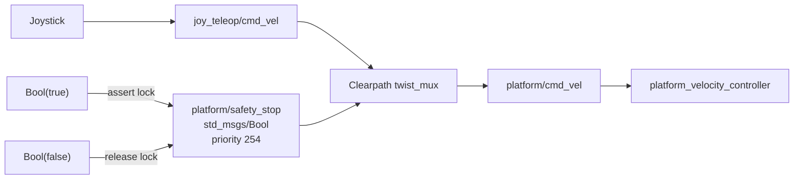
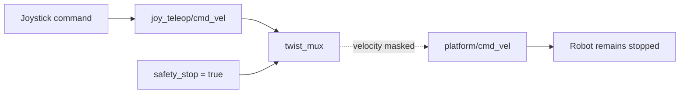

# Reusable ROS Safety-Stop Demo

## Contents

- [Purpose](#purpose)
- [What this reproduces](#what-this-reproduces)
- [Known binding](#known-binding)
- [Repeatable procedure](#repeatable-procedure)
  - [1. Connect to the Controlled Robot](#1-connect-to-the-controlled-robot)
  - [2. Confirm the expected safety-stop interface](#2-confirm-the-expected-safety-stop-interface)
  - [3. Confirm baseline joystick motion](#3-confirm-baseline-joystick-motion)
  - [4. Assert the software safety stop](#4-assert-the-software-safety-stop)
  - [5. Verify joystick motion is blocked](#5-verify-joystick-motion-is-blocked)
  - [6. Release the software safety stop](#6-release-the-software-safety-stop)
  - [7. Verify joystick motion is restored](#7-verify-joystick-motion-is-restored)
- [Expected state sequence](#expected-state-sequence)
- [Why repeated publication is used](#why-repeated-publication-is-used)
- [Recovery if the robot remains locked](#recovery-if-the-robot-remains-locked)
- [What this demo proves](#what-this-demo-proves)
- [What this demo does not prove](#what-this-demo-does-not-prove)
- [Important latency note](#important-latency-note)
- [Reference](#reference)

## Purpose

This file is the short, repeatable path for demonstrating the already-discovered ROS safety-stop behavior on the `CONTROLLED_ROBOT` without repeating the full ROS exploration.

Use it when the goal is simply to see the existing Clearpath software stop work in practice:

```text
joystick moves robot
        |
        v
publish safety_stop = true
        |
        v
joystick still produces commands
but robot motion is blocked
        |
        v
publish safety_stop = false
        |
        v
joystick motion returns
```

The detailed discovery evidence, commands, topology analysis, source inspection, and original experiments are preserved in [`exploration.md`](exploration.md).

## What this reproduces

The procedure reproduces only the already-proven local ROS behavior:



No custom RIS ROS node, new velocity topic, new mux, or priority change is required for this demonstration.

## Known binding

The current tested binding is:

| Item | Value |
|---|---|
| Architectural target | `CONTROLLED_ROBOT` |
| Current hardware binding | Clearpath Husky A200 (`husky1`) |
| Robot SSH endpoint | `robot@192.168.131.1` |
| ROS | ROS 2 Jazzy |
| Safety topic | `/husky1/platform/safety_stop` |
| Message type | `std_msgs/msg/Bool` |
| STOP | `data: true` |
| Release | `data: false` |
| `twist_mux` safety priority | `254` |
| Hardware E-stop priority | `255` |
| Safety lock timeout | `0.0` |
| Subscriber reliability | `BEST_EFFORT` |

The physical emergency stop remains the independent hardware-level safety control and must remain accessible during robot-motion testing.

# Repeatable procedure

## 1. Connect to the Controlled Robot

### Command

```bash
ssh robot@192.168.131.1
```

### Expected result

The shell prompt should become similar to:

```text
robot@husky1:~$
```

### Meaning

All following ROS commands execute directly in the Controlled Robot's configured ROS 2 environment.

---

## 2. Confirm the expected safety-stop interface

### Command

```bash
ros2 topic type /husky1/platform/safety_stop && \
ros2 param get /husky1/twist_mux locks.safety_stop.priority && \
ros2 param get /husky1/twist_mux locks.safety_stop.timeout
```

### Expected result

```text
std_msgs/msg/Bool
Integer value is: 254
Double value is: 0.0
```

### Meaning

The demonstration is targeting the same Clearpath software lock that was originally explored and validated.

If these values are different, do not assume the procedure still represents the same control configuration.

---

## 3. Confirm baseline joystick motion

With the test area clear, the robot supervised, and the physical E-stop accessible, briefly command a small normal joystick motion.

### Expected result

The robot responds normally to the joystick.

### Meaning

This establishes the baseline before asserting the software lock. A robot that does not move before the test cannot be used to prove that the safety lock caused the later stop.

---

## 4. Assert the software safety stop

### Command

```bash
timeout 2 ros2 topic pub -r 10 --qos-reliability best_effort \
  /husky1/platform/safety_stop std_msgs/msg/Bool "{data: true}"
```

### What it does

Publishes the asserted software lock at 10 Hz for two seconds using BEST_EFFORT reliability, matching the discovered `twist_mux` safety-stop subscriber.

### Expected result

The command publishes repeated `Bool(data=True)` messages and then exits after two seconds.

### Meaning

Once `twist_mux` accepts `true`, its priority-254 safety lock masks all configured normal velocity sources beneath it.

Because the lock timeout is `0.0`, the accepted `true` state remains active after this command exits until an accepted `false` changes it.

---

## 5. Verify joystick motion is blocked

Attempt the same small joystick motion used for the baseline.

### Expected result

The joystick may still be active, but the robot does **not** move.

Conceptually:



### Meaning

The software stop does not disable the joystick hardware. It prevents lower-priority velocity commands from passing through the existing Clearpath mux to the platform velocity controller.

---

## 6. Release the software safety stop

### Command

```bash
timeout 2 ros2 topic pub -r 10 --qos-reliability best_effort \
  /husky1/platform/safety_stop std_msgs/msg/Bool "{data: false}"
```

### What it does

Publishes the released state at 10 Hz for two seconds using the same BEST_EFFORT reliability.

### Expected result

Repeated `Bool(data=False)` messages are published and the command exits after two seconds.

### Meaning

Once `twist_mux` accepts `false`, the priority-254 software lock is released and normal velocity sources become eligible again.

---

## 7. Verify joystick motion is restored

Repeat the same small joystick motion.

### Expected result

The robot moves normally again.

### Meaning

The complete local ROS safety-stop cycle has been reproduced:

```text
normal motion
   -> assert software lock
   -> normal motion blocked
   -> release software lock
   -> normal motion restored
```

# Expected state sequence

```mermaid
stateDiagram-v2
    [*] --> BaselineMotion
    BaselineMotion --> SoftwareLocked: accepted Bool(true)
    SoftwareLocked --> SoftwareLocked: silence; timeout = 0.0
    SoftwareLocked --> MotionRestored: accepted Bool(false)
    MotionRestored --> MotionRestored: silence; timeout = 0.0
```



The key detail is that **silence does not release the lock**. The stored state changes only when another valid Boolean message is accepted because the configured timeout is `0.0`.

# Why repeated publication is used

The original live exploration observed:

```text
one-shot true
    -> STOP observed

one-shot false
    -> release was not observed

repeated BEST_EFFORT false
    -> release observed
```

The safety-stop subscriber advertises BEST_EFFORT reliability. Therefore this reusable demonstration deliberately publishes each requested state repeatedly for a short interval instead of treating one transient shell publication as guaranteed delivery.

This is a **test convenience**, not the final RIS runtime design.

# Recovery if the robot remains locked

If normal joystick motion does not return after the release step, first reissue the known working release command:

```bash
timeout 2 ros2 topic pub -r 10 --qos-reliability best_effort \
  /husky1/platform/safety_stop std_msgs/msg/Bool "{data: false}"
```

Then verify the hardware emergency-stop state:

```bash
ros2 topic echo --once /husky1/platform/emergency_stop
```

The expected released hardware state is:

```text
data: false
```

Do not bypass or modify the hardware emergency-stop path to make the demonstration pass.

# What this demo proves

A successful run demonstrates that, on the current Controlled Robot binding:

1. normal joystick control reaches the robot before the test;
2. `/husky1/platform/safety_stop` is an operational Clearpath `twist_mux` lock;
3. an accepted `Bool(true)` blocks normal joystick-driven motion;
4. the lock remains asserted without continuous publication because its timeout is `0.0`;
5. an accepted `Bool(false)` releases the software lock;
6. normal joystick motion resumes after release.

This is sufficient to demonstrate the **local ROS actuator-side mechanism** that the RIS system will eventually drive.

# What this demo does not prove

This procedure does **not** validate:

- Radar detection;
- distance-to-corner logic;
- DSP classification;
- NRF TX/RX transport;
- BLE delivery;
- serial-to-SSH delivery;
- state resynchronization after failure;
- end-to-end STOP latency;
- braking distance;
- the final RIS runtime bridge;
- a certified or hardware-level safety function.

It is specifically a reusable demonstration of the existing **ROS software lock**.

# Important latency note

During additional manual testing, asserting the stop while the robot was already moving was perceived as somewhat slow. That observation is qualitative and has not yet been measured.

This reusable CLI procedure must **not** be used to characterize final STOP latency because each invocation starts a new `ros2 topic pub` process and creates a temporary ROS publisher before transmitting. That startup work is part of the manual demonstration path and may contribute delay that should not exist in the final persistent runtime path.

The upcoming smoke validation should therefore measure separate timestamps/boundaries rather than attributing all observed delay to `twist_mux`:


The final design should use an already-running transport/publisher path before any latency or stopping-distance result is treated as representative of the RIS system.

# Reference

For the full discovery trail, exact command outputs, source-code inspection, QoS observations, original STOP/release experiments, and architectural interpretation, see [`exploration.md`](exploration.md).
