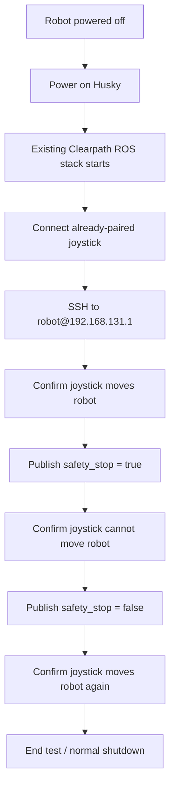

# Reusable ROS Safety-Stop Operation

## Contents

- [Purpose](#purpose)
- [Assumptions](#assumptions)
- [Run from powered off](#run-from-powered-off)
  - [1. Power on the Controlled Robot](#1-power-on-the-controlled-robot)
  - [2. Connect the joystick](#2-connect-the-joystick)
  - [3. SSH into the robot](#3-ssh-into-the-robot)
  - [4. Confirm normal joystick motion](#4-confirm-normal-joystick-motion)
  - [5. Trigger the software safety stop](#5-trigger-the-software-safety-stop)
  - [6. Confirm the joystick cannot move the robot](#6-confirm-the-joystick-cannot-move-the-robot)
  - [7. Release the software safety stop](#7-release-the-software-safety-stop)
  - [8. Confirm joystick motion returns](#8-confirm-joystick-motion-returns)
  - [9. End the run](#9-end-the-run)
- [Complete operating sequence](#complete-operating-sequence)
- [Expected result](#expected-result)
- [If release does not restore motion](#if-release-does-not-restore-motion)

## Purpose

This file is the direct operating procedure for reproducing the already-established ROS safety-stop behavior after the `CONTROLLED_ROBOT` has been powered off.

It is not an exploration or rediscovery procedure. It assumes the tested robot configuration has not changed.

```text
Power robot on
    -> connect joystick
    -> SSH to robot
    -> verify normal motion
    -> publish safety_stop = true
    -> verify joystick cannot move robot
    -> publish safety_stop = false
    -> verify joystick motion returns
    -> finish / power robot off
```

## Assumptions

This runbook assumes the previously established configuration remains unchanged:

- `CONTROLLED_ROBOT` is the same Clearpath Husky A200 (`husky1`);
- robot address is `192.168.131.1`;
- SSH user is `robot`;
- ROS 2 Jazzy starts automatically with the robot;
- the joystick remains paired/configured;
- the safety topic remains `/husky1/platform/safety_stop`;
- the topic type remains `std_msgs/msg/Bool`;
- `true` asserts STOP;
- `false` releases STOP;
- the Clearpath `twist_mux` configuration is unchanged.

If those assumptions are no longer true, use [`exploration.md`](exploration.md) instead of modifying the robot blindly.

# Run from powered off

## 1. Power on the Controlled Robot

Power on the Husky normally and allow the onboard computer and Clearpath ROS stack to boot.

No ROS setup command is required.

---

## 2. Connect the joystick

Turn on the already-paired joystick using the normal controller procedure.

It should reconnect as it did before shutdown.

---

## 3. SSH into the robot

From the control computer:

```bash
ssh robot@192.168.131.1
```

Expected prompt:

```text
robot@husky1:~$
```

---

## 4. Confirm normal joystick motion

With the area clear, the robot supervised, and the physical emergency stop accessible, command a small joystick movement.

**Expected:** the Husky moves normally.

---

## 5. Trigger the software safety stop

```bash
timeout 2 ros2 topic pub -r 10 --qos-reliability best_effort \
  /husky1/platform/safety_stop std_msgs/msg/Bool "{data: true}"
```

After the command exits, the software lock remains asserted under the current configuration.

---

## 6. Confirm the joystick cannot move the robot

Attempt the same small joystick movement.

**Expected:** the joystick does not move the Husky.

```text
Joystick command
      |
      v
  twist_mux  <--- safety_stop = true
      |
      X
      |
      v
Robot motion blocked
```

---

## 7. Release the software safety stop

```bash
timeout 2 ros2 topic pub -r 10 --qos-reliability best_effort \
  /husky1/platform/safety_stop std_msgs/msg/Bool "{data: false}"
```

---

## 8. Confirm joystick motion returns

Attempt the same small joystick movement again.

**Expected:** the Husky moves normally again.

The STOP/release cycle is complete.

---

## 9. End the run

When testing is finished:

1. leave the robot stopped;
2. exit SSH with `exit` if desired;
3. power down the Husky using the normal shutdown procedure.

No ROS files or Clearpath configuration need to be changed for another identical run.

# Complete operating sequence



# Expected result

| Stage | Expected behavior |
|---|---|
| Before STOP | Joystick moves the robot |
| After `data: true` | Joystick cannot move the robot |
| After `data: false` | Joystick moves the robot again |

Nothing else needs to be configured or rediscovered while the robot setup remains unchanged.

# If release does not restore motion

Run the release command again:

```bash
timeout 2 ros2 topic pub -r 10 --qos-reliability best_effort \
  /husky1/platform/safety_stop std_msgs/msg/Bool "{data: false}"
```

Then test the joystick again.

If motion still does not return, stop this repeatable procedure and move to troubleshooting. Do not change the established configuration merely to force the run to pass.
