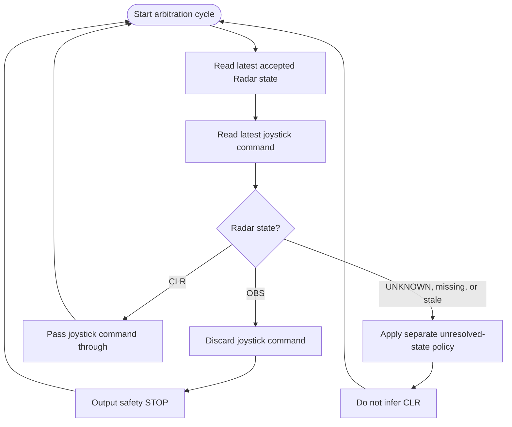
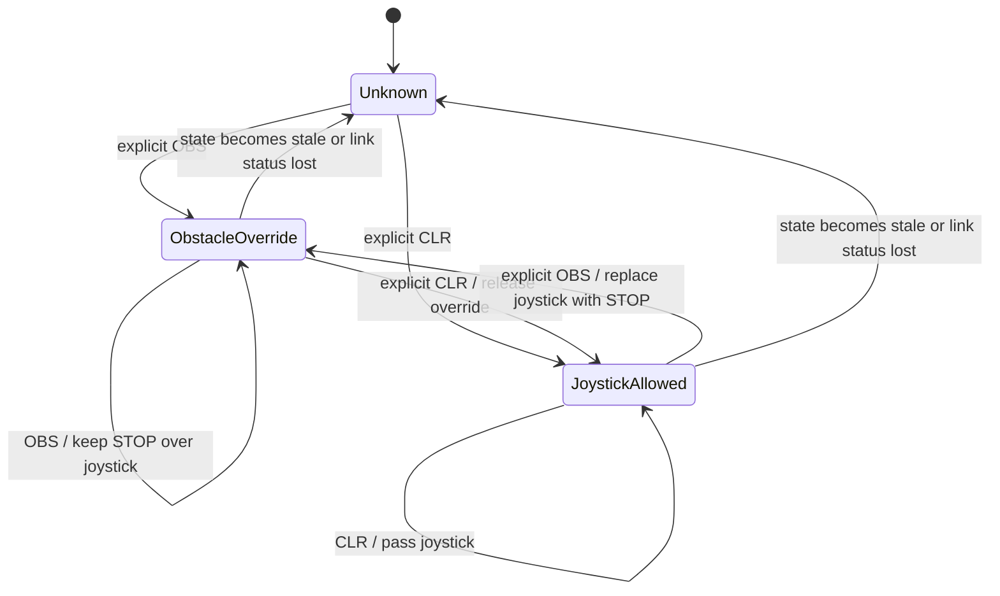

# Basic Safety Protocol — Radar Override of Joystick

## Contents

- [Purpose](#purpose)
- [Assumptions](#assumptions)
- [Protocol rule](#protocol-rule)
- [Inputs and outputs](#inputs-and-outputs)
- [Pseudocode](#pseudocode)
- [Arbitration flowchart](#arbitration-flowchart)
- [State flowchart](#state-flowchart)
- [Unknown or missing state](#unknown-or-missing-state)
- [Implementation boundary](#implementation-boundary)
- [Machine-readable contract](#machine-readable-contract)

## Purpose

Define the basic safety behavior independently from ROS, the controller implementation, or the transport used to deliver the Radar state.

## Assumptions

- The Radar station has already classified and publishes an explicit logical `OBS` or `CLR` state; this protocol does not classify raw Radar data.
- The event is intended for the `CONTROLLED_ROBOT`; `DUMMY_ROBOT` is not a command recipient.
- Only a valid explicit `CLR` releases a prior `OBS`; silence, malformed input, missing data, and stale data are not clear.
- A local Controlled Robot arbiter enforces the safety command ahead of joystick input. This document does not choose its ROS topic, message type, or implementation.

## Protocol rule

When the latest accepted Radar state is `OBS`, the safety command overrides the joystick command and the robot receives `STOP`. Repeated `OBS` updates keep the override active. An explicit `CLR` releases the override and allows the current joystick command to pass through.

This protocol specifies signal precedence. It does not define the ROS topic, controller/mux implementation, or how the Radar station classifies a scene.

## Inputs and outputs

| Signal | Meaning |
|---|---|
| Radar `OBS` | Obstacle state asserted; select safety `STOP` over joystick input. |
| Radar `CLR` | Explicit clear state; release safety override and select joystick input. |
| Joystick command | Normal operator command; pass through only while the latest accepted Radar state is `CLR`. |
| Selected output | `STOP` while Radar state is `OBS`; otherwise joystick command while state is explicitly `CLR`. |

The protocol states are logical values. Their wire encoding and the ROS/controller binding are specified at their owning implementation boundary.

## Pseudocode

```text
radar_state = UNKNOWN

on each arbitration cycle:
    if a valid Radar state update is received:
        if update is OBS or CLR:
            radar_state = update

    joystick_command = read_latest_joystick_command()

    if radar_state == OBS:
        discard joystick_command for this cycle
        output STOP
    else if radar_state == CLR:
        output joystick_command
    else:
        apply the separately defined unknown-state policy
        do not treat UNKNOWN, missing, or stale input as CLR
```

The state remains `OBS` until an explicit `CLR` is accepted. Silence does not release the override.

## Arbitration flowchart



## State flowchart



`Unknown` is deliberately not defined as joystick permission. The required response to unknown or stale state remains an unresolved system-level liveness policy.

## Unknown or missing state

The direct `OBS`/`CLR` precedence is defined above. This basic protocol does not choose the robot's motion response to an unknown, missing, or stale Radar state. Existing system policy forbids treating those conditions as `CLR`; the implementation must apply a separately accepted fail-safe policy before it is relied on for motion.

## Implementation boundary

This contract is independent from ROS. Its ROS topic, message type, arbitration node, and runtime behavior belong in [`../controller/`](../controller/) or the actual source package. The final STOP precedence must be enforced locally on the Controlled Robot, as required by the canonical [control authority](../../docs/architecture/safety/control-authority.md) document.

The Radar-side distance trigger is specified separately in the [Controlled Robot corner-proximity protocol](controlled-robot-corner-trigger.md). That protocol emits a logical trigger for the `CONTROLLED_ROBOT`; this document specifies how an accepted `OBS` state overrides joystick input. The distance algorithm's explicit release condition and end-to-end stopping evidence remain open.

## Machine-readable contract

The logical Radar state event is also described in [AsyncAPI](basic-safety-protocol.asyncapi.yaml). AsyncAPI documents the event contract; it does not choose a ROS topic or implement arbitration.
