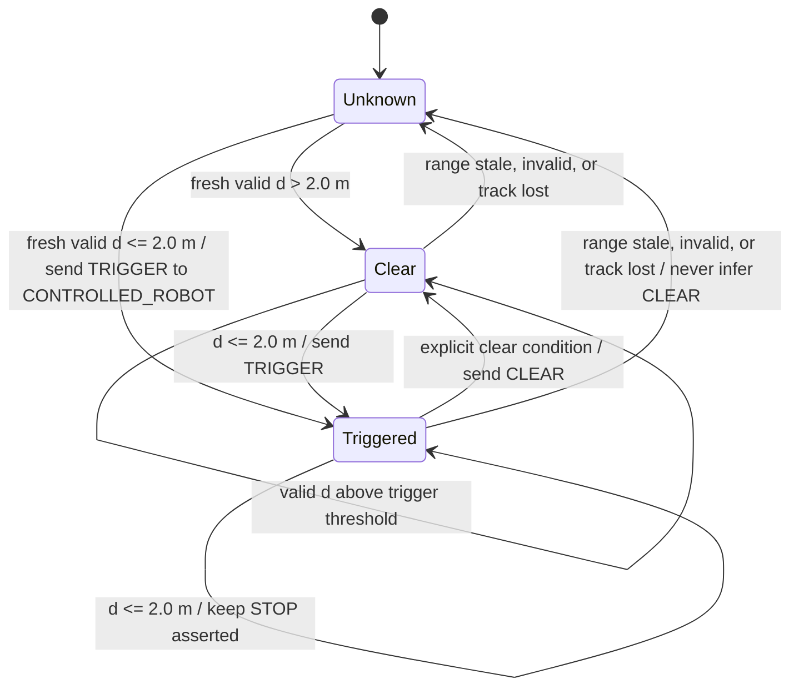

# Controlled Robot Corner-Proximity Trigger Protocol

## Contents

- [Purpose](#purpose)
- [Assumptions](#assumptions)
- [Range geometry](#range-geometry)
- [Two-meter threshold comparison](#two-meter-threshold-comparison)
- [Protocol behavior](#protocol-behavior)
- [Pseudocode](#pseudocode)
- [Trigger flowchart](#trigger-flowchart)
- [State flowchart](#state-flowchart)
- [Failure and release behavior](#failure-and-release-behavior)
- [Machine-readable contract](#machine-readable-contract)
- [Maturity and next work](#maturity-and-next-work)

## Purpose

Define the Radar-station algorithm that estimates the `CONTROLLED_ROBOT` distance to a corner and sends a proximity trigger to the `CONTROLLED_ROBOT`. The Radar station makes the trigger decision from its own range observations; it does not request speed, pose, or other state from the joystick/control station. The trigger destination is the `CONTROLLED_ROBOT`, never the `DUMMY_ROBOT`.

This protocol defines the range calculation and logical event. It does not select a ROS topic, implement the robot-local arbiter, or claim the proposed threshold has been validated.

## Assumptions

| Assumption | Protocol value or consequence |
|---|---|
| Radar position | Radar phase center is mounted directly above the corner, or its horizontal offset from the corner is calibrated out. |
| Measured range | `r` is instantaneous slant range to a tracked reference point on the `CONTROLLED_ROBOT`, not an arbitrary return or the `DUMMY_ROBOT`. |
| Height geometry | The tracked reference point is at ground height for the simple formula. If it is at height `z`, use the vertical separation `h - z`. |
| Independent decision | The Radar station computes and emits the trigger without receiving control-station or joystick state. A one-way trigger path to the `CONTROLLED_ROBOT` is still required. |
| Speed | `w = 1 m/s` is the assumed worst-case operating speed for the current Clearpath Husky A200 binding. Clearpath documents 1 m/s maximum speed. |
| Threshold | `d_trigger = 2.0 m` is a proposed center-reference trigger threshold, not a validated stopping distance. |
| Robot instance | `CONTROLLED_ROBOT` and `DUMMY_ROBOT` are architectural roles. If both are bound to Husky A200, they are distinct physical instances; this trigger addresses only `CONTROLLED_ROBOT`. |

If the Radar return cannot be associated with a fresh `CONTROLLED_ROBOT` reference-point estimate, the distance is invalid. An invalid or missing estimate never emits `CLEAR`.

## Range geometry

Let:

- `h` be the vertical height of the Radar phase center above the ground reference plane;
- `r` be the measured slant range to the tracked ground-level reference point;
- `d` be the horizontal ground-plane distance from that reference point to the corner.

For a level floor and a calibrated Radar directly above the corner:

```text
r² = d² + h²
d = sqrt(r² - h²), provided r >= h
```

For a tracked point at height `z`, replace `h` with the vertical separation:

```text
d = sqrt(r² - (h - z)²), provided r >= abs(h - z)
```

The result is the ground-plane distance to the **tracked reference point**. An arbitrary Radar reflection is not automatically the robot center. The Radar-side tracker must provide or calibrate the reference-point offset before this result is used as `d`.

If the Radar reports horizontal ground range rather than slant range, use that reported horizontal range directly; do not subtract the height a second time.

## Two-meter threshold comparison

The current hardware-binding record identifies the `CONTROLLED_ROBOT` as a Clearpath Husky A200. Clearpath specifies a 990 mm length, 670 mm width, and maximum speed of 1 m/s in its [Husky A200 user manual](https://docs.clearpathrobotics.com/docs_robots/outdoor_robots/husky/a200/user_manual_husky/).

At the proposed threshold and assumed maximum operating speed:

| Quantity | Calculation | Result |
|---|---:|---:|
| Time for the reference point to reach the corner at constant speed | `2.0 m / 1.0 m/s` | `2.0 s` |
| Threshold as Husky body lengths | `2.0 m / 0.990 m` | `2.02 lengths` |
| Threshold as Husky body widths | `2.0 m / 0.670 m` | `2.99 widths` |
| Front extent from a centered reference point, straight-on | `0.990 m / 2` | `0.495 m` |
| Remaining front-edge distance at trigger | `2.0 m - 0.495 m` | `1.505 m` |
| Time for the front edge to reach the corner at 1 m/s | `1.505 m / 1.0 m/s` | `1.505 s` |

This comparison supports `2.0 m` as a **plausible early trigger point**: it is about two body lengths from the corner, and it leaves about 1.5 m between the front edge and the corner under the stated center-reference, straight-on geometry. It does not by itself prove that the robot will stop before the corner.

For the threshold to provide enough stopping margin, measured end-to-end trigger latency `T` and guaranteed minimum deceleration `a_min` must satisfy:

```text
w * T + w² / (2 * a_min) + front_extent + geometric_margin <= 2.0 m
```

At `w = 1 m/s` and `front_extent = 0.495 m`, only `1.505 m` remains for trigger latency travel, braking distance, and additional margin. Latency, braking behavior, localization/range error, approach angle, and floor conditions are not yet measured. Therefore the two-meter value remains **design-only pending a controlled stopping-distance test**.

## Protocol behavior

1. The Radar station samples slant range to a track identified as `CONTROLLED_ROBOT`.
2. It projects the range onto the ground plane using the configured Radar/target height geometry.
3. For a valid fresh estimate, it asserts `TRIGGER` when `d <= 2.0 m`.
4. The event is addressed to the `CONTROLLED_ROBOT`; the `DUMMY_ROBOT` receives no control command.
5. The receiver maps `TRIGGER` to the existing logical safety `OBS` behavior. The robot-local arbiter applies STOP precedence over joystick input.
6. Release requires an explicit `CLEAR` event after a separately configured clear condition. The release threshold/hysteresis is **TBD**; missing, stale, invalid, or lost range data cannot release a latched trigger.

The event is transport-independent. The existing Transceiver/serial/SSH route may carry it, but the exact transport encoding and controller binding remain implementation-boundary decisions.

## Pseudocode

```text
TRIGGER_DISTANCE_M = 2.0
ASSUMED_MAX_SPEED_MPS = 1.0
radar_state = UNKNOWN

on each Radar range sample:
    track = identify CONTROLLED_ROBOT reference point

    if track is missing, invalid, or stale:
        do not emit CLEAR
        retain any active trigger; apply unresolved invalid-range policy
        continue

    vertical_delta = radar_height_h - track_height_z
    if slant_range_r < abs(vertical_delta):
        mark range invalid
        do not emit CLEAR
        continue

    d = sqrt(slant_range_r^2 - vertical_delta^2)

    if d <= TRIGGER_DISTANCE_M:
        if radar_state is not TRIGGERED:
            emit TRIGGER addressed to CONTROLLED_ROBOT
            radar_state = TRIGGERED
    else if explicit_clear_condition(d) is satisfied:
        emit CLEAR addressed to CONTROLLED_ROBOT
        radar_state = CLEAR
    else:
        retain radar_state
```

`ASSUMED_MAX_SPEED_MPS` is documented for threshold analysis. The Radar does not depend on live speed sharing to make the trigger decision.

## Trigger flowchart

```mermaid
flowchart TD
    A([Read Radar range sample]) --> B{Fresh CONTROLLED_ROBOT track?}
    B -->|No| C[Keep active trigger latched; do not emit CLEAR]
    C --> A
    B -->|Yes| D{Range valid for h and z?}
    D -->|No| C
    D -->|Yes| E[Project slant range onto ground plane: d = sqrt(r² - (h-z)²)]
    E --> F{d ≤ 2.0 m?}
    F -->|Yes| G[Emit TRIGGER to CONTROLLED_ROBOT]
    G --> H[Robot-local arbiter maps trigger to OBS / STOP]
    H --> A
    F -->|No| I{Explicit clear condition satisfied?}
    I -->|No| J[Retain current state]
    I -->|Yes| K[Emit CLEAR to CONTROLLED_ROBOT]
    J --> A
    K --> A
```

## State flowchart



The release condition shown as “explicit clear condition” is not numerically specified yet. Add a clear threshold/hysteresis and stale timeout before implementation.

## Failure and release behavior

- An invalid range, missing track, stale sample, or range-link loss never means `CLEAR`.
- A previously asserted trigger remains latched until an explicit release event is justified by valid Radar data and the configured release condition.
- The receiver/arbiter must retain local STOP precedence even if later joystick messages arrive.
- Exact sample freshness limits, uncertainty margin, release threshold/hysteresis, message-loss handling, and restart/resynchronization behavior remain open protocol parameters.
- Software STOP remains an experiment control, not a replacement for physical emergency stop or supervised testing.

## Machine-readable contract

The logical event and payload are described in [AsyncAPI](controlled-robot-corner-trigger.asyncapi.yaml). The contract does not name a ROS topic and does not replace the local ROS arbitration required by the [control authority](../../docs/architecture/safety/control-authority.md).

## Maturity and next work

**Maturity: Design only.** The range geometry and proposed 2.0 m trigger are specified, but the reference-point tracker, uncertainty, explicit release rule, transport encoding, measured end-to-end latency, braking performance, and controlled stopping-distance evidence are not established.

**Next item:** calibrate `h`, target-reference height/offset, and range uncertainty; then measure the Husky A200's worst-case trigger-to-zero-motion distance at the configured 1 m/s cap under supervised conditions. Accept or revise `2.0 m` only after the measured bound fits within the available `1.505 m` front-edge margin plus the approved experiment margin.
