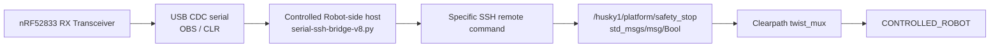
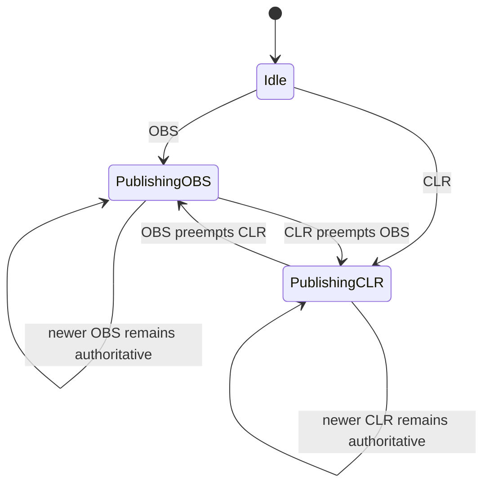

# Serial-to-SSH Bridge Explanation and Operation

## Contents

- [Purpose](#purpose)
- [Current status](#current-status)
- [End-to-end control path](#end-to-end-control-path)
- [Serial protocol behavior](#serial-protocol-behavior)
- [Why the serial output is transition-oriented](#why-the-serial-output-is-transition-oriented)
- [How the implementation evolved](#how-the-implementation-evolved)
  - [Serial validation — `serial-test-v2.py`](#serial-validation--serial-test-v2py)
  - [Bridge v1 — initial Paramiko bridge](#bridge-v1--initial-paramiko-bridge)
  - [Bridge v2 — explicit ROS discovery preflight](#bridge-v2--explicit-ros-discovery-preflight)
  - [Bridge v3 — Clearpath setup-path experiment](#bridge-v3--clearpath-setup-path-experiment)
  - [Bridge v4 — exact SSH remote commands](#bridge-v4--exact-ssh-remote-commands)
  - [Bridge v5 — source ROS Jazzy](#bridge-v5--source-ros-jazzy)
  - [Bridge v6 — intermediate discovery checkpoint](#bridge-v6--intermediate-discovery-checkpoint)
  - [Bridge v7 — reproduce the live Clearpath ROS environment](#bridge-v7--reproduce-the-live-clearpath-ros-environment)
  - [Bridge v8 — preemptive latest-state-wins scheduling](#bridge-v8--preemptive-latest-state-wins-scheduling)
- [Current v8 design](#current-v8-design)
- [ROS command semantics](#ros-command-semantics)
- [How to operate v8](#how-to-operate-v8)
  - [Prerequisites](#prerequisites)
  - [One-time host setup](#one-time-host-setup)
  - [Run the bridge](#run-the-bridge)
  - [Put the Transceiver in RX mode](#put-the-transceiver-in-rx-mode)
  - [Stub-mode validation](#stub-mode-validation)
  - [Normal BLE operation](#normal-ble-operation)
- [Expected runtime behavior](#expected-runtime-behavior)
- [Troubleshooting notes learned during integration](#troubleshooting-notes-learned-during-integration)
- [Known limitations and next concern](#known-limitations-and-next-concern)
- [Version history](#version-history)

## Purpose

This document explains how the RIS Robotics serial-to-SSH bridge reached its current working implementation, why each version changed, and how to operate the validated v8 bridge.

The bridge owns the integration boundary between the RX Transceiver's newline-delimited `OBS` / `CLR` serial output and the existing `CONTROLLED_ROBOT` ROS safety-stop interface.

It does **not** replace Clearpath's local motion arbitration. The existing `twist_mux` remains the authority that blocks or restores lower-priority velocity sources.

## Current status

As of 2026-10-05, the following path has been physically exercised successfully:

```text
RX Transceiver serial
        |
        | OBS / CLR
        v
serial-ssh-bridge-v8.py
        |
        | specific SSH remote command
        v
CONTROLLED_ROBOT onboard computer
        |
        | ROS 2 Bool publication
        v
/husky1/platform/safety_stop
        |
        v
Clearpath twist_mux
        |
        +-- OBS / true  -> motion blocked
        |
        +-- CLR / false -> motion restored
```

The current working implementation is:

```text
robotics/serial/serial-ssh-bridge-v8.py
```

The serial transport itself was validated before SSH integration using:

```text
robotics/serial/serial-test-v2.py
```

## End-to-end control path

The current integration path is:



The bridge therefore translates only the safety state:

| Serial state | ROS value | Meaning |
|---|---:|---|
| `OBS` | `true` | Assert software safety stop |
| `CLR` | `false` | Release software safety stop |

The physical emergency stop remains independent and higher priority than this software path.

## Serial protocol behavior

The validated RX serial protocol is deliberately small:

```text
OBS\n
CLR\n
```

Host parsing is newline-delimited. Raw operating-system reads are **not** treated as message boundaries.

For example, the following is valid serial behavior:

```text
RAW b'O'
RAW b'BS\n'
LINE b'OBS'
```

Likewise:

```text
RAW b'C'
RAW b'LR\n'
LINE b'CLR'
```

The important evidence is the completed parsed line, not whether one `read()` call happened to return the whole message.

The bridge ignores any completed line other than exact `OBS` or exact `CLR`.

## Why the serial output is transition-oriented

The RX firmware deduplicates repeated logical states. Repeated BLE or synthetic `OBS` events do not continuously flood the serial host, and repeated `CLR` events are likewise suppressed.

Conceptually:

```text
CLEAR -> OBS   => emit OBS once
OBS   -> OBS   => emit nothing
OBS   -> CLEAR => emit CLR once
CLEAR -> CLEAR => emit nothing
```

This behavior exists because BLE state advertising can repeat the same state many times. The serial boundary was designed as a transition stream rather than a continuous state stream.

This behavior was accepted for the current implementation and is not considered a serial failure.

A consequence remains: if the host bridge starts or reconnects after a transition has already happened and the RX state does not change again, the deduplication layer does not automatically replay the current state. State resynchronization is therefore a separate future design concern.

## How the implementation evolved

### Serial validation — `serial-test-v2.py`

Before SSH was introduced, the serial boundary was isolated and tested by itself.

The listener:

- auto-detected SEGGER/J-Link CDC interfaces;
- opened the available ACM ports;
- printed raw byte chunks;
- reconstructed newline-delimited messages;
- accepted only exact `OBS` and `CLR` lines.

Physical stub-mode testing proved complete `OBS` and `CLR` framing on `/dev/ttyACM0`.

This established an important boundary: subsequent failures were no longer assumed to be serial failures unless the parsed `LINE` output itself was incorrect.

### Bridge v1 — initial Paramiko bridge

The first complete bridge added SSH and invoked the already-proven ROS safety-stop publication remotely.

Both state changes used the same publication policy:

```text
10 Hz for 2 seconds
BEST_EFFORT QoS
```

rather than a one-shot publication.

This matched the earlier physical ROS experiment in which repeated BEST_EFFORT publication was the reliable operating procedure, especially for release.

v1 successfully:

- read `OBS` / `CLR` from serial;
- authenticated over SSH;
- launched `ros2 topic pub` remotely.

However, the robot did not react. The remote process existed, but it was not participating in the same ROS discovery environment as the working interactive shell.

### Bridge v2 — explicit ROS discovery preflight

v2 attempted to make the ROS environment explicit and added a preflight check for:

```text
/husky1/platform/safety_stop
```

The preflight failed with:

```text
Unknown topic '/husky1/platform/safety_stop'
```

This proved that successfully launching the ROS CLI was not enough; the non-interactive SSH command needed the robot's actual ROS discovery context.

### Bridge v3 — Clearpath setup-path experiment

v3 attempted to reproduce the robot environment by sourcing a guessed Clearpath setup file.

That path did not exist on this robot, so the version failed before bridge operation.

The important lesson was to stop guessing robot-specific setup paths and instead reproduce only values directly observed in the working shell.

### Bridge v4 — exact SSH remote commands

v4 simplified the transport model.

Instead of treating SSH as an interactive session, the bridge used the same conceptual operation as:

```text
ssh robot@192.168.131.1 '<specific command>'
```

This matched the intended architecture: each serial transition causes a specific remote ROS command.

The next failure was explicit:

```text
timeout: failed to run command 'ros2': No such file or directory
```

The SSH command reached the robot correctly; the non-interactive shell simply did not have ROS 2 on its `PATH`.

### Bridge v5 — source ROS Jazzy

v5 prefixed both remote commands with:

```bash
source /opt/ros/jazzy/setup.bash
```

This made the `ros2` executable available remotely.

The command could now launch, but publication still did not affect the live ROS graph because the Clearpath discovery variables were still absent.

### Bridge v6 — intermediate discovery checkpoint

v6 was an intermediate attempt to introduce the discovery fix, but the generated script did not actually contain the required environment change. Operationally it behaved like v5.

This version is preserved because it records the debugging history and the distinction between the intended modification and the artifact that was actually executed.

### Bridge v7 — reproduce the live Clearpath ROS environment

The working interactive SSH shell was inspected directly and exposed:

```text
ROS_SUPER_CLIENT=True
ROS_DOMAIN_ID=0
ROS_AUTOMATIC_DISCOVERY_RANGE=SUBNET
ROS_DISCOVERY_SERVER=127.0.0.1:11811;
```

A direct remote command that sourced Jazzy and exported those exact values was tested while observing `/husky1/platform/safety_stop`. Both `true` and `false` were seen on the ROS topic.

v7 therefore reproduced the actual environment instead of inferring it.

At this point the serial command, SSH execution, ROS environment, and Bool semantics were all individually correct.

The remaining issue was scheduling.

v7 executed each two-second publication synchronously. Therefore a new state could wait behind an older state that was still publishing.

For example:

```text
OBS received
    |
    v
publish true for 2 seconds
    |
    | CLR arrives here but waits
    v
OBS command finishes
    |
    v
publish false for 2 seconds
```

This was especially undesirable for a safety path because a newer state should become authoritative immediately rather than waiting in FIFO order behind a stale command.

### Bridge v8 — preemptive latest-state-wins scheduling

v8 changed the scheduler from sequential command completion to **latest-state-wins** behavior.

Each new state:

1. checks whether a previous RIS ROS publisher is still running;
2. kills the previous publisher process group;
3. starts the new publisher in its own remote session/process group;
4. records the new remote PID;
5. returns immediately from SSH while the bounded two-second ROS publisher runs remotely.

The remote PID is tracked in:

```text
/tmp/ris-safety-publisher.pid
```

and publisher output is written to:

```text
/tmp/ris-safety-publisher.log
```

The local queue also collapses accumulated transitions so stale queued states are discarded and the newest state is applied.

Conceptually:



This v8 behavior was physically exercised successfully for both STOP and release.

## Current v8 design

The current bridge has four important responsibilities.

### 1. Serial discovery and framing

It finds SEGGER/J-Link CDC interfaces and reads at:

```text
115200 baud
8 data bits
no parity
1 stop bit
```

It reconstructs messages using newline framing and accepts only exact `OBS` or `CLR`.

### 2. State translation

```text
OBS -> Bool(true)
CLR -> Bool(false)
```

### 3. ROS environment reproduction

Each remote command explicitly sources ROS 2 Jazzy and exports the Clearpath ROS discovery environment observed on the robot.

### 4. Preemptive scheduling

The newest serial state supersedes any still-running older publisher.

This prevents a stale two-second publication from blocking the next state transition.

## ROS command semantics

Both states use the same bounded repeated-publication mechanism.

The effective STOP command is:

```bash
timeout 2 ros2 topic pub -r 10 --qos-reliability best_effort \
  /husky1/platform/safety_stop std_msgs/msg/Bool "{data: true}"
```

The effective release command is:

```bash
timeout 2 ros2 topic pub -r 10 --qos-reliability best_effort \
  /husky1/platform/safety_stop std_msgs/msg/Bool "{data: false}"
```

The bridge intentionally does **not** use a one-shot publication for either state.

The two-second repeated BEST_EFFORT form is retained because it is the procedure that restored motion reliably during the earlier ROS-side physical experiment.

## How to operate v8

### Prerequisites

The current implementation assumes:

- Linux host connected to the RX Transceiver over USB;
- Ethernet connectivity to the `CONTROLLED_ROBOT` onboard computer;
- `CONTROLLED_ROBOT` binding is the current Clearpath Husky A200 at `192.168.131.1`;
- SSH user is `robot`;
- ROS 2 Jazzy and the existing Clearpath stack are running on the robot;
- `/husky1/platform/safety_stop` remains the active software safety-lock topic;
- `pyserial` is installed on the host;
- `sshpass` is installed on the host;
- the physical emergency stop remains accessible during physical motion testing.

### One-time host setup

Install the Python serial dependency if needed:

```bash
python3 -m pip install pyserial
```

Install `sshpass` if needed:

```bash
sudo apt install sshpass
```

The committed repository version reads the SSH credential from:

```text
RIS_ROBOT_SSH_PASSWORD
```

Set that environment variable in the host shell before running the bridge.

### Run the bridge

From the repository root:

```bash
export RIS_ROBOT_SSH_PASSWORD='<robot-password>'
python3 robotics/serial/serial-ssh-bridge-v8.py
```

Expected startup includes discovery of the J-Link CDC interfaces followed by:

```text
Bridge active. Waiting for exact OBS/CLR lines.
```

The integration session physically observed the valid protocol on `/dev/ttyACM0`. The bridge opens all matching J-Link interfaces and processes whichever one produces valid protocol lines.

### Put the Transceiver in RX mode

The unified Transceiver firmware boots in TX mode.

From the default boot state, press **Button 2 once** to enter RX mode.

Expected RX Natural LED state under the current firmware mapping:

```text
LED1: steady ON
LED2: normally OFF except receive pulse
LED3: ON for Coded S=8
LED4: OFF in Natural stub mode
```

### Stub-mode validation

Button 3 cycles the RX stub source:

```text
Natural
  |
  | Button 3
  v
Forced CLR
  |
  | Button 3
  v
Forced OBS
  |
  | Button 3
  v
Natural
```

Important: moving from **Forced OBS to Natural emits no synthetic serial state**. Therefore after observing `OBS`, one Button 3 press may correctly produce no new serial line. Pressing Button 3 again moves Natural to Forced CLR and produces `CLR`.

Expected bridge evidence for OBS:

```text
LINE b'OBS'
>>> VALID OBS <<<
[BRIDGE] ... -> OBS -> preemptive SSH scheduler
[SSH] OBS / STOP: ...
```

Expected bridge evidence for CLR:

```text
LINE b'CLR'
>>> VALID CLR <<<
[BRIDGE] ... -> CLR -> preemptive SSH scheduler
[SSH] CLR / RELEASE: ...
```

### Normal BLE operation

Stub mode is only a local RX validation mechanism.

In normal operation the RX Transceiver remains in Natural mode and receives `OBS` / `CLR` state through BLE from the TX Transceiver. The host bridge does not need to know whether a validated RX state originated from BLE or the development stub; it only consumes the resulting serial protocol line.

## Expected runtime behavior

### OBS path

```text
RX emits OBS\n
    |
    v
bridge parses OBS
    |
    v
newest state becomes OBS
    |
    v
previous remote RIS publisher is terminated if still active
    |
    v
remote true publisher starts
    |
    v
/husky1/platform/safety_stop = true
    |
    v
twist_mux blocks lower-priority motion
```

### CLR path

```text
RX emits CLR\n
    |
    v
bridge parses CLR
    |
    v
newest state becomes CLR
    |
    v
previous remote RIS publisher is terminated if still active
    |
    v
remote false publisher starts
    |
    v
/husky1/platform/safety_stop = false
    |
    v
twist_mux permits normal lower-priority control again
```

## Troubleshooting notes learned during integration

### Split raw reads are normal

Do not diagnose this as corruption:

```text
RAW b'O'
RAW b'BS\n'
```

The parser correctly reconstructs `OBS` once the newline arrives.

### No output after one stub-button press can be correct

From Forced OBS, Button 3 moves to Natural first. Natural does not inject a synthetic state. Another Button 3 press is required to reach Forced CLR.

### `ros2: No such file or directory`

A non-interactive SSH command does not automatically inherit the ROS CLI path. The working bridge explicitly sources:

```text
/opt/ros/jazzy/setup.bash
```

### ROS command runs but robot does not react

The Clearpath ROS discovery environment must also be reproduced. The working values observed on this robot are:

```text
ROS_SUPER_CLIENT=True
ROS_DOMAIN_ID=0
ROS_AUTOMATIC_DISCOVERY_RANGE=SUBNET
ROS_DISCOVERY_SERVER=127.0.0.1:11811;
```

### CLR waits behind OBS in older versions

That was the v7 scheduling problem. v8 does not intentionally wait for the previous two-second publication to finish; the newest state preempts it.

## Known limitations and next concern

The bridge is now functionally able to carry both `OBS` and `CLR` through serial, SSH, ROS, and the existing Clearpath safety-stop interface.

However, **functional correctness is not the same as acceptable stop latency**.

The current path still includes several potentially significant timing components:

```text
serial detection
    + host scheduling
    + new SSH command execution
    + remote shell startup
    + ROS CLI process startup
    + ROS discovery / publisher creation
    + twist_mux lock handling
    + controller response
    + physical robot deceleration
```

The current implementation therefore must not be described as latency-validated.

The observed physical system has already motivated concern about how quickly the robot actually reaches zero motion after `OBS`. That concern should be evaluated separately from this document's conclusion that the **state path itself now works**.

The next design discussion should focus on reducing and measuring trigger-to-stop latency without discarding the evidence and working behavior established here.

## Version history

| Artifact | Main change | Outcome |
|---|---|---|
| `serial-test-v2.py` | Isolated RX serial listener and exact newline framing | Serial `OBS` / `CLR` validated |
| `serial-ssh-bridge-v1.py` | Initial serial + Paramiko SSH + ROS command | SSH command ran, robot did not react |
| `serial-ssh-bridge-v2.py` | Explicit ROS discovery/preflight attempt | Safety topic not visible |
| `serial-ssh-bridge-v3.py` | Tried robot-specific setup path | Assumed path did not exist |
| `serial-ssh-bridge-v4.py` | Switched to direct specific SSH command execution | `ros2` missing from non-interactive PATH |
| `serial-ssh-bridge-v5.py` | Source ROS 2 Jazzy | ROS CLI available; discovery still incomplete |
| `serial-ssh-bridge-v6.py` | Intermediate discovery checkpoint | Intended discovery change was not present in executed artifact |
| `serial-ssh-bridge-v7.py` | Added exact observed Clearpath ROS discovery variables | ROS state reached graph; synchronous scheduling remained |
| `serial-ssh-bridge-v8.py` | Added preemptive latest-state-wins remote scheduling | **Working OBS and CLR bridge** |
