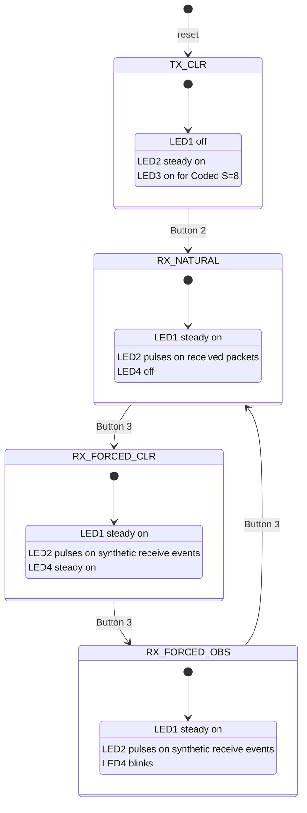
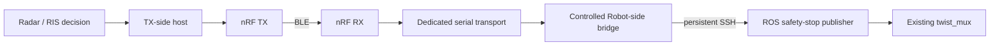

# Serial Integration Exploration — nRF Transceiver to Host

**Date:** 2026-10-05  
**System boundary:** nRF52833 Transceiver serial console to host computer  
**Target role:** RX Transceiver feeding the future `CONTROLLED_ROBOT` bridge  
**Current firmware:** shared runtime TX/RX image on `main`  
**Current board target:** `nrf52833dk/nrf52833`

## Contents

- [Summary](#summary)
- [What was proven](#what-was-proven)
- [Observed hardware state model](#observed-hardware-state-model)
- [Linux serial enumeration](#linux-serial-enumeration)
- [Recorded exploration](#recorded-exploration)
  - [1. Establish the reset state](#1-establish-the-reset-state)
  - [2. Switch from TX to RX](#2-switch-from-tx-to-rx)
  - [3. Enter Forced CLR stub mode](#3-enter-forced-clr-stub-mode)
  - [4. Probe the first ACM interface](#4-probe-the-first-acm-interface)
  - [5. Probe the second ACM interface](#5-probe-the-second-acm-interface)
  - [6. Hold the first ACM interface open during a state transition](#6-hold-the-first-acm-interface-open-during-a-state-transition)
  - [7. Observe natural over-the-air RX activity](#7-observe-natural-over-the-air-rx-activity)
  - [8. Inspect the latest firmware serial implementation](#8-inspect-the-latest-firmware-serial-implementation)
  - [9. Check the Linux firmware toolchain](#9-check-the-linux-firmware-toolchain)
- [Current serial implementation assessment](#current-serial-implementation-assessment)
- [Why the current path is insufficient for the final bridge](#why-the-current-path-is-insufficient-for-the-final-bridge)
- [Required redesign direction](#required-redesign-direction)
- [Conclusions](#conclusions)
- [Open work](#open-work)

## Summary

The 2026-10-05 exploration separated the wireless path from the host serial path and showed that they are not failing in the same place.

The nRF52833 Transceiver runtime state machine behaved consistently once the board was reset to a known state. The board booted in TX + CLR, switched to RX with Button 2, entered Forced CLR with Button 3, and showed the expected RX activity indications. Later, with a second physical Transceiver sending over the air, the RX board's activity LED pulsed in response to received packets. That provides direct evidence that the BLE TX-to-RX path is operating.

The host serial side was less satisfactory. Linux exposed two SEGGER J-Link ACM interfaces for the connected board. Manual reads did not reliably produce complete `OBS` / `CLR` lines. During one timed listener, changing the RX stub from Forced CLR to Forced OBS produced a partial visible `OB` on `/dev/ttyACM0`. This demonstrates that bytes from the firmware console path reached the host, but it does **not** validate complete, reliable, framed delivery of the protocol event.

Source inspection of the current firmware explains why this boundary is weak. RX protocol events are emitted with `printk("OBS\n")` and `printk("CLR\n")` through `DT_CHOSEN(zephyr_console)`. TX serial input is consumed with `uart_poll_in()` from that same console device, one byte at a time inside the main runtime loop, which sleeps for 5 ms each iteration. The console is therefore simultaneously being treated as a debugging channel and as the transport for safety-state control data.

That implementation was adequate for early smoke testing, but it is not the desired final serial architecture for the RIS-to-robot path. The agreed direction is to replace the console-based control path with a dedicated, event-driven serial transport and flash the corrected implementation onto both physical Transceivers before building the serial-to-SSH bridge on top of it.

## What was proven

| Question | Result | Meaning |
|---|---|---|
| Known reset role | TX | A true reset returned the board to the documented default TX role. |
| Reset TX state | CLR | Physical LED1 was off while physical LED2 was steadily on. |
| Reset PHY | Coded S=8 | Physical LED3 was on in the known reset condition. |
| Runtime role switch | Works | One Button 2 press changed TX to RX without reflashing. |
| RX role indication | Works | Physical LED1 became steady on and physical LED2 became normally off outside receive activity. |
| RX Forced CLR stub | Works | Button 3 produced LED4 steady on and repeated LED2 receive-event pulses. |
| Natural BLE reception | Observed | With the other Transceiver sending, the RX board's LED2 pulsed, proving valid Transceiver packets reached the RX firmware. |
| TX state indication | Defined and usable | On the TX board, LED1 off means CLR and LED1 pulsing means OBS while LED2 remains the TX-role indicator. |
| Linux J-Link enumeration | Two ACM interfaces | One connected board exposed `if00 -> ttyACM0` and `if02 -> ttyACM1`. |
| Complete serial `OBS` / `CLR` delivery | Not yet validated | Manual reads were inconsistent; one listener showed only `OB`, not a complete accepted protocol line. |
| BLE path vs serial path | Separable | RX activity proved the radio path could work even while host serial capture remained unresolved. |
| Current RX output mechanism | `printk()` on Zephyr console | Protocol output is coupled to the debug console. |
| Current TX input mechanism | `uart_poll_in()` on Zephyr console | Host commands are polled one byte at a time from the debug console. |
| Current Linux build environment | Not ready | `west --version` returned `Command 'west' not found`. |
| Immediate implementation environment decision | Use existing Windows nRF environment | The Windows setup had already been used successfully with the required Nordic tooling and is the preferred next environment for the serial redesign. |

## Observed hardware state model

The clean hardware observations matched the firmware's documented runtime controls.



The initial confusion around LED1 and LED2 was resolved by returning the board to a true reset state rather than interpreting an unknown pre-existing runtime state.

## Linux serial enumeration

The connected Nordic development board enumerated through SEGGER J-Link with two serial interfaces:

```text
/dev/serial/by-id/
usb-SEGGER_J-Link_001050611489-if00 -> ../../ttyACM0
usb-SEGGER_J-Link_001050611489-if02 -> ../../ttyACM1
```

This is important because a single physical board does **not** appear as a single unambiguous serial device on this host. Any host-side automation must therefore identify the intended interface deliberately rather than assume that the first `/dev/ttyACM*` entry is always correct.

The initial experimental Python auto-detection attempts were not accepted as a validated solution. One version relied on pyserial manufacturer/description metadata; a later version scanned `/dev/serial/by-id/`. Neither approach had yet been proven end-to-end against complete `OBS` / `CLR` events. The discovery problem should therefore be revisited only after the firmware serial transport itself is corrected.

# Recorded exploration

## 1. Establish the reset state

### Physical action

Reset the connected Transceiver board.

### Expected current-firmware boot state

```text
Physical LED1: OFF
Physical LED2: steady ON
Physical LED3: ON
Physical LED4: OFF
```

### Observed result

The board reached:

```text
LED1 off
LED2 on and not blinking
```

with the reset pattern otherwise consistent with the current firmware.

### Meaning

This matched the current firmware's boot default:

```text
TX + Coded S=8 + CLR
```

It provided a known state from which later button transitions could be interpreted reliably.

---

## 2. Switch from TX to RX

### Physical action

Press Button 2 once.

### Observed result

```text
LED1 on
LED2 off
```

### Meaning

This matches the current runtime role transition from TX to RX:

```text
TX + CLR
   |
Button 2
   v
RX + Natural receive source
```

Physical LED1 is the RX-role indicator. Physical LED2 becomes an RX activity indicator rather than a steady role indicator.

---

## 3. Enter Forced CLR stub mode

### Physical action

From RX Natural, press Button 3 once.

### Observed result

```text
LED4 on steadily
LED2 pulsing
```

### Meaning

This is the documented RX Forced CLR mode.

The firmware synthesizes clear-state receive events at the configured interval. Each accepted synthetic receive event causes the RX activity request and therefore a short LED2 pulse. LED4 being steadily on identifies Forced CLR specifically.

The absence of a visible serial `CLR` at this point is not sufficient evidence of failure because the RX duplicate-suppression policy intentionally treats an initial clear state in a fresh observation epoch as silent. The first clear does not need to be emitted until an obstacle episode has occurred.

---

## 4. Probe the first ACM interface

### Command

```bash
stty -F /dev/ttyACM0 115200 raw -echo && timeout 5 cat /dev/ttyACM0
```

### Result

No output was displayed before the command returned.

### Meaning

This did **not** prove that `/dev/ttyACM0` was wrong.

At the time of the read, the board was already in Forced CLR. Since an initial CLR is deliberately silent and repeated same-state events are deduplicated, a quiet console during that window is valid behavior.

This was an important correction to the first interpretation: silence must not be conflated with an invalid serial interface when the protocol itself may suppress the current state.

---

## 5. Probe the second ACM interface

### Command

```bash
timeout 10 cat /dev/ttyACM1
```

### Result

No output was displayed.

### Meaning

This also did not prove that the board was broken. The test still depended on a state transition occurring during the listener window and on selecting the actual console interface.

At this point both exposed ACM devices were known, but neither had been validated as a reliable protocol endpoint.

---

## 6. Hold the first ACM interface open during a state transition

### Command

```bash
timeout 30 cat /dev/ttyACM0 &
```

### Physical sequence

While a timed listener was active:

1. the RX board was placed in Forced CLR;
2. Button 3 was pressed again to advance to Forced OBS.

### Observed terminal output

A later timed listener produced:

```text
OB
```

### Meaning

This is useful but incomplete evidence.

It shows that bytes associated with the expected obstacle transition reached the host through `/dev/ttyACM0`. However, the observed text was only `OB`, not a complete exact line:

```text
OBS
```

Therefore this observation must **not** be recorded as validation of the serial protocol. It establishes only that the host saw at least part of the firmware console output during the Forced CLR to Forced OBS transition.

The correct conclusion is:

> `/dev/ttyACM0` demonstrated evidence of carrying the firmware output path, but complete reliable `OBS\n` / `CLR\n` delivery remains unvalidated.

---

## 7. Observe natural over-the-air RX activity

### Setup

The RX board was returned to Natural receive behavior and a second Transceiver board was used as the transmitter.

### Observation

When the other board transmitted, physical LED2 on the RX board pulsed.

### Meaning

According to the current firmware, RX physical LED2 pulses when a valid Transceiver service-data packet is received, including repeated packets that may be suppressed from serial output by deduplication.

This observation therefore proves an important boundary independently of serial capture:

```text
TX Transceiver
      |
     BLE
      |
      v
RX Transceiver packet parser
      |
      +--> LED2 receive activity observed
```

The wireless path is functioning at least at the level required to accept valid Transceiver packets.

It also establishes why LED2 alone cannot identify `CLR` versus `OBS`: LED2 reports packet reception activity, not the received state value.

On the TX side, the current firmware provides the state indication instead:

```text
TX LED1 off      -> advertising CLR
TX LED1 pulsing  -> advertising OBS
TX LED2 steady   -> TX role active
```

---

## 8. Inspect the latest firmware serial implementation

The current `firmware/transceiver/src/main.c` uses the board's chosen Zephyr console directly:

```c
static const struct device *const console =
    DEVICE_DT_GET(DT_CHOSEN(zephyr_console));
```

### RX output

When the RX deduplication logic decides a state transition must be emitted, it uses:

```c
case RX_EMIT_OBS:
    printk("OBS\n");
    break;
case RX_EMIT_CLR:
    printk("CLR\n");
    break;
```

Thus `OBS` / `CLR` are not currently sent through a dedicated protocol UART abstraction. They are printed through the Zephyr console.

### TX input

TX consumes host serial bytes using:

```c
int err = uart_poll_in(console, &byte);
```

The function processes at most the byte obtained in that polling call, accumulates characters into a small line buffer, and interprets a newline-terminated command as `OBS` or `CLR`.

The outer transceiver runtime loop ends each iteration with:

```c
k_sleep(K_MSEC(5));
```

### Flush behavior

When changing from RX back to TX, stale bytes are drained from the same console using repeated `uart_poll_in()` calls before the TX latch is reset to CLR.

### Configuration

The current application enables:

```text
CONFIG_SERIAL=y
CONFIG_CONSOLE=y
CONFIG_UART_CONSOLE=y
```

while application logging is disabled.

### Meaning

The current system couples three concerns onto the same device abstraction:

```text
Zephyr console
   |
   +--> protocol RX output via printk()
   |
   +--> TX protocol input via uart_poll_in()
   |
   +--> rare firmware diagnostic ERR lines
```

This is simple and was sufficient for bring-up, but it is not a clean transport boundary for a control path that will ultimately assert and release the robot software safety lock.

---

## 9. Check the Linux firmware toolchain

Before changing the firmware, the Linux development machine was checked for the Nordic/Zephyr `west` tool.

### Command

```bash
west --version
```

### Result

```text
Command 'west' not found
```

### Meaning

The Linux machine is not currently ready to build the project's established nRF Connect SDK firmware flow without installing and configuring the Nordic toolchain.

The immediate decision was therefore to perform the next firmware redesign from the existing Windows environment, where the nRF Connect SDK / SEGGER / `west` workflow had already been used successfully for these boards.

No Linux SDK installation was performed during this exploration.

## Current serial implementation assessment

The current serial path should be classified as **prototype-grade**, not as a failed wireless design and not as final bridge infrastructure.

### Current RX path


### Current TX path


### Main weaknesses

1. **Protocol traffic is coupled to a debug console.**
   The same console abstraction is responsible for control-state output/input and firmware diagnostics.

2. **RX protocol output uses `printk()`.**
   This provides no explicit application-level ownership of transmission completion, buffering, backpressure, or framing beyond a newline in a debug-console print.

3. **TX input is polling-based.**
   `uart_poll_in()` is called from the application loop rather than using an explicit event-driven receive path.

4. **Serial behavior is harder to reason about independently of console routing.**
   Host integration must first discover which J-Link ACM interface represents the chosen console and then distinguish exact protocol lines from any diagnostic text.

5. **The final safety bridge needs stronger boundary semantics.**
   The eventual host process will map `OBS` to ROS safety-stop assertion and `CLR` to release. That consumer should receive explicit transport events rather than rely on debug-console behavior.

## Why the current path is insufficient for the final bridge

The wider control path is intended to become:



The ROS exploration has already shown that the downstream safety-lock state can persist indefinitely. That makes state-transfer quality at this serial boundary important: silence, malformed input, console diagnostics, reconnects, and partial lines must never accidentally be interpreted as `CLR`.

The protocol rule remains:

```text
OBS       -> assert software safety stop
CLR       -> explicitly release software safety stop
silence   -> never synthesize CLR
malformed -> never synthesize CLR
```

A dedicated serial transport will make those semantics easier to enforce and validate independently from debugging output.

## Required redesign direction

The next firmware implementation should replace the console-as-control-transport pattern on **both physical Transceivers**.

The intended direction is:

```text
Application protocol state
        |
        v
explicit serial transport component
        |
        v
UART event / buffer handling
        |
        v
host
```

rather than:

```text
protocol state -> printk() -> debug console -> host
```

and on TX:

```text
host -> UART event/buffer handling -> explicit command parser
```

rather than:

```text
host -> debug console -> uart_poll_in() -> main-loop polling
```

The redesign should preserve the existing high-level `OBS` / `CLR` semantics and BLE state machine. This exploration does **not** authorize changing protocol meaning, BLE roles, PHY behavior, button mappings, or ROS safety authority.

The specific Zephyr UART API and framing implementation remain implementation decisions to be made during the firmware change. The required property is architectural: serial becomes an explicit transport owned by the application rather than an accidental use of the debug console.

## Conclusions

1. The nRF runtime role and stub controls are behaving consistently when testing starts from a known reset state.
2. The RX board can receive valid packets from the other Transceiver; the BLE path is therefore not the immediate blocker.
3. RX LED2 is only a receive-activity indicator and cannot identify whether the packet carries CLR or OBS.
4. The TX board's LED1 provides the local advertised-state indication: off for CLR, pulsing for OBS.
5. Linux exposes the J-Link board with multiple ACM interfaces, so device selection is not inherently one-board-to-one-device.
6. `/dev/ttyACM0` showed partial evidence of carrying the firmware output path during a forced OBS transition, but complete `OBS\n` / `CLR\n` serial delivery has not yet been validated.
7. The current firmware uses `printk()` for RX protocol output and `uart_poll_in()` for TX protocol input through `zephyr_console`.
8. That serial implementation is acceptable as historical bring-up code but is not the serial architecture desired for the final safety-control bridge.
9. The next firmware task is to implement a dedicated event-driven serial transport and flash the corrected shared image onto both Transceiver boards.
10. The Linux machine does not currently have `west`; the immediate firmware work should therefore continue from the already-established Windows Nordic development environment unless the Linux toolchain is deliberately installed later.

## Open work

The next serial work should proceed in this order:

1. inspect and confirm the Windows nRF Connect SDK / `west` environment;
2. redesign the firmware serial layer without changing the BLE protocol semantics;
3. build the shared Transceiver image for `nrf52833dk/nrf52833`;
4. flash the same corrected image onto both physical Transceiver boards;
5. validate TX host input as exact `OBS` / `CLR` commands;
6. validate natural BLE transfer between the two boards;
7. validate RX host output as complete exact `OBS` / `CLR` events;
8. validate duplicate suppression and initial-CLR behavior on the new serial transport;
9. validate unplug/replug and serial reconnect behavior;
10. only after the serial boundary is proven, implement the persistent serial-to-SSH-to-ROS bridge.

The serial bridge must not be considered implemented merely because BLE activity or LED transitions work. The actual host-visible protocol event must be captured and validated end to end.
