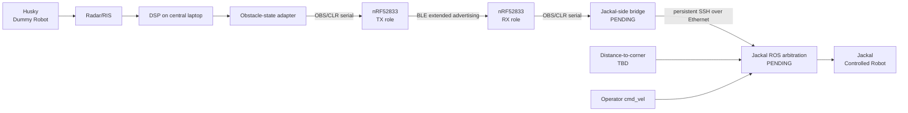

# System Architecture

## Contents

- [Purpose](#purpose)
- [Experiment roles](#experiment-roles)
- [Physical and logical topology](#physical-and-logical-topology)
- [Component responsibilities](#component-responsibilities)
- [Current versus target architecture](#current-versus-target-architecture)
- [System boundaries](#system-boundaries)
- [Non-goals](#non-goals)
- [Architectural constraints](#architectural-constraints)

## Purpose

This document defines the current cross-subsystem architecture without treating target-state components as already implemented behavior.

## Experiment roles

- **Husky — Dummy Robot:** repeatable moving physical target in the conflicting/hidden corridor. It is sensed; it is not in the Jackal control path.
- **Radar/RIS setup:** observes the corridor geometry and supplies frames/data to the central sensing computer.
- **Central laptop:** owns radar acquisition, real-time DSP/classification, semantic obstacle state, and the DSP-side serial boundary.
- **NRF Transceiver pair:** transports compact state across BLE. Both boards run the same firmware image; runtime role determines TX or RX.
- **Jackal-side computer/laptop:** target host for RX serial consumption and persistent SSH forwarding. The bridge software is not yet implemented.
- **Jackal onboard ROS computer:** target location for final command arbitration. The arbiter and distance gate are not yet implemented.
- **Jackal — Controlled Robot:** manually teleoperated robot whose motion is eventually subject to the local STOP authority.

## Physical and logical topology



Only the path through RX serial has implementation today. The graph shows the target system so ownership is clear, but pending nodes are explicitly marked.

## Component responsibilities

| Component | Owns | Does not own |
|---|---|---|
| DSP | acquisition, feature maps, inference adapter, vote, semantic label | BLE or robot motion control |
| DSP integration package | label-to-obstacle mapping, serial discovery/output | model mathematics or BLE packet construction |
| Transceiver TX | exact `OBS`/`CLR` UART intake, latched state, BLE advertisement | classification or robot policy |
| Transceiver RX | BLE filtering/dedup, transition-only `OBS`/`CLR` UART output | SSH/ROS control |
| Jackal-side bridge | **future:** consume RX serial and forward state through persistent SSH | motion arbitration |
| Jackal ROS layer | **future:** local STOP precedence and distance gate | sensing/classification |
| Physical safety controls | emergency stop and supervised lab safety | experiment software semantics |

## Current versus target architecture

### Current implemented chain

```text
Radar acquisition
 -> DSP maps/inference/vote
 -> obstacle-state adapter
 -> serial writer + auto-discovery
 -> NRF TX
 -> BLE
 -> NRF RX
 -> serial output / optional Python logger
```

Two qualifications matter:

1. The classification path is in `PLACEHOLDER_MODE = True`, so experiment serial actuation is blocked by default even though the adapter/writer code exists.
2. The NRF pair is validated independently with host-generated `OBS`/`CLR`; the complete live DSP-to-NRF hardware boundary has not yet been validated.

### Target chain

```text
current chain
 -> Jackal-side serial consumer
 -> persistent SSH over Ethernet
 -> Jackal-local ROS safety input
 -> distance-gated command arbiter
 -> Jackal base controller
```

The target chain is an accepted architecture, not current implementation.

## System boundaries

The repository intentionally transports **semantic state**, not raw radar frames, across the NRF link. This limits coupling between sensing and robotics.

The final motion decision belongs on the robot side. The laptop can transport the event, but it must not become the hidden authority that decides command precedence by timing.

## Non-goals

- Autonomous navigation, SLAM, or path planning for the Jackal.
- Complex autonomy for the Husky.
- Sending raw Radar/RIS data over BLE.
- Treating the NRF firmware as the safety arbiter.
- Treating SSH message arrival order as a priority mechanism.

## Architectural constraints

- The physical boards are nRF52833 DKs; the supported target is `nrf52833dk/nrf52833`.
- Both boards run the same image and boot TX + Coded S=8.
- Button 2 changes runtime role; Button 1 changes BLE PHY.
- The DSP serial path must not silently choose among ambiguous devices.
- The trained detector must replace placeholder inference before experiment control is enabled.
- A valid clear decision must come from the semantic pipeline; silence or failure is not equivalent to clear.
- The software STOP does not replace physical emergency-stop capability.
