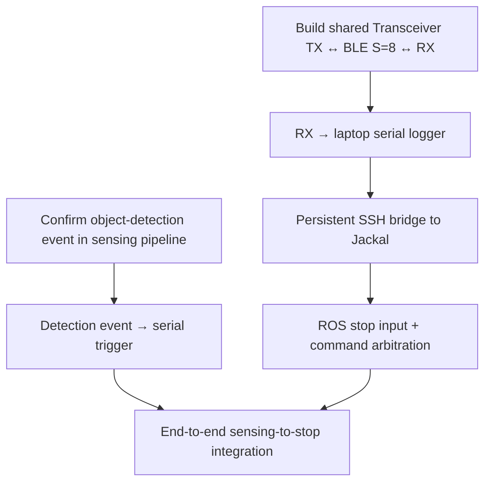

# Control Signal Integration Plan

**Date:** 2026-09-16  
**Scope:** End-to-end route of the Radar/RIS-derived STOP trigger, the exact ask from the sensing team, and the remaining implementation work on the robotics side.

## 1. Objective

The goal is to convert an object-detection result from the existing Radar/RIS processing pipeline into a STOP authority on the Clearpath Jackal without expanding the project into a general autonomous-robotics system.

The intended route is:

```text
Radar/RIS processing
        |
        v
Object-detection event
        |
        v
USB serial (`OBS` / `CLR`)
        |
        v
Transceiver (TX role)
        |
BLE Coded PHY S=8
        |
        v
Transceiver (RX role)
        |
        v
USB serial (`OBS` / `CLR` transitions)
        |
        v
Jackal-side Python logger
        |
        v
Persistent SSH over Ethernet
        |
        v
Jackal onboard ROS computer
        |
        v
Safety-stop input / arbiter
        |
        v
Jackal base controller
```

## 2. External assumption to confirm

The current understanding of the sensing-side setup is:

- the Infineon radar is connected to the sensing computer over USB;
- that computer drives the radar;
- Radar/RIS data are processed there in real time; and
- the resulting object-detection information is available somewhere in the processing pipeline on that same computer.

The robotics work does not need to know or reproduce the internal Radar/RIS algorithms. It only needs a clean event boundary after the relevant detection decision has been made.

This assumption must be confirmed by the sensing team before the final pipeline-to-serial integration is fixed.

> [!IMPORTANT]
> **Sensing-team answer — processing-pipeline assumption**  
> **Status:** _Pending response_  
> **Please confirm or correct:** Is the object-detection result available on the sensing computer in an accessible stage of the existing Radar/RIS processing pipeline?  
> **Team response:** _TBD — replace this line with the confirmed architecture / correction._

## 3. Exact ask from the sensing team

Only two things are required from their side. Each ask has a deliberately separate response block so the eventual answer becomes part of the system record rather than remaining only in chat or a meeting.

### Ask 1 — Identify the object-detection insertion point

**Request:** Identify the point in the current processing pipeline where the required object-detection event is available.

> [!NOTE]
> **Sensing-team answer — Ask 1**  
> **Status:** _Pending response_  
> **Pipeline block / stage:** _TBD_  
> **Available event or state:** _TBD_  
> **How that event can be accessed:** _TBD_  
> **Relevant code/module, if applicable:** _TBD_  
> **Additional constraints or comments:** _TBD_

### Ask 2 — Allow the detection event to produce a serial trigger

**Request:** Permit a serial-output step at that point so the computer can send a compact trigger to the connected NRF transmitter whenever the detection condition occurs.

> [!NOTE]
> **Sensing-team answer — Ask 2**  
> **Status:** _Pending response_  
> **Serial-output step permitted / feasible:** _TBD_  
> **Where the serial-output code should be inserted:** _TBD_  
> **Trigger representation (`STOP` / `CLEAR` or equivalent):** _TBD_  
> **Serial interface / port constraints:** _TBD_  
> **Relevant implementation constraints or comments:** _TBD_

The interface can remain minimal; for example, a compact `STOP` / `CLEAR` state or equivalent representation is sufficient. Raw sensing data do not need to cross into the robotics system.

Once these answer blocks are filled, they become the authoritative integration contract for the boundary between the sensing system and the robotics work. If the team's answer changes the assumed architecture, the downstream diagram and implementation plan should be updated from that confirmed answer rather than preserving the earlier assumption.

## 4. Robotics-side deliverable A — BLE transport

### Hardware

Two Nordic NRF boards are already available:

- one NRF board on the Radar/RIS side as **BLE TX**;
- one NRF board on the Jackal side as **BLE RX**.

No additional hardware is currently expected for this part.

### Function

The firmware subsystem is the **Transceiver**: one shared firmware application compiled in either TX or RX role. The sensing-side TX receives newline-delimited `OBS` and `CLR` states over USB serial and continuously broadcasts the latched current state. The robot-side RX listens on BLE Coded PHY, suppresses duplicate broadcasts, and exposes only the first `OBS` and first following `CLR` transition over USB serial. TX is identified by two blinking board-defined LEDs; RX by one blinking board-defined LED.

The radio path uses non-connectable extended advertising on BLE Coded PHY with the S=8 coding requirement supplied by the nRF Connect SDK advertising-coding-selection API. This prioritizes range over throughput.

### Expected effort and timing

This TX-to-RX BLE link is expected to require only a few hours of work and is targeted to be operational before the **2026-09-17 team session**.

Once it works independently, the only remaining dependency for this deliverable is connecting the sensing team's detection event to the serial trigger entering the TX board.

## 5. Current implementation boundary — RX serial logger

The current firmware deliverable ends at a small Python process on the Jackal-side laptop. It reads the RX serial stream, accepts `OBS` and `CLR` transition lines, timestamps them when received by the host, prints JSON Lines, and can append those records to a file.

```text
Radar
  -> serial OBS/CLR
  -> Transceiver TX
  -> BLE Coded PHY S=8
  -> Transceiver RX
  -> serial OBS/CLR transitions
  -> Python logger
```

## 6. Later deliverable — Serial-to-SSH bridge

The Jackal-side laptop receives the decoded state from the Transceiver RX board over USB serial.

The laptop does not need ROS installed for the current architecture. Instead, a small bridge process can:

1. open the serial connection to the Transceiver RX board;
2. establish and keep open an SSH connection to the Jackal onboard computer over Ethernet;
3. wait for serial control messages; and
4. when a STOP event arrives, send the corresponding command through the existing SSH session so it executes inside the Jackal's ROS environment.

Conceptual behavior:

```text
open serial
open persistent SSH

while experiment is running:
    receive serial message
    if STOP:
        execute ROS-side stop action through SSH
    if CLEAR:
        update ROS-side safety state according to experiment logic
```

The SSH session should be persistent during the experiment rather than established separately for every control event. This keeps connection setup out of the per-trigger path.

This SSH work is downstream context and is not part of the Transceiver/serial-logger implementation.

## 7. Later deliverable — ROS control arbitration

The STOP input must have higher **control authority** than the joystick, but this should not be described as one ROS topic inherently having a higher priority than another. ROS topics do not provide that semantics by themselves.

The intended structure is:

```text
Normal joystick / velocity command ----\
                                        > command arbiter / mux --> Jackal base controller
Radar/RIS-derived STOP ----------------/
                 higher authority
```

The ROS-side implementation therefore needs an arbiter, mux, supervisor, or equivalent control layer that prevents normal velocity commands from reaching the base whenever STOP is asserted.

A direct remote ROS publish through the SSH session is useful for initial bring-up and testing. The actual precedence rule remains local to the ROS control layer.

This is the more involved robotics task because it touches the Jackal's existing ROS command/control path. It can nevertheless be developed independently: the Jackal can be used during normal access periods, the ROS side can be implemented and tested without the sensing team, and the team only needs to be brought back in for final end-to-end integration.

## 8. Integration dependency graph



The sensing-team dependency is isolated to **A/B**. The BLE, laptop bridge, and ROS work can proceed independently in parallel.

## 9. Current status

| Item | Status | Notes |
|---|---|---|
| Two NRF boards | Available | No additional BLE hardware currently required |
| Shared Transceiver TX/RX implementation | Implemented in repository | Build-time roles; coded S=8 advertising; board-alias LED identification |
| Sensing-pipeline event location | Needs confirmation | Main ask for sensing team; answer placeholder is in Section 3 |
| Pipeline event → serial trigger | Pending | Depends on confirmed insertion point; answer placeholder is in Section 3 |
| NRF RX → laptop serial logger | Implemented in repository | Deduplicated `OBS`/`CLR` transitions with host UTC timestamps |
| Persistent SSH bridge | Pending | Robotics-side work over Ethernet |
| ROS stop arbitration | Pending | More involved; can be developed independently on Jackal |
| Full end-to-end integration | Pending | Final joint step after both sides are ready |

## 10. Experiment semantics and failure boundaries

The desired behavior is simple: when the sensing pipeline reports the unsafe condition, the Jackal must be prevented from proceeding even if the operator continues to command motion.

The software path is an experiment-level control mechanism, not a replacement for the Jackal's physical emergency stop or supervised laboratory safety procedures.

The final implementation must also define what a loss of BLE, serial, or SSH means. A missing communication path must not be silently interpreted as a `CLEAR` result. This behavior should be fixed explicitly before people and a moving robot are used in the complete experiment.

## 11. Final system boundary

The project remains intentionally divided into local responsibilities:

- **Sensing side:** detect the relevant object/occupancy condition and expose a compact event.
- **Communication side:** transport that event over serial and BLE.
- **Jackal-side bridge:** translate the received serial state into a command delivered to the Jackal computer through persistent SSH.
- **Jackal ROS side:** locally enforce the STOP-over-joystick control rule.

That separation keeps the integration small and testable while preserving the main research story: the Radar/RIS sensing result directly influences a real robot's motion without requiring the robot itself to perform the hidden-corridor sensing or autonomous navigation.
