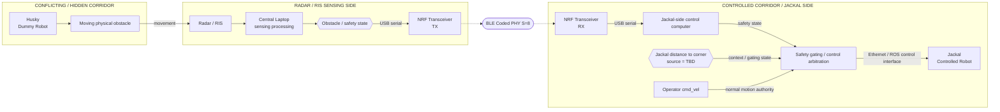

# RIS Robotics — System Design

**Status:** Current integration architecture  
**Date:** 2026-09-17  
**Document role:** Maintain the full system picture while making the sensing-team boundary, control-signal route, Jackal-side ROS path, and current implementation responsibilities explicit.

## System Design

The experiment now uses two robots with deliberately different responsibilities:

- **Husky = Dummy Robot.** It moves through the conflicting / hidden corridor as the repeatable physical obstacle observed by Radar/RIS. Sophisticated Husky autonomy is irrelevant to this experiment.
- **Jackal = Controlled Robot.** It moves through the controlled corridor, remains manually teleoperated through `cmd_vel`, and is the robot whose motion is subject to the Radar/RIS-derived safety intervention.

The Radar/RIS side derives a compact obstacle/safety state; raw sensing data do not need to reach the robot. That state crosses the existing USB → NRF → BLE → NRF → USB boundary. The Jackal-side computer combines the received safety state with Jackal distance-to-corner state and operator motion intent, then performs the final control arbitration through the Jackal-side ROS interface.



The connection technology still changes intentionally across the remote path: **USB/serial → BLE → USB/serial → Ethernet/ROS**. The NRF/BLE path transports compact state; it does not directly control Jackal drive hardware.

### Distance-gated STOP

The Jackal has only **two logical motion-control authorities**:

1. normal teleoperation / `cmd_vel`;
2. higher-priority safety STOP.

Distance-to-corner is **not** a third command or control authority. It is contextual state used by the arbitration logic to decide whether the STOP authority should be enforced.

```text
conflicting-corridor unsafe ----\
                                 > safety gating ----\
distance to corner -------------/                    \
                                                      > final motion authority -> Jackal
operator cmd_vel ------------------------------------/
```

The active rule is:

```text
if conflicting_corridor_unsafe
   AND jackal_distance_to_corner <= DISTANCE_THRESHOLD:
    STOP overrides cmd_vel
else:
    normal cmd_vel remains allowed
```

Current unresolved parameters are intentionally explicit:

- `DISTANCE_THRESHOLD = TBD`
- distance-to-corner sensing / estimation mechanism = **TBD**

No localization mechanism is implied until one is explicitly selected.

Normal behavior follows directly: with no relevant unsafe condition, `cmd_vel` controls the Jackal; with an obstacle detected while the Jackal is still far from the corner, `cmd_vel` may continue; with an obstacle detected and the Jackal within the threshold, STOP wins; when the obstacle clears, normal `cmd_vel` may resume.

## Sensing-side assumption that must be confirmed

The robotics integration currently depends on one important assumption about the existing sensing implementation.

The **Infineon radar is connected by USB to the sensing team's computer**, that computer drives the radar, and the Radar/RIS processing is performed there in real time. The exact internal RIS implementation is owned by the sensing team and does not need to be duplicated in the robotics code. What matters to this integration is that the resulting object-detection information is available somewhere in the processing pipeline running on that computer.

The diagram therefore intentionally does **not** assert a second physical USB cable from the RIS to the computer. It only shows the RIS-assisted sensing contribution reaching the common processing computer while the known radar-to-computer USB link is explicit.

### Specific ask from the sensing team

The required interface from the sensing team is intentionally small:

1. identify an accessible point in the current processing pipeline where an object-detection event is available; and
2. allow a small integration step at that point that sends a serial trigger to the NRF transmitter whenever the required object-detection condition occurs.

Conceptually:

```text
Existing Radar/RIS pipeline
          |
          v
   Object detected
          |
          v
     Serial trigger
          |
          v
       NRF TX
```

The robotics integration does not require raw Radar/RIS frames to leave their computer and does not require the sensing team to implement the BLE or Jackal-side ROS control path.

## Implementation on the robotics side

### 1. Transceiver and serial logger

Two NRF boards are already available. No additional hardware is currently required for the BLE link.

The two boards run one shared **Transceiver** application in different build-time roles. TX accepts newline-delimited `OBS` and `CLR` commands and latches the state until the opposite command arrives. It continuously advertises the current state using non-connectable extended advertising on BLE Coded PHY with an explicit S=8 coding request. RX scans on coded PHY only, suppresses repeated advertisements of the same state, and emits one serial `OBS` followed by one serial `CLR` per obstacle episode.

TX blinks the board-defined `led0` and `led1`; RX blinks only `led0`. A Python logger on the RX-side computer timestamps each serial transition in UTC and prints/persists it as JSON Lines.

The current implementation boundary ends at this logger. Once the standalone link is operational on hardware, the remaining sensing-side dependency is connecting the real pipeline event to the TX serial input.

### 2. Later: Jackal-side serial-to-SSH bridge

The receiving NRF board connects by USB serial to the laptop on the Jackal rack. A later process on this laptop will consume the logged transition stream for robot control.

The SSH and robot-control path described below is downstream context and is not implemented as part of the Transceiver work.

The laptop does **not** need a local ROS installation for the current architecture. Instead, it maintains a persistent SSH session over Ethernet to the Jackal's onboard computer, where ROS is already running. When the laptop receives a STOP event from serial, the bridge sends the corresponding command through the already-open SSH session so that the ROS-side action executes on the Jackal computer.

Conceptually:

```text
NRF RX
  |
  | USB serial
  v
Jackal-side laptop
  |
  | persistent SSH over Ethernet
  v
Jackal onboard computer
  |
  v
ROS safety / stop input
```

Opening a new SSH connection for every detection event is not the intended design. The session should remain open during the experiment so the serial event can immediately affect the remote ROS control path.

### 3. ROS stop arbitration

The ROS side is the more involved part because the STOP requirement is not implemented by giving one ROS topic an intrinsic "higher priority." ROS topics themselves do not provide this priority relationship.

Instead, the Jackal needs a command-arbitration layer: normal joystick velocity commands and the Radar/RIS-derived STOP input both enter a **mux/supervisor/arbiter**, and that component enforces the rule that STOP wins whenever it is asserted.

```text
Joystick velocity ---------\
                           > ROS arbiter / mux --> Jackal base controller
Radar/RIS STOP ------------/
          higher authority
```

A direct ROS publish triggered through SSH is suitable for bringing up and testing the path. The control semantics must still be enforced locally on the Jackal through the ROS-side arbitration logic rather than relying on message arrival order.

This ROS work can be developed independently using the Jackal without requiring the sensing team to be present. Once it is ready, the project can move to final end-to-end integration.

## Responsibility boundary and current status

| Block | Owner | Current state | Dependency / resource |
|---|---|---|---|
| Radar/RIS real-time processing | Sensing team | Existing system | Existing sensing setup |
| Expose object-detection event | Sensing team + integration point | **Needs confirmation** | Accessible event in their pipeline |
| Detection event → serial trigger | Integration boundary | **Pending pipeline access** | Serial output from sensing computer |
| Shared Transceiver TX → BLE S=8 → RX | Robotics side | Implemented in repository; hardware smoke test required | Two NRF boards already available |
| NRF RX → laptop serial logger | Robotics side | Implemented in repository | Existing USB connection; Python + pyserial |
| Laptop → persistent SSH → Jackal | Robotics side | Pending | Ethernet link; no ROS required on laptop |
| ROS safety input + joystick arbitration | Robotics side | Pending; more involved | Jackal access; ROS-side control work |
| Full sensing-to-stop integration | Joint integration | Follows the blocks above | Sensing trigger + completed robotics path |

The critical external dependency is therefore narrow: **where the object-detection event can be extracted from the existing sensing pipeline**. The BLE and Jackal-side work can proceed independently in parallel.

## Control and safety semantics

The control rule is now distance-gated: **STOP remains the higher-priority authority, but it is enforced only when the conflicting corridor is unsafe and the Jackal is within the configured distance threshold from the corner.** Obstacle state and distance-to-corner are gating inputs; they are not additional motion commands.

The software STOP mechanism is part of the research integration and does not replace the Jackal's physical emergency-stop hardware or normal supervised procedures. Communication-loss behavior also needs to be explicit in the final implementation: loss of BLE, serial, or SSH must not silently be interpreted as proof that the corridor is clear.

## Bigger picture

The architecture keeps the research contribution focused. The sensing team remains responsible for producing the object-detection result. The robotics integration converts that result into a compact control trigger, moves it through a dedicated BLE link, and enforces the result locally at the Jackal's ROS control boundary.

The robot is not being turned into an autonomous-navigation platform. No SLAM, autonomous route planning, or hidden-corridor perception is required on the Jackal. The intended demonstration is simply:

**Husky provides the moving Dummy Robot target → Radar/RIS derives the conflicting-corridor safety state → the compact state crosses the NRF/BLE path → Jackal-side arbitration combines that state with distance-to-corner context → STOP overrides manual motion only when the gated unsafe condition applies.**

Detailed implementation and handoff notes are maintained in [`control-signal-path.md`](control-signal-path.md).
