# RIS Robotics — System Design

**Status:** Initial design draft  
**Date:** 2026-09-15  
**Document role:** Figure-first description of the complete RIS/Radar-to-Jackal system

---

## 1. How to read this document

This system document is intentionally **figure-first**. The diagrams are the primary description of the architecture. Text exists mainly to define the figure convention and remove ambiguity.

The system is drawn from the **sensing side toward the robot side**.

The main story is:

```text
Radar / RIS
    -> Central Laptop
    -> NRF BLE transmitter attached to the Central Laptop
    -> BLE
    -> NRF BLE receiver attached to the laptop above the Jackal
    -> Jackal Laptop
    -> Ethernet
    -> Jackal Robot
```

The same physical architecture carries a logical control story:

```text
Joystick control
        +
STOP broadcast generated from Radar/RIS information
        |
        v
Laptop above Jackal
        |
        v
Jackal Robot
```

---

# 2. Figure convention

Every system figure in this repository should follow the same visual language unless a later subsystem document explicitly introduces an additional convention.

## 2.1 Large block = physical device or major compute element

A large rectangular block represents a device or major compute element.

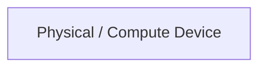

Examples in this system are:

- Radar
- RIS
- Central Laptop
- NRF BLE board
- Laptop above the Jackal
- Jackal Robot

---

## 2.2 Small capsule between blocks = connection technology / interface stack

When two large blocks are connected, the **technology used to connect them is shown as a smaller capsule between the blocks**.

The connection technology belongs visually to the connection, not to either large device block.

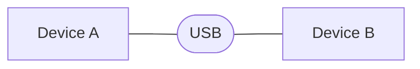

This reads as:

```text
Device A <---- USB ----> Device B
```

The same convention applies to Ethernet, BLE, serial links, or any later interface.

### Different stacks are allowed

If the system crosses several technologies, each technology is shown independently rather than hiding the transition.

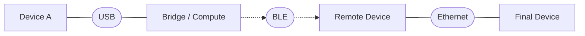

Therefore a reader can follow the system simply by reading:

```text
DEVICE -> TECHNOLOGY -> DEVICE -> TECHNOLOGY -> DEVICE
```

The architecture does **not** assume that the whole system uses one networking stack.

---

## 2.3 Solid connection = wired physical/data connectivity

A normal solid connection represents a wired physical/data relationship.


Examples:

- Radar ↔ Central Laptop over USB
- RIS ↔ Central Laptop over USB
- Laptop ↔ NRF board over USB
- Jackal Laptop ↔ Jackal Robot over Ethernet

The line itself means **connectivity**, not control authority.

---

## 2.4 Dashed directional connection = wireless broadcast

The BLE hop leaves one local physical assembly and reaches another physical assembly wirelessly.

It is therefore drawn as a dashed directional path.

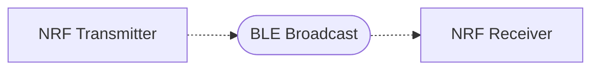

The arrow direction expresses the broadcast direction used by this experiment.

---

## 2.5 Enclosure = same local/core assembly

A labelled enclosure means that the enclosed blocks belong to the same local system assembly for the purpose of this architecture.

For example, the NRF board attached by USB to the Central Laptop is shown **inside the Central Sensing Core** because we have not yet left that core device/assembly.

Likewise, the receiving NRF board and the laptop mounted above the Jackal belong to the **Jackal-Side Compute Core**.

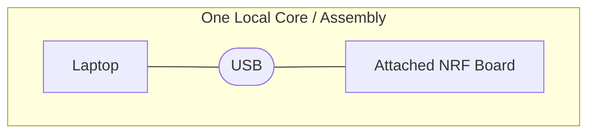

An enclosure does **not** mean the NRF board is physically inside the laptop chassis. It means it is locally attached to and operationally part of that compute assembly.

---

## 2.6 Hexagonal block + thick arrow = control

Connectivity and control are deliberately different concepts in these figures.

A **hexagonal block** represents a control input, control signal, or control authority.

A **thick directional arrow** represents control influence.

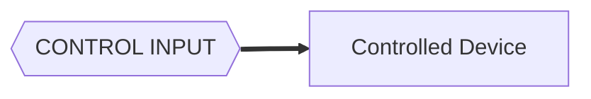

This is intentionally different from:


The first says:

> this input controls behavior.

The second says:

> these devices are connected using this technology.

A physical connection may carry a control signal, but the two concepts are drawn separately when control meaning matters.

---

# 3. Figure 1 — Initial physical system architecture

This is the initial end-to-end physical architecture.

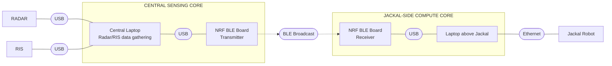

## 3.1 Read Figure 1 as a sentence

```text
RADAR
  -- USB -->
Central Laptop

RIS
  -- USB -->
Central Laptop

Central Laptop
  -- USB -->
NRF BLE Transmitter

NRF BLE Transmitter
  -- BLE BROADCAST -->
NRF BLE Receiver

NRF BLE Receiver
  -- USB -->
Laptop above Jackal

Laptop above Jackal
  -- ETHERNET -->
Jackal Robot
```

---

# 4. Figure 2 — Core-boundary view

The same architecture can be simplified to show exactly **where the system leaves one core and enters another**.

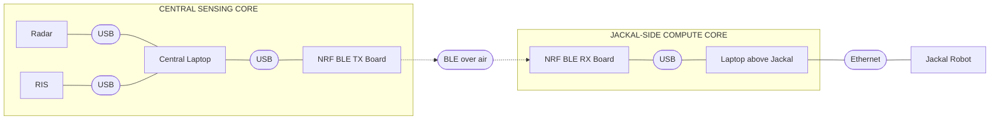

The important boundary is the BLE hop:

```text
CENTRAL SENSING CORE
        |
        | BLE
        v
JACKAL-SIDE COMPUTE CORE
        |
        | Ethernet
        v
     JACKAL
```

Everything before the BLE hop belongs to the corner/sensing-side assembly.

Everything immediately after the BLE hop belongs to the mobile Jackal-side compute assembly.

---

# 5. Figure 3 — Information acquisition side

The sensing side has two independent sensing devices feeding the same Central Laptop.

They are peer inputs into the laptop.

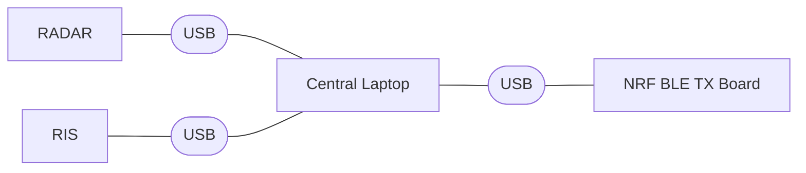

The Central Laptop is therefore the first common compute point in the robotics integration.

```text
Radar data ----\
                > Central Laptop -> NRF BLE board
RIS data ------/
```

This diagram deliberately does **not** define the Radar or RIS internal sensing algorithms. It only defines their place in the system architecture and their physical connection to the Central Laptop.

---

# 6. Figure 4 — BLE bridge between the two compute cores

The NRF boards form the wireless bridge between the sensing-side compute and the robot-side compute.

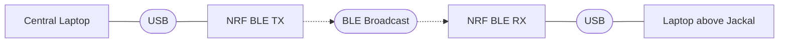

The BLE link is intentionally narrow in responsibility.

At the system level, its job is to carry the **STOP-related control information** from the Central Laptop side to the Jackal Laptop side.

The detailed packet format, advertising scheme, timing, retransmission behavior, and exact NRF firmware are **not defined by this figure yet**.

---

# 7. Figure 5 — Jackal-side physical connectivity

The Jackal-side compute path is:

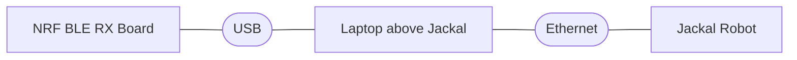

The laptop above the Jackal is therefore the compute bridge between:

```text
BLE safety information
        and
Jackal robot actuation
```

The NRF board does not connect directly to the Jackal drive hardware in this initial architecture.

---

# 8. Figure 6 — Control convention applied to the Jackal

The Jackal has **two control influences** in this experiment.

They are intentionally drawn differently from ordinary connectivity.

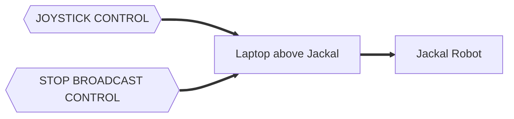

This is a **logical control figure**, not a physical wiring figure.

It says:

1. The joystick provides normal motion-control intent.
2. The STOP broadcast provides safety-control intent.
3. Both control influences reach the Jackal through the laptop above the robot.
4. The Jackal Laptop is the point from which the effective robot-control command reaches the Jackal.

The exact software mechanism that combines these two control influences is intentionally left open for the next design step.

---

# 9. Figure 7 — Where the STOP control signal comes from

The STOP control is not an independent manual button in this architecture.

It originates from the sensing-side system.

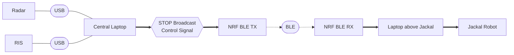

This figure expresses the control meaning:

```text
Radar / RIS information
        |
        v
Central Laptop
        |
        v
STOP control signal
        |
        v
BLE transmission
        |
        v
Jackal Laptop
        |
        v
Jackal control
```

---

# 10. Figure 8 — Normal-control path versus STOP-control path

The two control stories can now be drawn independently.

## 10.1 Normal-control path

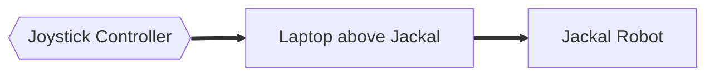

Meaning:

```text
Joystick -> Jackal Laptop -> Jackal
```

## 10.2 STOP-control path

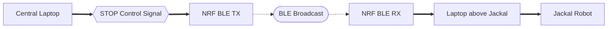

Meaning:

```text
Central Laptop
    -> STOP control
    -> NRF TX
    -> BLE
    -> NRF RX
    -> Jackal Laptop
    -> Jackal
```

The physical transport technologies can change from segment to segment while the **logical STOP control path remains one continuous control story**.

---

# 11. Figure 9 — Complete initial design: physical architecture + control meaning

This is the initial complete system view.

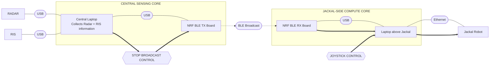

## 11.1 What this complete figure says

### Physical/data architecture

```text
Radar --USB--\
              \
               Central Laptop --USB-- NRF TX --BLE-- NRF RX --USB-- Jackal Laptop --Ethernet-- Jackal
              /
RIS ----USB--/
```

### Control architecture

```text
Joystick --------------------------------------> Jackal Laptop ---> Jackal

Radar/RIS -> Central Laptop -> STOP Broadcast -> Jackal Laptop ---> Jackal
```

The two views are intentionally superimposed in Figure 9 because they describe different meanings over the same system.

---

# 12. Current system blocks

The initial design therefore contains these major blocks:

| Block | Role in the initial design |
|---|---|
| Radar | Sensing input to the Central Laptop |
| RIS | Sensing input to the Central Laptop |
| Central Laptop | Common sensing-side compute and origin of the STOP broadcast control signal |
| Sensing-side NRF board | BLE transmitter attached to the Central Laptop by USB |
| BLE link | Wireless bridge between the sensing-side and Jackal-side compute cores |
| Jackal-side NRF board | BLE receiver attached to the Jackal Laptop by USB |
| Laptop above Jackal | Robot-side compute point receiving control information and interfacing to the Jackal |
| Jackal Robot | Controlled mobile platform |
| Joystick Controller | Normal robot-control input |
| STOP Broadcast Control | Safety-related control input originating from the Central Laptop side |

---

# 13. Current connection map

| From | Connection technology | To |
|---|---|---|
| Radar | USB | Central Laptop |
| RIS | USB | Central Laptop |
| Central Laptop | USB | NRF BLE TX board |
| NRF BLE TX board | BLE broadcast | NRF BLE RX board |
| NRF BLE RX board | USB | Laptop above Jackal |
| Laptop above Jackal | Ethernet | Jackal Robot |

This table is secondary to the figures; it exists only as a compact textual index of the physical connectivity.

---

# 14. Current control map

| Control source | Control path | Controlled target |
|---|---|---|
| Joystick Controller | Joystick → Jackal Laptop → Jackal | Jackal Robot |
| STOP Broadcast Control | Central Laptop → NRF TX → BLE → NRF RX → Jackal Laptop → Jackal | Jackal Robot |

The control map deliberately does not yet specify the internal arbitration implementation on the Jackal Laptop.

---

# 15. What is intentionally not decided yet

The initial figure fixes the **system topology**, not every implementation detail.

The following are intentionally left for later refinement:

- exact Radar-to-laptop USB protocol;
- exact RIS-to-laptop USB protocol;
- exact Central-Laptop-to-NRF USB protocol;
- exact NRF firmware organization;
- BLE packet/message structure;
- BLE broadcast interval;
- how STOP and CLEAR are represented;
- exact Jackal-side USB protocol;
- joystick software stack;
- exact Jackal control software interface;
- exact STOP-versus-joystick arbitration mechanism;
- logging architecture;
- timing measurements;
- failure and stale-message behavior.

Those details should be added only when we intentionally design the corresponding subsystem.

---

# 16. Initial design summary figure

For quick reference, the system can be reduced to one line:

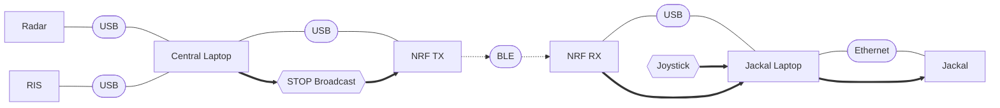

**Figure rule to remember:**

```text
LARGE BLOCK       = device / major compute element
SMALL CAPSULE     = connection technology / interface stack
SOLID LINK        = wired connectivity
DASHED LINK       = wireless BLE broadcast
HEXAGON           = control input / control signal
THICK ARROW       = control influence
ENCLOSURE         = same local/core system assembly
```

This is the baseline system figure from which the subsystem designs will be derived.