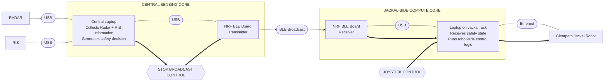

# RIS Robotics — System Design

**Status:** Initial design draft  
**Date:** 2026-09-15  
**Document role:** Single full-system architecture figure followed by the rationale, interfaces, control model, and decisions that produced it.

---

## 1. Purpose

This document describes the complete initial architecture for the RIS Robotics experiment. It is intentionally organized around **one full system diagram**. The figure establishes the physical topology, local system boundaries, communication technologies, and logical control paths. The text that follows explains how to read that figure and records the design choices behind it.

The research objective is not autonomous robotics. The existing Radar/RIS system senses activity in the two-corridor corner environment. The robotics integration demonstrates that a sensing result can be converted into a safety-control signal and used to prevent a mobile robot from proceeding when the conflicting corridor is occupied.

The robot therefore remains deliberately simple: it is manually driven, while an independent Radar/RIS-derived STOP signal has higher authority than normal motion control.

---

## 2. Figure convention

The system figure uses a fixed visual language so that readers who are not robotics specialists can follow the architecture without needing to know ROS, BLE internals, or the Radar/RIS implementation.

- **Large rectangular block:** a physical device or major compute element.
- **Small capsule between blocks:** the technology or interface stack connecting two devices. The capsule belongs to the connection rather than either endpoint.
- **Solid link:** wired physical/data connectivity.
- **Dashed directional link:** wireless BLE broadcast across the air interface.
- **Enclosure / subgraph:** components that belong to the same local operating assembly or core.
- **Hexagonal block:** a control input or control signal rather than a physical device.
- **Thick directional arrow:** control influence or authority rather than ordinary connectivity.

The important convention is that **every device-to-device connection states the technology used to cross that boundary**. Different technologies may appear consecutively. For example, the architecture can legitimately move from USB to BLE to USB to Ethernet; each transition is shown explicitly instead of hiding the stack changes.

An enclosure does not imply that every enclosed component is physically inside the same chassis. For example, an NRF board connected to a laptop by USB is still drawn inside that laptop's local core because the system has not yet crossed a remote communication boundary.

---

# 3. Full System Diagram

The figure contains two stories at the same time:

1. **Physical/data connectivity:** Radar and RIS feed the Central Laptop; the Central Laptop is locally attached to an NRF transmitter; BLE crosses from the sensing-side core to the Jackal-side core; the receiving NRF board feeds the Jackal-mounted laptop; the laptop connects to the Jackal by Ethernet.
2. **Control authority:** normal motion comes from the joystick, while the Radar/RIS-derived STOP broadcast is an independent safety-control input. Both are resolved on the Jackal-side laptop before the effective command reaches the robot.

---

## 4. Physical System Architecture

### 4.1 Radar and RIS to the Central Laptop

Radar and RIS are peer sensing inputs. Both are connected to the **Central Laptop using USB**. At this level of the design, their internal sensing algorithms are outside the robotics integration boundary. The robotics system only depends on the fact that the Central Laptop has access to the relevant Radar/RIS information and can determine whether the conflicting corridor should be considered safe or unsafe.

The Central Laptop is therefore the first common compute point in the end-to-end robotics system.

### 4.2 Central Laptop to the sensing-side NRF board

The Central Laptop connects by **USB** to the NRF board that acts as the BLE transmitter. The board is considered part of the **Central Sensing Core** because it is a locally attached peripheral; the architecture has not yet crossed the wireless system boundary.

The Central Laptop does not need to send raw Radar or RIS data over BLE. The interface is intentionally narrow: the sensing side derives a compact safety state, such as STOP/CLEAR or an equivalent representation, and the NRF board carries that result.

### 4.3 BLE boundary between the two cores

The first remote system boundary is the **BLE broadcast** between the sensing-side NRF board and the NRF board associated with the Jackal.

This is the dedicated Radar/RIS-to-robot safety communication path. The BLE link is intentionally small in responsibility: it transports the derived safety/control information rather than high-bandwidth sensor data.

### 4.4 Jackal-side NRF board to the Jackal laptop

The receiving NRF board is connected by **USB** to the laptop carried on the Jackal. These two components form the **Jackal-Side Compute Core**.

The NRF board's role is to receive the BLE broadcast and expose the decoded safety state to software running on the Jackal-side laptop. It is not connected directly to the Jackal drive hardware.

### 4.5 Jackal laptop to the robot

The Jackal-side laptop connects to the **Clearpath Jackal over Ethernet**. This laptop is the bridge between the safety information arriving from BLE and the robot's normal control interface.

The Jackal already has a **wooden rack/platform** suitable for carrying this laptop, which removes the need to design a separate computer mount for the first experiment implementation.

---

## 5. Control Model

The Jackal has two logical control influences.

### 5.1 Joystick control

The joystick represents the normal operator control path. The operator manually drives the Jackal through the experiment route. The project does not currently require autonomous navigation, SLAM, localization, or path planning.

The joystick therefore expresses normal motion intent.

### 5.2 STOP broadcast control

The STOP broadcast originates from the Central Laptop after the Radar/RIS information indicates that the conflicting corridor is unsafe. The signal is transported through the sensing-side NRF board, BLE, the receiving NRF board, and finally into the Jackal-side laptop.

This signal is a **control authority**, not merely another data stream. Its purpose is to prevent the robot from continuing into the unsafe region even if the operator continues requesting motion.

### 5.3 Priority rule

The fundamental control rule is:

> **STOP authority has higher priority than joystick motion authority.**

The exact software arbitration mechanism on the Jackal-side laptop has not yet been fixed, but the intended behavior is already decided: if the Radar/RIS safety state says the conflicting corridor is unsafe, the robot-side control layer must inhibit the relevant motion or command the Jackal to stop. When the state is clear, normal joystick control is allowed again.

This preserves the research contribution cleanly: the Radar/RIS system decides whether the hidden/conflicting corridor is occupied, while the robot computer locally enforces the resulting stop.

---

## 6. Communication Decision: Wi-Fi to BLE

### Initial choice: Wi-Fi

The first communication architecture placed the operator computer, robot computer, and Radar/RIS processing computer on a common Wi-Fi network. Under that concept, Wi-Fi could have carried:

- operator velocity commands;
- camera/video data for remote driving;
- Radar/RIS safety state;
- robot telemetry and experiment logs;
- supporting ROS/network-discovery traffic where applicable.

This would have reused the robot's normal IP networking and made the safety state easy to expose as a conventional network or ROS message.

### Revised choice: BLE using NRF boards

The design was simplified to use **Bluetooth Low Energy with Nordic NRF boards** for the safety path.

The reason is that the Radar/RIS-to-robot interface carries only a very small state, not a high-bandwidth data stream. BLE therefore lets the project create an explicit, independently testable sensing-to-safety interface without making IP networking or ROS transport a second research problem.

The move to BLE provides several practical benefits:

- the safety interface becomes small and explicit;
- the safety path is decoupled from any Wi-Fi used for camera streaming or teleoperation;
- raw Radar/RIS data never needs to cross to the robot;
- IP/ROS networking complexity is avoided for what is fundamentally a compact state;
- the NRF hardware is already appropriate for BLE development;
- the robotics integration remains subordinate to the Radar/RIS sensing contribution rather than becoming a networking study.

Wi-Fi may still be used independently for other robot functions if needed, but it is no longer the transport for the Radar/RIS safety decision.

---

## 7. Robot Platform Decision: Husky to Jackal

### Initial choice: Clearpath Husky

The first plan used a Clearpath Husky. Technically, Husky was fully suitable: it could be teleoperated and could support the same higher-priority safety-stop architecture.

There was also a practical historical reason for choosing it. During the Rogers project, the Husky had been easy to borrow because it was already part of that work. That existing access lowered the operational overhead of obtaining the robot.

### Revised choice: Clearpath Jackal

The experiment will instead use a **Clearpath Jackal**. The change is driven by practical simplicity, not by a requirement for better sensing or more advanced autonomy.

Both robots are capable of the required experiment. The Jackal is preferred because the robotics task is intentionally narrow: manual driving plus a safety override. A simpler platform keeps engineering effort focused on Radar/RIS detection, BLE communication, and the safety interlock.

### Husky vs Jackal tradeoffs

| Tradeoff | Husky | Jackal | Impact on this experiment |
|---|---|---|---|
| Technical suitability | Suitable for teleoperation + safety override | Suitable for teleoperation + safety override | No meaningful difference in the core function |
| Familiarity | Already used extensively in the Rogers project | Newer platform for this work | Husky has a familiarity advantage |
| Previous access | Easy to borrow under the Rogers project context | Different access process | Husky historically had easier access |
| Current operating plan | Previous arrangement no longer applies in the same way | Use during normal working hours | Jackal is practical without relocating it |
| Office / after-hours use | Previously easier to arrange | Moving it to the office requires extra administrative steps and a professor's signature | Jackal has less relocation flexibility |
| Physical deployment | More platform/overhead than the simple corridor test needs | Easier and simpler for this experiment | Jackal advantage |
| Experiment complexity | More robotics capability than required | Better aligned with the intentionally simple robot role | Jackal keeps scope focused |
| Laptop mounting | No specific convenient mount identified in this plan | Existing wooden rack/platform can carry the laptop | Jackal advantage |
| Robot-side architecture | Joystick/cmd_vel + higher-priority safety override | Same | Changing robots does not change the experiment concept |

The practical interpretation is straightforward: **Jackal is not selected because it is "smarter." It is selected because it is a simpler competent actuator for the experiment.**

---

## 8. Jackal Access and Experimental Operation

Taking the Jackal from its normal operating area into the office requires additional administrative approval, including extra paperwork and a professor's signature. Rather than making the experiment dependent on that process, the current plan is to use the Jackal during **typical working hours** in its normally accessible environment.

This is an operational constraint, not a technical limitation of the platform. It affects scheduling and where the experiment is executed, but it does not alter the system architecture.

The existing wooden rack on the Jackal is part of the current physical plan. The data-collection / robot-side laptop can sit on that rack while receiving the BLE safety state, running the control logic, and recording relevant experiment data.

---

## 9. System Responsibility Boundaries

The architecture intentionally separates responsibilities.

### Radar/RIS sensing side

Responsible for:

- observing the relevant corridor activity;
- deriving the safety state used by the robotics experiment;
- originating the STOP-related control decision.

Not responsible for:

- driving the Jackal;
- robot navigation;
- robot localization;
- robot path planning.

### BLE link

Responsible for:

- carrying the compact Radar/RIS-derived safety state from the sensing side to the robot side.

Not responsible for:

- raw sensing-data transport;
- camera/video transport;
- general robot networking.

### Jackal-side laptop

Responsible for:

- receiving the decoded safety state from the NRF receiver;
- accepting normal joystick control intent;
- enforcing the priority relationship between STOP and normal motion;
- interfacing to the Jackal over Ethernet;
- supporting experiment logging as the design is refined.

### Jackal

Responsible for:

- executing the final robot motion command through its existing low-level control system.

The project does not currently ask the Jackal to independently detect the hidden-corridor person or to make an autonomous navigation decision.

---

## 10. Safety Principle

The software safety-stop mechanism is part of the experimental integration; it does **not** replace the Jackal's physical emergency-stop hardware or normal supervised procedures when testing around people.

A key implementation requirement still to be designed is the treatment of stale or missing BLE messages. Silence cannot automatically be interpreted as proof that the corridor is clear. Startup state, message timeout, recovery, and fail-safe behavior must therefore be defined before human-in-the-loop motion testing.

---

## 11. What the Initial Design Fixes

This document fixes the following system-level choices:

- Radar and RIS are connected by USB to the Central Laptop.
- The Central Laptop is the common sensing-side compute point.
- The Central Laptop connects by USB to an NRF BLE transmitter.
- BLE is the dedicated safety communication path between sensing and robot sides.
- A second NRF board receives BLE on the Jackal side and connects by USB to the Jackal-mounted laptop.
- The Jackal-mounted laptop connects to the Jackal over Ethernet.
- The Jackal is manually controlled through a joystick.
- Radar/RIS-derived STOP control has higher priority than normal joystick motion.
- The robot platform is Jackal rather than Husky.
- Jackal testing is planned primarily during normal working hours because office relocation requires additional approval and a professor's signature.
- The existing wooden rack on the Jackal is the default mounting point for the data-collection laptop.

---

## 12. What Is Intentionally Not Decided Yet

The topology and major choices are fixed, but the following implementation details remain open for the next design stage:

- exact Radar-to-laptop USB protocol;
- exact RIS-to-laptop USB protocol;
- exact Central-Laptop-to-NRF USB protocol;
- NRF firmware organization;
- BLE payload/message structure;
- BLE broadcast interval;
- STOP/CLEAR encoding;
- stale-message and lost-link behavior;
- exact Jackal-side NRF-to-laptop USB protocol;
- joystick software stack;
- exact Jackal motion-control interface;
- exact STOP-versus-joystick arbitration implementation;
- logging schema and storage location;
- clock/timestamp strategy;
- detection-to-stop latency measurement;
- startup, recovery, and fail-safe semantics.

These items should be designed individually without changing the overall system story unless a later experiment requirement forces an architectural change.
