# RIS Robotics — System Design

**Status:** Current integration architecture  
**Date:** 2026-09-16  
**Document role:** Maintain the full system picture while making the sensing-team boundary, control-signal route, Jackal-side ROS path, and current implementation responsibilities explicit.

## System Design

The experiment connects the existing Radar/RIS sensing setup to a Clearpath Jackal so that a sensing result can directly stop robot motion. The Jackal remains manually driven; the Radar/RIS system provides an independent STOP authority when the conflicting corridor is occupied.

The robotics contribution is therefore deliberately narrow:

1. obtain an object-detection event from the existing Radar/RIS processing pipeline;
2. convert that event to a serial trigger;
3. transport the trigger over BLE using two Nordic NRF boards;
4. receive the trigger on the Jackal-side laptop;
5. use the laptop's Ethernet connection and a persistent SSH session to cause the Jackal's onboard ROS system to assert a safety-stop input; and
6. arbitrate that safety input above normal joystick motion commands.

The complete intended path is shown below.

```mermaid
flowchart LR
    subgraph SENSING["RADAR / RIS SENSING SIDE"]
        direction LR
        RIS["RIS-assisted sensing path"]
        RADAR["Infineon Radar"]
        RUSB(["USB"])
        PC["Radar/RIS Processing Computer<br/>Drives radar<br/>Runs real-time processing pipeline"]
        DETECT{{"Object-detection event"}}
        STX(["USB Serial"])
        TX["NRF BLE Board<br/>TX"]

        RADAR --- RUSB --- PC
        RIS -.-> PC
        PC ==> DETECT
        DETECT --> STX --> TX
    end

    BLE(["BLE Broadcast"])

    subgraph MOBILE["JACKAL-SIDE BRIDGE"]
        direction LR
        RX["NRF BLE Board<br/>RX"]
        SRX(["USB Serial"])
        LAPTOP["Laptop on Jackal rack<br/>Serial-to-SSH bridge"]

        RX --- SRX --- LAPTOP
    end

    SSH(["Ethernet<br/>Persistent SSH"])

    subgraph JACKALCORE["JACKAL ONBOARD COMPUTER / ROS"]
        direction LR
        ROSSTOP["ROS safety / stop input"]
        JOY["Normal joystick velocity input"]
        ARB["ROS command arbiter / mux"]
        BASE["Jackal base controller"]

        ROSSTOP ==>|"higher authority"| ARB
        JOY --> ARB
        ARB --> BASE
    end

    TX -.-> BLE -.-> RX
    LAPTOP --> SSH --> ROSSTOP
```



### Figure convention

| Figure element | Meaning |
|---|---|
| Large rectangular block | Physical device or major compute/software element |
| Small capsule between blocks | Connection technology or interface stack |
| Solid link | Wired/local data connectivity |
| Dashed directional link | Wireless or logical sensing contribution |
| Enclosure | Components belonging to the same local operating side/core |
| Hexagonal block | Trigger/control event |
| Thick directional arrow | Higher control authority rather than ordinary data flow |

The connection technology is shown whenever the system crosses a device boundary. The end-to-end route therefore changes intentionally from **USB/serial → BLE → USB/serial → Ethernet/SSH → ROS**.

## Sensing-side assumption that must be confirmed

The robotics integration currently depends on one important assumption about the existing sensing implementation.

The **Infineon radar is connected by USB to the sensing team's computer**, that computer drives the radar, and the Radar/RIS processing is performed there in real time. The exact internal RIS implementation is owned by the sensing team and does not need to be duplicated in the robotics code. What matters to this integration is that the resulting object-detection information is available somewhere in the processing pipeline running on that computer.

The diagram therefore intentionally does **not** assert a second physical USB cable from the RIS to the computer. It only shows the RIS-assisted sensing contribution reaching the common processing computer while the known radar-to-computer USB link is explicit.

### Specific ask from the sensing team

The required interface from the sensing team is intentionally small:

1. identify an accessible point in the current processing pipeline where an object-detection event is available; and
2. allow a small integration step at that point that sends a serial trigger to the NRF transmitter whenever the required object-detection condition occurs.

Conceptually:

```text
Existing Radar/RIS pipeline
          |
          v
   Object detected
          |
          v
     Serial trigger
          |
          v
       NRF TX
```

The robotics integration does not require raw Radar/RIS frames to leave their computer and does not require the sensing team to implement the BLE or Jackal-side ROS control path.

## Implementation on the robotics side

### 1. BLE trigger transport

Two NRF boards are already available. No additional hardware is currently required for the BLE link.

The sensing-side board acts as the BLE transmitter and receives the detection trigger from the processing computer over USB serial. The Jackal-side board acts as the BLE receiver and exposes the received STOP state over USB serial to the laptop mounted on the Jackal.

The BLE TX-to-RX implementation is expected to require only a few hours of work and is targeted to be working before the **2026-09-17 session**. Once that link is operational, the remaining dependency for the first end-to-end deliverable is connecting the sensing pipeline's detection event to the serial input of the NRF transmitter.

### 2. Jackal-side serial-to-SSH bridge

The receiving NRF board connects by USB serial to the laptop on the Jackal rack. A small process on this laptop listens continuously for the received control state.

The laptop does **not** need a local ROS installation for the current architecture. Instead, it maintains a persistent SSH session over Ethernet to the Jackal's onboard computer, where ROS is already running. When the laptop receives a STOP event from serial, the bridge sends the corresponding command through the already-open SSH session so that the ROS-side action executes on the Jackal computer.

Conceptually:

```text
NRF RX
  |
  | USB serial
  v
Jackal-side laptop
  |
  | persistent SSH over Ethernet
  v
Jackal onboard computer
  |
  v
ROS safety / stop input
```

Opening a new SSH connection for every detection event is not the intended design. The session should remain open during the experiment so the serial event can immediately affect the remote ROS control path.

### 3. ROS stop arbitration

The ROS side is the more involved part because the STOP requirement is not implemented by giving one ROS topic an intrinsic "higher priority." ROS topics themselves do not provide this priority relationship.

Instead, the Jackal needs a command-arbitration layer: normal joystick velocity commands and the Radar/RIS-derived STOP input both enter a **mux/supervisor/arbiter**, and that component enforces the rule that STOP wins whenever it is asserted.

```text
Joystick velocity ---------\
                           > ROS arbiter / mux --> Jackal base controller
Radar/RIS STOP ------------/
          higher authority
```

A direct ROS publish triggered through SSH is suitable for bringing up and testing the path. The control semantics must still be enforced locally on the Jackal through the ROS-side arbitration logic rather than relying on message arrival order.

This ROS work can be developed independently using the Jackal without requiring the sensing team to be present. Once it is ready, the project can move to final end-to-end integration.

## Responsibility boundary and current status

| Block | Owner | Current state | Dependency / resource |
|---|---|---|---|
| Radar/RIS real-time processing | Sensing team | Existing system | Existing sensing setup |
| Expose object-detection event | Sensing team + integration point | **Needs confirmation** | Accessible event in their pipeline |
| Detection event → serial trigger | Integration boundary | **Pending pipeline access** | Serial output from sensing computer |
| NRF TX → BLE → NRF RX | Robotics side | **Planned before 2026-09-17 session** | Two NRF boards already available |
| NRF RX → laptop serial listener | Robotics side | Pending | Existing USB connection |
| Laptop → persistent SSH → Jackal | Robotics side | Pending | Ethernet link; no ROS required on laptop |
| ROS safety input + joystick arbitration | Robotics side | Pending; more involved | Jackal access; ROS-side control work |
| Full sensing-to-stop integration | Joint integration | Follows the blocks above | Sensing trigger + completed robotics path |

The critical external dependency is therefore narrow: **where the object-detection event can be extracted from the existing sensing pipeline**. The BLE and Jackal-side work can proceed independently in parallel.

## Control and safety semantics

The control rule remains:

> **STOP authority has higher priority than joystick motion authority.**

If the operator continues requesting motion while the Radar/RIS-derived state indicates that the conflicting corridor is unsafe, the ROS-side arbitration layer must prevent the Jackal from proceeding. When the safety state permits motion again, normal joystick control can resume according to the final experiment logic.

The software STOP mechanism is part of the research integration and does not replace the Jackal's physical emergency-stop hardware or normal supervised procedures. Communication-loss behavior also needs to be explicit in the final implementation: loss of BLE, serial, or SSH must not silently be interpreted as proof that the corridor is clear.

## Bigger picture

The architecture keeps the research contribution focused. The sensing team remains responsible for producing the object-detection result. The robotics integration converts that result into a compact control trigger, moves it through a dedicated BLE link, and enforces the result locally at the Jackal's ROS control boundary.

The robot is not being turned into an autonomous-navigation platform. No SLAM, autonomous route planning, or hidden-corridor perception is required on the Jackal. The intended demonstration is simply:

**Radar/RIS detects the relevant condition → a compact STOP trigger crosses the communication path → the Jackal's local control layer overrides manual motion.**

Detailed implementation and handoff notes are maintained in [`control-signal-path.md`](control-signal-path.md).